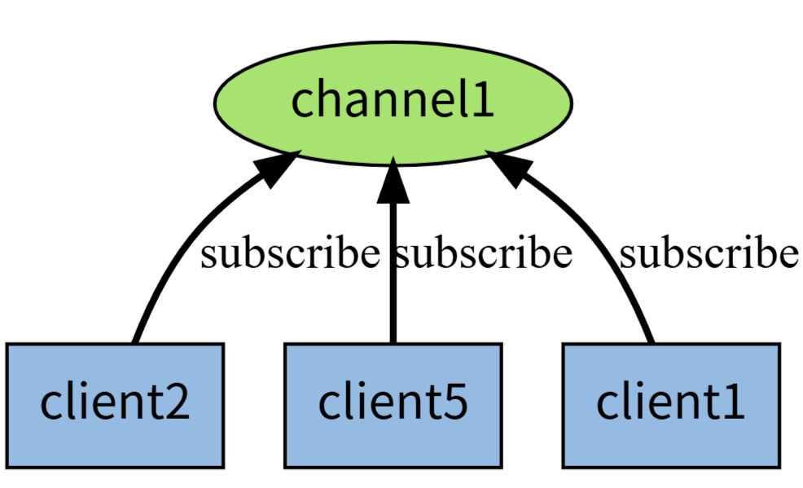
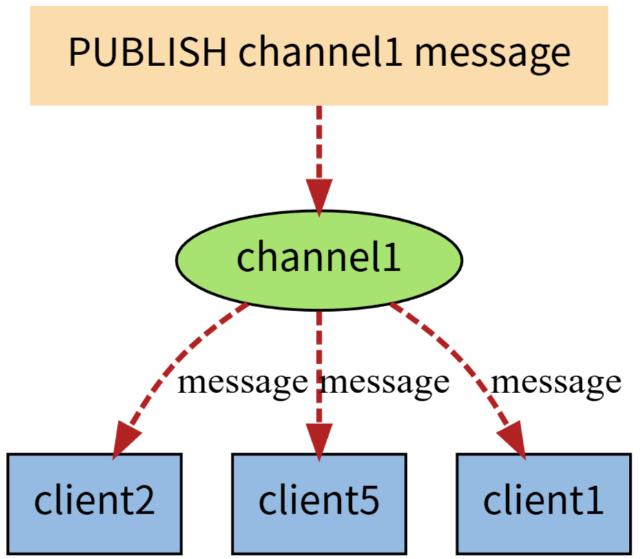
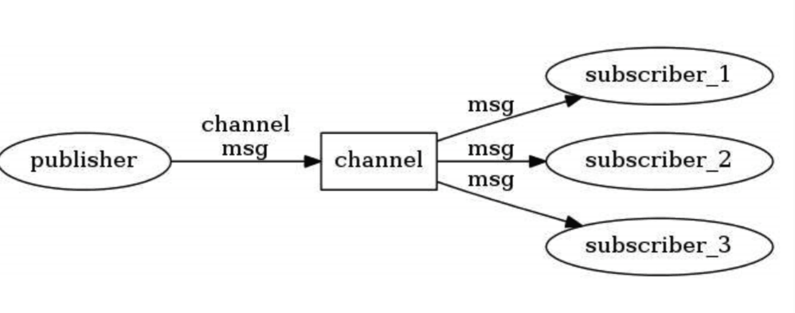
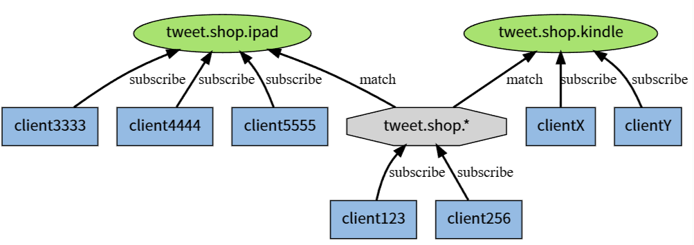
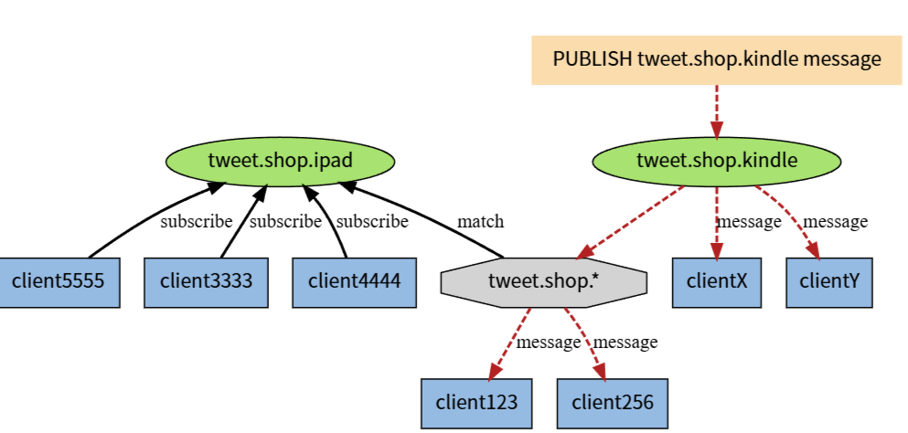
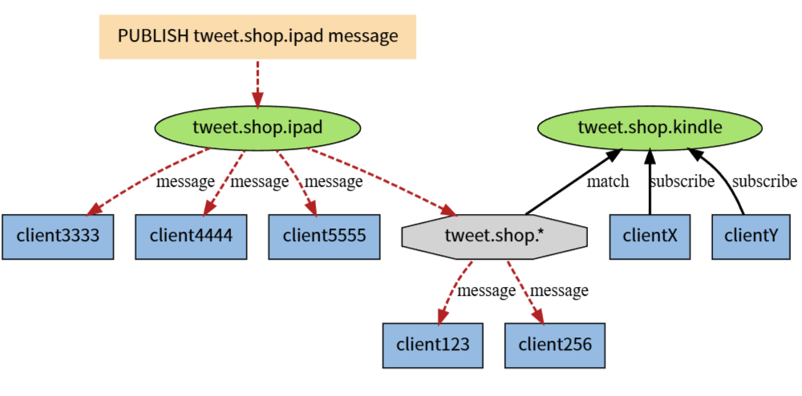
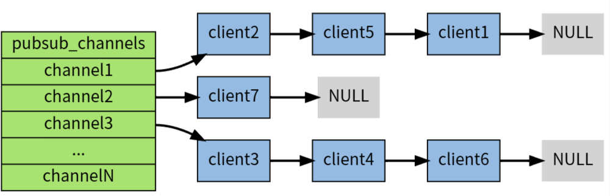
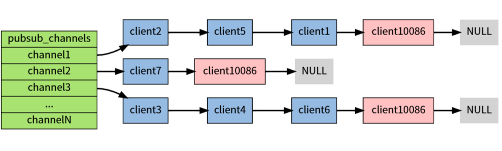
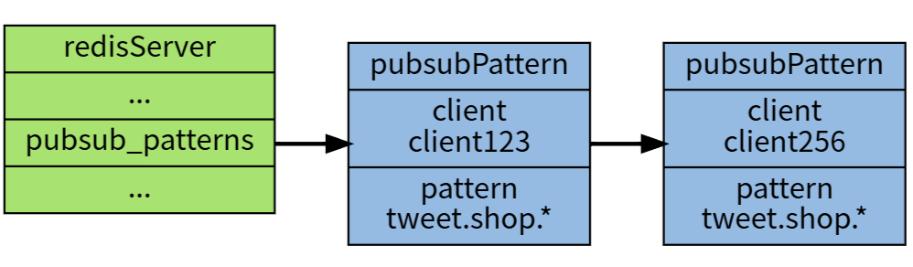
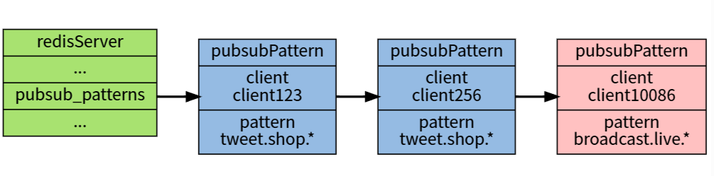

# 发布订阅

> Redis List 实现消息队列的核心在于利用其**阻塞式弹出命令**，让消费者在没有消息时进入休眠状态，而不是忙轮询，从而节省 CPU 资源。
>
> 通常我们使用 `LPUSH` + `BRPOP` 或 `RPUSH` + `BLPOP` 的组合来实现 FIFO（先进先出）队列。
>
> - 生产者：LPUSH queue_name message。将消息插入列表的**头部**
> - 消费者：BRPOP queue_name timeout。从列表的**尾部**阻塞式弹出消息。`timeout` 设为 0 表示无限期等待。
>
> 优点：
>
> - **简单高效**：List 基于双向链表实现，`LPUSH`/`RPUSH` 和 `LPOP`/`RPOP` 的时间复杂度均为 O(1)*O*(1) ，性能极高。
> - **阻塞机制**：`BLPOP`/`BRPOP` 可以让消费者在队列为空时阻塞等待，而不是忙轮询，极大地节省了 CPU 资源。
> - **有序性**：消息严格按照插入顺序被消费。
>
> 缺失：
>
> - **无原生 ACK**：这是 List 最大的短板。一旦 `LPOP`/`RPOP`，消息即从队列消失。若消费者处理失败或崩溃，消息将**永久丢失**。
> - **无广播模式**：List 是点对点的，一条消息只能被一个消费者消费。如果需要广播（Pub/Sub），应使用 Redis 的发布订阅功能。
> - **无消费者组**：虽然可以启动多个消费者竞争消费（竞争消费同一个 Key），但无法像 Kafka 那样进行精细的负载均衡管理。
> - **无消息回溯**：消息被消费后即删除，无法再次查询历史消息。
>
> 可靠性增强模式：`RPOPLPUSH` / `BRPOPLPUSH`。为了防止“消息丢失”，我们通常引入一个“**正在处理队列**”（In-Progress Queue）来暂存已被取出但尚未确认的消息。
>
> 1. 原子性转移：消费者不再直接使用 `RPOP`，而是使用 `RPOPLPUSH source_queue processing_queue`。
>    - 该命令会**原子性**地将消息从“主队列”（`source_queue`）移出，并放入“正在处理队列”（`processing_queue`）。
>    - 如果消费者在处理过程中崩溃，消息依然保留在“正在处理队列”中。
> 2. **业务处理**：消费者拿到消息后开始执行业务逻辑（如扣减库存、发送短信）。
> 3. **手动确认**：业务逻辑执行成功后，消费者显式地使用 `LREM` 或 `LPOP` 将消息从“正在处理队列”中移除。
> 4. 故障恢复（兜底）：
>    - 启动一个**监控线程**或**定时任务**，定期扫描“正在处理队列”。
>    - 检查消息的“入队时间”，如果发现某条消息在 `processing_queue` 中停留时间过长（例如超过了正常的处理耗时），则判定持有该消息的消费者已宕机。
>    - 监控程序将该消息从“正在处理队列”移回“主队列”（或死信队列），供其他消费者重新处理。

**Redis单独使用Pub/Sub模块来支持消息多播，即发布/订阅模式(publish/subscribe)，它是一种消息通信模式：发布者(pub)发送消息，订阅者(sub)接收消息。**

**发布者会将的消息发布到一个chanel（通道）中而不是发送给指定的订阅者，发布者也不知道可能有哪些订阅者。**

**订阅者可以订阅一个或多个channel，只接收来自订阅的channel的消息，并且不知道有哪些（如果有）发布者，这种模式实现了消息发布者和订阅者的解耦。**


作为例子， 下图展示了频道 channel1 ， 以及订阅这个频道的三个客户端 —— client2 、 client5 和 client1 之间的关系：



当有新消息通过 PUBLISH 命令发送给频道 channel1 时， 这个消息就会被发送给订阅它的三个客户端：





>Redis有两种发布/订阅模式：
>
>- 基于频道(Channel)的发布/订阅
>- 基于模式(pattern)的发布/订阅


## 基于频道(Channel)的发布或订阅

"发布/订阅"模式包含两种角色，分别是**发布者和订阅者**。发布者可以**向指定的频道(channel)发送消息**；订阅者可以订阅一个或者多个频道(channel)，**所有订阅此频道的订阅者都会收到此消息。**



### `publish channel message`：发布者发布消息

下面操作会向channel：sports频道发布一条消息“Tim won the championship”，**返回结果为订阅者个数**，因为此时没有订阅，所以返回结果为0：

```
127.0.0.1:6379> publish channel:sports "Tim won the championship"
(integer) 0
```

发出去的消息**不会被持久化**，也就是有客户端订阅channel:sports后只能接收到后续发布到该频道的消息，之前的就接收不到了。

### `subscribe channel [channel ...]`：订阅者订阅消息

订阅者可以订阅一个或多个频道，下面操作为当前客户端订阅了channel：sports频道：

```
127.0.0.1:6379> subscribe channel:sports
Reading messages… (press Ctrl-C to quit)
1) "subscribe"
2) "channel:sports"
3) (integer) 1
```

此时另一个客户端发布一条消息

```
127.0.0.1:6379> publish channel:sports "James lost the championship"
(integer) 1
```

当前订阅者客户端会收到如下消息：

```
127.0.0.1:6379> subscribe channel:sports
Reading messages… (press Ctrl-C to quit)
…
1) "message"   // 消息的种类
2) "channel:sports"  // 始发频道的名称
3) "James lost the championship" // 实际的消息内容
```

订阅的客户端每次可以收到一个3个参数的消息：**消息的种类，始发频道的名称，实际的消息内容**

> 消息类型的取值可能是以下3个:
>
> - subscribe。表示订阅成功的反馈信息。第二个值是订阅成功的频道名称，第三个是当前客户端订阅的频道数量。
> - message。表示接收到的消息，第二个值表示产生消息的频道名称，第三个值是消息的内容。
> - unsubscribe。表示成功取消订阅某个频道。第二个值是对应的频道名称，第三个值是当前客户端订阅的频道数量，当此值为0时客户端会退出订阅状态，之后就可以执行其他非"发布/订阅"模式的命令了。

有关订阅命令有两点需要注意：

- **客户端在执行订阅命令之后进入了订阅状态，只能接收subscribe、psubscribe、unsubscribe、punsubscribe的四个命令。**
- **新开启的订阅客户端，无法收到该频道之前的消息，因为Redis不会对发布的消息进行持久化。**

### `unsubscribe [channel [channel ...]]`：取消订阅

- 客户端可以通过unsubscribe命令取消对指定频道的订阅，取消成功后，不会再收到该频道的发布消息：

  ```
  127.0.0.1:6379> unsubscribe channel:sports
  1) "unsubscribe"
  2) "channel:sports"
  3) (integer) 0
  ```

- 按照模式订阅和取消订阅

  ```
  psubscribe pattern [pattern…]
  punsubscribe [pattern [pattern …]]
  ```

  - 除了subcribe和unsubscribe命令，Redis命令还**支持glob风格**的订阅命令psubscribe和取消订阅命令punsubscribe，例如下面操作订阅以it开头的所有频道：

    ```
    127.0.0.1:6379> psubscribe it*
    Reading messages… (press Ctrl-C to quit)
    1) "psubscribe"
    2) "it*"
    3) (integer) 1
    ```


### pubsub查询订阅

- `pubsub channels [pattern]`：查看活跃的频道

  - 所谓活跃的频道是指当前频道至少有一个订阅者，其中[pattern]是可以指定具体的模式：

    ```
    127.0.0.1:6379> pubsub channels
    1) "channel:sports"
    2) "channel:it"
    3) "channel:travel"
    127.0.0.1:6379> pubsub channels channel:*r*
    1) "channel:sports"
    2) "channel:travel"
    ```

- `pubsub numsub [channel ...]`：查看频道订阅数

  - 当前channel：sports频道的订阅数为2：

    ```
    127.0.0.1:6379> pubsub numsub channel:sports
    1) "channel:sports"
    2) (integer) 2
    ```

- `pubsub numpat`：查看模式订阅

  当前只有一个客户端通过模式来订阅：

  ```
  127.0.0.1:6379> pubsub numpat
  (integer) 1
  ```

## 基于模式(pattern)的发布/订阅

如果有某个/某些模式和这个频道匹配的话，那么所有订阅这个/这些频道的客户端也同样会收到信息。

**用图例解释什么是基于模式的发布订阅**

下图展示了一个带有频道和模式的例子， 其中 tweet.shop.* 模式匹配了 tweet.shop.kindle 频道和 tweet.shop.ipad 频道， 并且有不同的客户端分别订阅它们三个：



当有信息发送到 tweet.shop.kindle 频道时， 信息除了发送给 clientX 和 clientY 之外， 还会发送给订阅 tweet.shop.* 模式的 client123 和 client256 ：



另一方面， 如果接收到信息的是频道 tweet.shop.ipad ， 那么 client123 和 client256 同样会收到信息：




### **基于模式的例子**

通配符中?表示1个占位符，*表示任意个占位符(包括0)，?*表示1个以上占位符。

publish发布

```
127.0.0.1:6379> publish c m1
(integer) 0
127.0.0.1:6379> publish c1 m1
(integer) 1
127.0.0.1:6379> publish c11 m1
(integer) 0
127.0.0.1:6379> publish b m1
(integer) 1
127.0.0.1:6379> publish b1 m1
(integer) 1
127.0.0.1:6379> publish b11 m1
(integer) 1
127.0.0.1:6379> publish d m1
(integer) 0
127.0.0.1:6379> publish d1 m1
(integer) 1
127.0.0.1:6379> publish d11 m1
(integer) 1
```

psubscribe订阅

```
127.0.0.1:6379> psubscribe c? b* d?*
Reading messages... (press Ctrl-C to quit)
1) "psubscribe"
2) "c?"
3) (integer) 1
1) "psubscribe"
2) "b*"
3) (integer) 2
1) "psubscribe"
2) "d?*"
3) (integer) 3
1) "pmessage"
2) "c?"
3) "c1"
4) "m1"
1) "pmessage"
2) "b*"
3) "b"
4) "m1"
1) "pmessage"
2) "b*"
3) "b1"
4) "m1"
1) "pmessage"
2) "b*"
3) "b11"
4) "m1"
1) "pmessage"
2) "d?*"
3) "d1"
4) "m1"
1) "pmessage"
2) "d?*"
3) "d11"
4) "m1"
```

### **注意点**

(1)使用psubscribe命令可以重复订阅同一个频道，如客户端执行了`psubscribe c? c?*`。这时向c1发布消息客户端会接受到两条消息，而同时publish命令的返回值是2而不是1。同样的，如果有另一个客户端执行了`subscribe c1` 和`psubscribe c?*`的话，向c1发送一条消息该客户顿也会受到两条消息(但是是两种类型:message和pmessage)，同时publish命令也返回2.

(2)punsubscribe命令可以退订指定的规则，用法是: `punsubscribe [pattern [pattern ...]]`,如果没有参数则会退订所有规则。

(3)使用punsubscribe只能退订通过psubscribe命令订阅的规则，不会影响直接通过subscribe命令订阅的频道；同样unsubscribe命令也不会影响通过psubscribe命令订阅的规则。另外需要注意punsubscribe命令退订某个规则时不会将其中的通配符展开，而是进行严格的字符串匹配，所以`punsubscribe *` 无法退订`c*`规则，而是必须使用`punsubscribe c*`才可以退订。（它们是相互独立的，后文可以看到数据结构上看也是两种实现）

## 深入理解Redis的订阅发布机制

### 基于频道(Channel)的发布/订阅如何实现的？

底层是通过**字典**（图中的pubsub_channels）实现的，这个**字典就用于保存订阅频道的信息：字典的键为正在被订阅的频道， 而字典的值则是一个链表， 链表中保存了所有订阅这个频道的客户端。**

- **数据结构**

比如说，在下图展示的这个 pubsub_channels 示例中， client2 、 client5 和 client1 就订阅了 channel1 ， 而其他频道也分别被别的客户端所订阅：



- **订阅**

当客户端调用 SUBSCRIBE 命令时， 程序就将客户端和要订阅的频道在 pubsub_channels 字典中关联起来。

举个例子，如果客户端 client10086 执行命令 `SUBSCRIBE channel1 channel2 channel3` ，那么前面展示的 pubsub_channels 将变成下面这个样子：



- **发布**

当调用 `PUBLISH channel message` 命令， 程序首先根据 channel 定位到字典的键， 然后将信息发送给字典值链表中的所有客户端。

比如说，对于以下这个 pubsub_channels 实例， 如果某个客户端执行命令 `PUBLISH channel1 "hello moto"` ，那么 client2 、 client5 和 client1 三个客户端都将接收到 "hello moto" 信息：

- **退订**

使用 UNSUBSCRIBE 命令可以退订指定的频道， 这个命令执行的是订阅的反操作： 它从 pubsub_channels 字典的给定频道（键）中， 删除关于当前客户端的信息， 这样被退订频道的信息就不会再发送给这个客户端。

### 基于模式-pattern-的发布-订阅如何实现的)基于模式(Pattern)的发布/订阅如何实现的？

**底层是pubsubPattern节点的链表。**

- **数据结构** redisServer.pubsub_patterns 属性是一个链表，链表中保存着所有和模式相关的信息：

```c
struct redisServer {
    // ...
    list *pubsub_patterns;
    // ...
};
```

链表中的每个节点都包含一个 redis.h/pubsubPattern 结构：

```c
typedef struct pubsubPattern {
    redisClient *client;  // 订阅模式的客户端
    robj *pattern;         // 订阅的模式
} pubsubPattern;
```

client 属性保存着**订阅模式的客户端**，而 pattern 属性则保存着被**订阅的模式**。

**每当调用 PSUBSCRIBE 命令订阅一个模式时， 程序就创建一个包含客户端信息和被订阅模式的 pubsubPattern 结构， 并将该结构添加到 redisServer.pubsub_patterns 链表中。**

作为例子，下图展示了一个包含两个模式的 pubsub_patterns 链表， 其中 client123 和 client256 都正在订阅 tweet.shop.* 模式：



- **订阅**

如果这时客户端 client10086 执行 `PSUBSCRIBE broadcast.list.*` ， 那么 pubsub_patterns 链表将被更新成这样：



通过遍历整个 pubsub_patterns 链表，程序可以检查所有正在被订阅的模式，以及订阅这些模式的客户端。

- **发布**

发送信息到模式的工作也是由 PUBLISH 命令进行的, 显然就是匹配模式获得Channels，然后再把消息发给客户端。

- **退订**

使用 PUNSUBSCRIBE 命令可以退订指定的模式， 这个命令执行的是订阅模式的反操作： 程序会删除 redisServer.pubsub_patterns 链表中， 所有和被退订模式相关联的 pubsubPattern 结构， 这样客户端就不会再收到和模式相匹配的频道发来的信息。

### SpringBoot结合Redis发布/订阅实例？

最佳实践是通过RedisTemplate，关键代码如下：

```java
// 发布
redisTemplate.convertAndSend("my_topic_name", "message_content");

// 配置订阅
RedisMessageListenerContainer container = new RedisMessageListenerContainer();
container.setConnectionFactory(connectionFactory);
container.addMessageListener(xxxMessageListenerAdapter, "my_topic_name");
```

我找了[一篇文章在新窗口打开](https://blog.csdn.net/llll234/article/details/80966952)，如果需要可以看看具体的集成。

