参与复制的Redis实例划分为**主节点(master)和从节点(slave)**。默认情况下，Redis都是主节点。**每个从节点只能有一个主节点，而主节点可以同时具有多个从节点。复制的数据流是单向的，只能由主节点复制到从节点，master以写为主，Slave以读为主。**

接下来的内容主要包括以下几方面：

Redis高级：

- Redis主从
- Redis哨兵
- Redis分片集群
- Redis数据结构
- Redis内存回收
- Redis缓存一致性

微服务高级：

- Eureka和Nacos对比
- Ribbon和SpringCloudLoadBalancer
- Hystix和Sentinel
- 限流算法

# 1.Redis主从

单节点Redis的并发能力是有上限的，要进一步提高Redis的并发能力，就需要搭建主从集群，实现读写分离。

## 1.1.主从集群结构

下图就是一个简单的Redis主从集群结构：

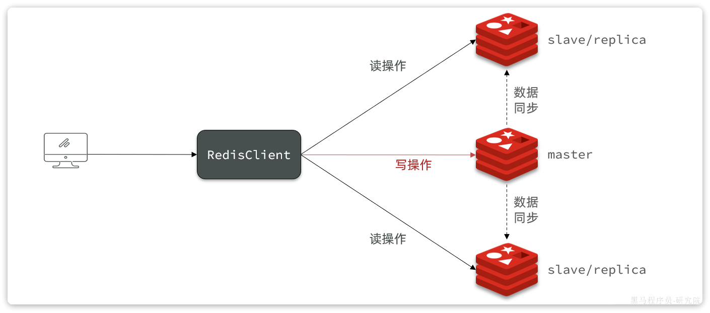

如图所示，集群中有一个master节点、两个slave节点（现在叫replica）。当我们通过Redis的Java客户端访问主从集群时，应该做好路由：

- 如果是写操作，应该访问master节点，master会自动将数据同步给两个slave节点
- 如果是读操作，建议访问各个slave节点，从而分担并发压力

## 1.2.搭建主从集群

我们会在同一个虚拟机中利用3个Docker容器来搭建主从集群，容器信息如下：

| **容器名** | **角色** | **IP**          | **映射****端口** |
| :--------- | :------- | :-------------- | :--------------- |
| r1         | master   | 192.168.150.101 | 7001             |
| r2         | slave    | 192.168.150.101 | 7002             |
| r3         | slave    | 192.168.150.101 | 7003             |

### 1.2.1.启动多个Redis实例

我们利用课前资料提供的docker-compose文件来构建主从集群：

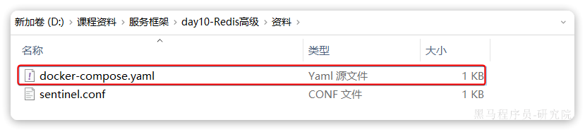

文件内容如下：

```YAML
version: "3.2"

services:
  r1:
    image: redis
    container_name: r1
    network_mode: "host"
    entrypoint: ["redis-server", "--port", "7001"]
  r2:
    image: redis
    container_name: r2
    network_mode: "host"
    entrypoint: ["redis-server", "--port", "7002"]
  r3:
    image: redis
    container_name: r3
    network_mode: "host"
    entrypoint: ["redis-server", "--port", "7003"]
```

将其上传至虚拟机的`/root/redis`目录下：

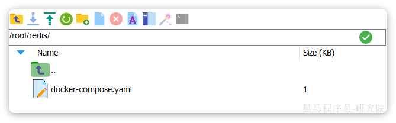

执行命令，运行集群：

```Bash
docker compose up -d
```

结果：

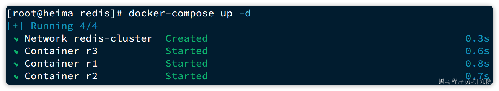

查看docker容器，发现都正常启动了：

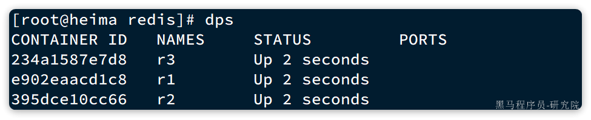

由于采用的是host模式，我们看不到端口映射。不过能直接在宿主机通过ps命令查看到Redis进程：

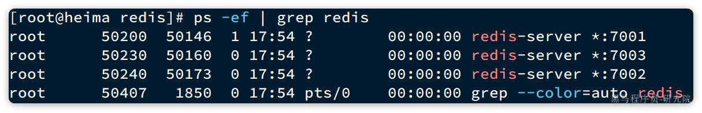

### 1.2.2.建立集群

虽然我们启动了3个Redis实例，但是它们并没有形成主从关系。我们需要通过命令来配置主从关系：

```Bash
# Redis5.0以前
slaveof <masterip> <masterport>
# Redis5.0以后
replicaof <masterip> <masterport>
```

有临时和永久两种模式：

- 永久生效：在redis.conf文件中利用`slaveof`命令指定`master`节点
- 临时生效：直接利用redis-cli控制台输入`slaveof`命令，指定`master`节点

我们测试临时模式，首先连接`r2`，让其以`r1`为master

```Bash
# 连接r2
docker exec -it r2 redis-cli -p 7002
# 认r1主，也就是7001
slaveof 192.168.150.101 7001
```

然后连接`r3`，让其以`r1`为master

```Bash
# 连接r3
docker exec -it r3 redis-cli -p 7003
# 认r1主，也就是7001
slaveof 192.168.150.101 7001
```

然后连接`r1`，查看集群状态：

```Bash
# 连接r1
docker exec -it r1 redis-cli -p 7001
# 查看集群状态
info replication
```

结果如下：

```Bash
127.0.0.1:7001> info replication
# Replication
role:master
connected_slaves:2
slave0:ip=192.168.150.101,port=7002,state=online,offset=140,lag=1
slave1:ip=192.168.150.101,port=7003,state=online,offset=140,lag=1
master_failover_state:no-failover
master_replid:16d90568498908b322178ca12078114e6c518b86
master_replid2:0000000000000000000000000000000000000000
master_repl_offset:140
second_repl_offset:-1
repl_backlog_active:1
repl_backlog_size:1048576
repl_backlog_first_byte_offset:1
repl_backlog_histlen:140
```

可以看到，当前节点`r1:7001`的角色是`master`，有两个slave与其连接：

- `slave0`：`port`是`7002`，也就是`r2`节点
- `slave1`：`port`是`7003`，也就是`r3`节点

### 1.2.3.测试

依次在`r1`、`r2`、`r3`节点上执行下面命令：

```Bash
set num 123

get num
```

你会发现，只有在`r1`这个节点上可以执行`set`命令（**写操作**），其它两个节点只能执行`get`命令（**读操作**）。也就是说读写操作已经分离了。

## 1.3.主从同步原理

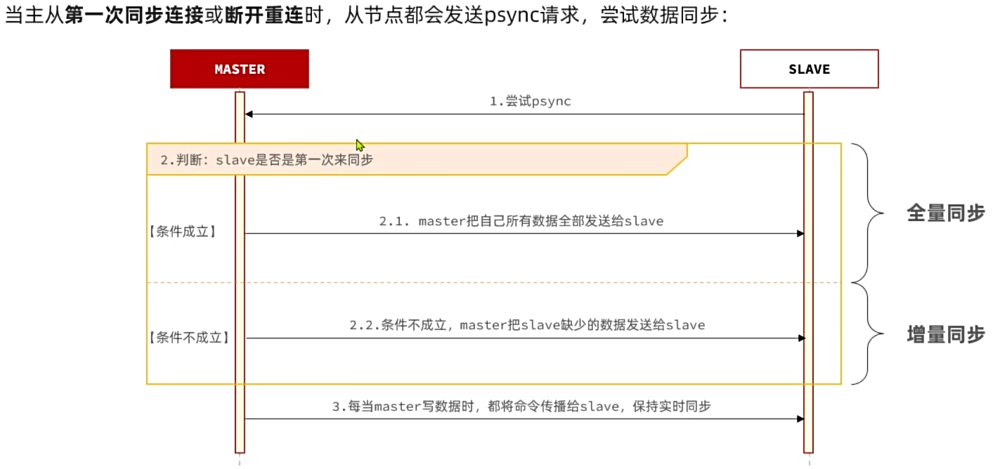


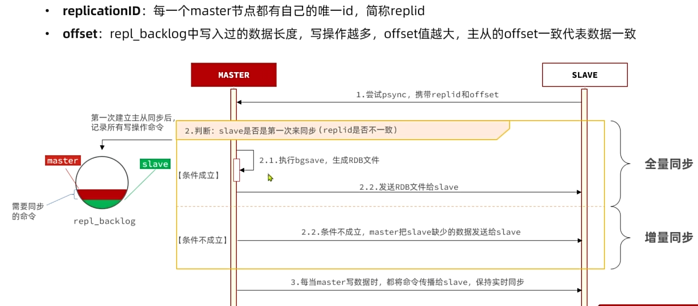

在刚才的主从测试中，我们发现`r1`上写入Redis的数据，在`r2`和`r3`上也能看到，这说明主从之间确实完成了数据同步。

那么这个同步是如何完成的呢？

### 1.3.1.全量同步

主从第一次建立连接时，会执行**全量同步**，将master节点的所有数据都拷贝给slave节点，流程：

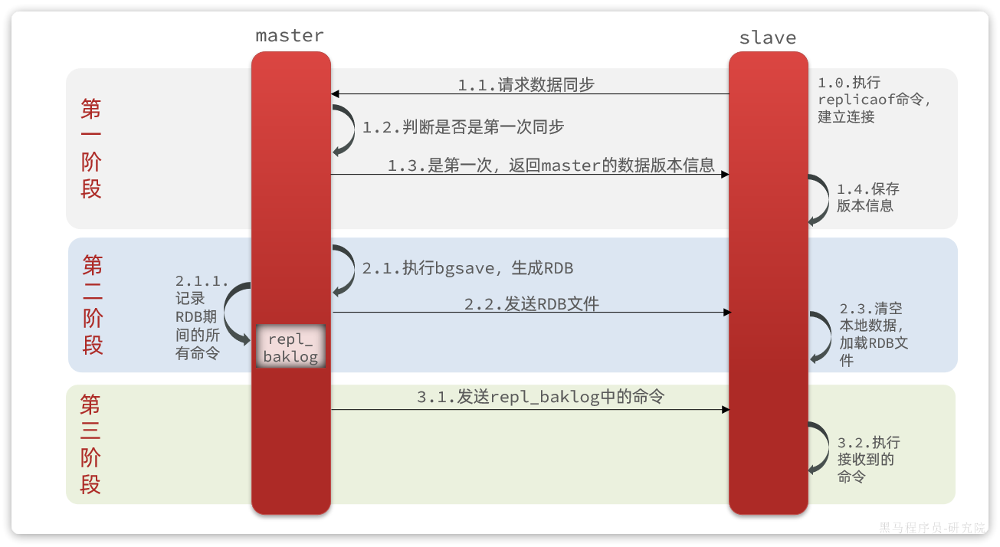

这里有一个问题，`master`如何得知`salve`是否是第一次来同步呢？？

有几个概念，可以作为判断依据：

- **`Replication Id`**：简称`replid`，是数据集的标记，replid一致则是同一数据集。每个`master`都有唯一的`replid`，`slave`则会继承`master`节点的`replid`。
- **`offset`**：偏移量，随着记录在`repl_baklog`中的数据增多而逐渐增大。`slave`完成同步时也会记录当前同步的`offset`。如果`slave`的`offset`小于`master`的`offset`，说明`slave`数据落后于`master`，需要更新。

因此`slave`做数据同步，必须向`master`声明自己的`replication id `和`offset`，`master`才可以判断到底需要同步哪些数据。

由于我们在执行`slaveof`命令之前，所有redis节点都是`master`，有自己的`replid`和`offset`。

当我们第一次执行`slaveof`命令，与`master`建立主从关系时，发送的`replid`和`offset`是自己的，与`master`肯定不一致。

`master`判断发现`slave`发送来的`replid`与自己的不一致，说明这是一个全新的slave，就知道要做全量同步了。

`master`会将自己的`replid`和`offset`都发送给这个`slave`，`slave`保存这些信息到本地。自此以后`slave`的`replid`就与`master`一致了。

因此，**master****判断一个节点是否是第一次同步的依据，就是看replid是否一致**。流程如图：

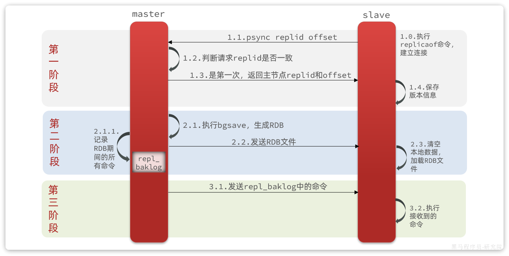

完整流程描述：

- `slave`节点请求增量同步
- `master`节点判断`replid`，发现不一致，拒绝增量同步
- `master`将完整内存数据生成`RDB`，发送`RDB`到`slave`
- `slave`清空本地数据，加载`master`的`RDB`
- `master`将`RDB`期间的命令记录在`repl_baklog`，并持续将log中的命令发送给`slave`
- `slave`执行接收到的命令，保持与`master`之间的同步

来看下`r1`节点的运行日志：

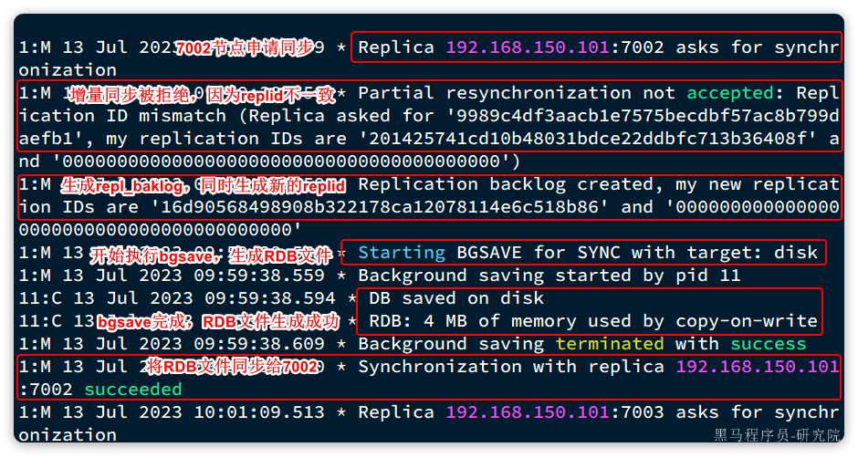

再看下`r2`节点执行`replicaof`命令时的日志：

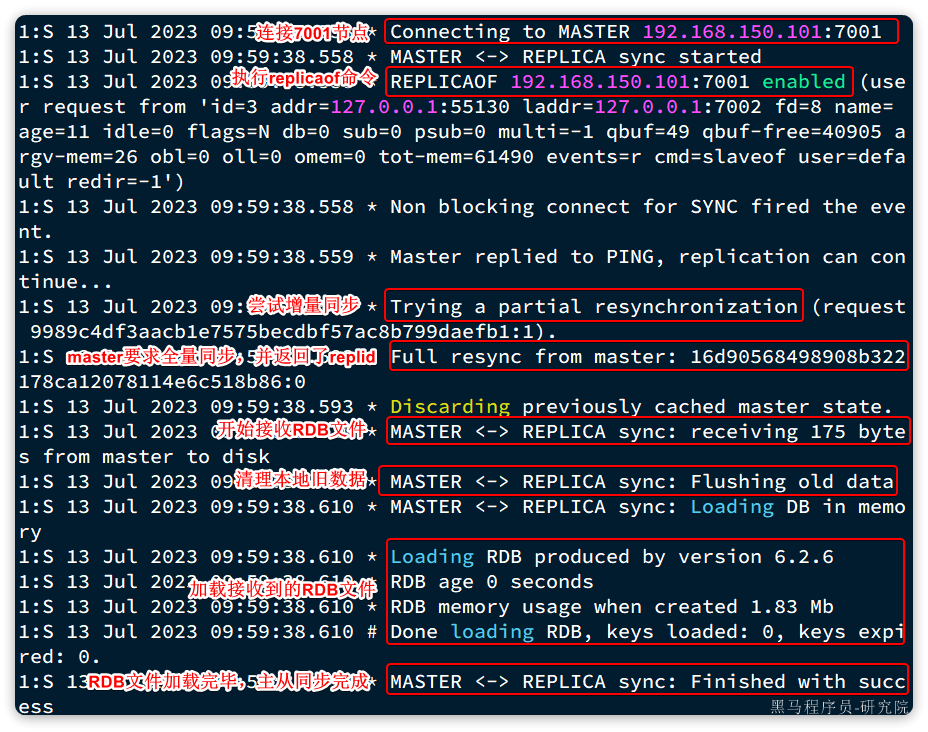

与我们描述的完全一致。

### 1.3.2.增量同步

全量同步需要先做RDB，然后将RDB文件通过网络传输个slave，成本太高了。因此除了第一次做全量同步，其它大多数时候slave与master都是做**增量同步**。

什么是增量同步？就是只更新slave与master存在差异的部分数据。如图：

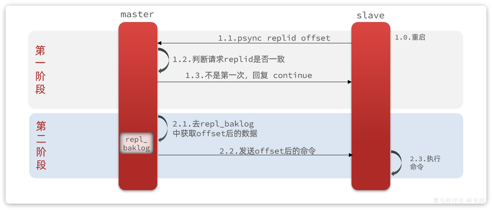

那么master怎么知道slave与自己的数据差异在哪里呢?

### 1.3.3.repl_baklog原理

master怎么知道slave与自己的数据差异在哪里呢?

这就要说到全量同步时的`repl_baklog`文件了。这个文件是一个固定大小的数组，只不过数组是环形，也就是说**角标到达数组末尾后，会再次从0开始读写**，这样数组头部的数据就会被覆盖。

`repl_baklog`中会记录Redis处理过的命令及`offset`，包括master当前的`offset`，和slave已经拷贝到的`offset`：

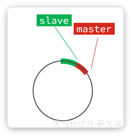

slave与master的offset之间的差异，就是salve需要增量拷贝的数据了。

随着不断有数据写入，master的offset逐渐变大，slave也不断的拷贝，追赶master的offset：

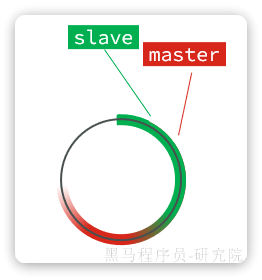

直到数组被填满：

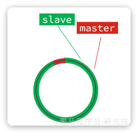

此时，如果有新的数据写入，就会覆盖数组中的旧数据。不过，旧的数据只要是绿色的，说明是已经被同步到slave的数据，即便被覆盖了也没什么影响。因为未同步的仅仅是红色部分：

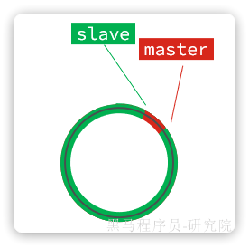

但是，如果slave出现网络阻塞，导致master的`offset`远远超过了slave的`offset`： 

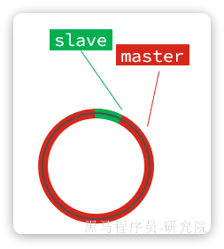

如果master继续写入新数据，master的`offset`就会覆盖`repl_baklog`中旧的数据，直到将slave现在的`offset`也覆盖：

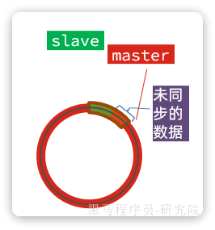

棕色框中的红色部分，就是尚未同步，但是却已经被覆盖的数据。此时如果slave恢复，需要同步，却发现自己的`offset`都没有了，无法完成增量同步了。只能做**全量同步**。

`repl_baklog`大小有上限，写满后会覆盖最早的数据。如果slave断开时间过久，导致尚未备份的数据被覆盖，则无法基于`repl_baklog`做增量同步，只能再次全量同步。

## 1.4.主从同步优化

主从同步可以保证主从数据的一致性，非常重要。

可以从以下几个方面来优化Redis主从就集群：

- 在master中配置`repl-diskless-sync  yes`启用无磁盘复制，避免全量同步时的磁盘IO。
- Redis单节点上的内存占用不要太大，减少RDB导致的过多磁盘IO
- 适当提高`repl_baklog`的大小，发现slave宕机时尽快实现故障恢复，尽可能避免全量同步
- 限制一个master上的slave节点数量，如果实在是太多slave，则可以采用`主-从-从`链式结构，减少master压力

`主-从-从`架构图：

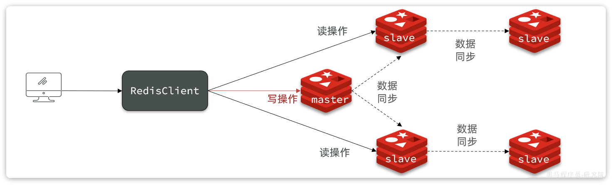

简述全量同步和增量同步区别？

- 全量同步：master将完整内存数据生成RDB，发送RDB到slave。后续命令则记录在repl_baklog，逐个发送给slave。
- 增量同步：slave提交自己的offset到master，master获取repl_baklog中从offset之后的命令给slave

什么时候执行全量同步？

- slave节点第一次连接master节点时
- slave节点断开时间太久，repl_baklog中的offset已经被覆盖时

什么时候执行增量同步？

- slave节点断开又恢复，并且在`repl_baklog`中能找到offset时

# 2.Redis哨兵

主从结构中master节点的作用非常重要，一旦故障就会导致集群不可用。那么有什么办法能保证主从集群的高可用性呢？

## 2.1.哨兵工作原理

Redis提供了`哨兵`（`Sentinel`）机制来监控主从集群监控状态，确保集群的高可用性。

### 2.1.1.哨兵作用

哨兵集群作用原理图：

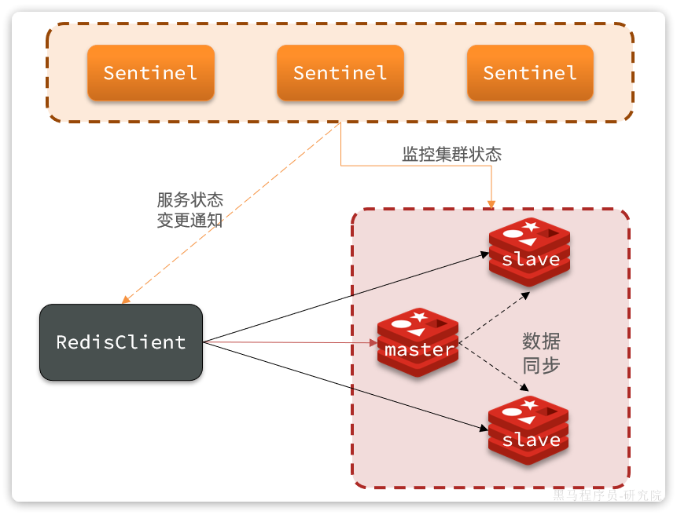

哨兵的作用如下：

- **状态监控**：`Sentinel` 会不断检查您的`master`和`slave`是否按预期工作
- **故障恢复（failover）**：如果`master`故障，`Sentinel`会将一个`slave`提升为`master`。当故障实例恢复后会成为`slave`
- **状态通知**：`Sentinel`充当`Redis`客户端的服务发现来源，当集群发生`failover`时，会将最新集群信息推送给`Redis`的客户端

那么问题来了，`Sentinel`怎么知道一个Redis节点是否宕机呢？

### 2.1.2.状态监控

`Sentinel`基于心跳机制监测服务状态，每隔1秒向集群的每个节点发送ping命令，并通过实例的响应结果来做出判断：

- **主观下线（sdown）**：如果某sentinel节点发现某Redis节点未在规定时间响应，则认为该节点主观下线。
- **客观下线(odown)**：若超过指定数量（通过`quorum`设置）的sentinel都认为该节点主观下线，则该节点客观下线。quorum值最好超过Sentinel节点数量的一半，Sentinel节点数量至少3台。

如图：

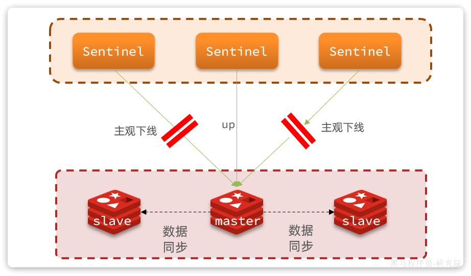

一旦发现master故障，sentinel需要在salve中选择一个作为新的master，选择依据是这样的：

- 首先会判断slave节点与master节点断开时间长短，如果超过`down-after-milliseconds * 10`则会排除该slave节点
- 然后判断slave节点的`slave-priority`值，越小优先级越高，如果是0则永不参与选举（默认都是1）。
- 如果`slave-prority`一样，则判断slave节点的`offset`值，越大说明数据越新，优先级越高
- 最后是判断slave节点的`run_id`大小，越小优先级越高（`通过info server可以查看run_id`）。

对应的官方文档如下：

https://redis.io/docs/management/sentinel/#replica-selection-and-priority

问题来了，当选出一个新的master后，该如何实现身份切换呢？

大概分为两步：

- 在多个`sentinel`中选举一个`leader`
- 由`leader`执行`failover`

### 2.1.3.选举leader

首先，Sentinel集群要选出一个执行`failover`的Sentinel节点，可以成为`leader`。要成为`leader`要满足两个条件：

- 最先获得超过半数的投票
- 获得的投票数不小于`quorum`值

而sentinel投票的原则有两条：

- 优先投票给目前得票最多的
- 如果目前没有任何节点的票，就投给自己

比如有3个sentinel节点，`s1`、`s2`、`s3`，假如`s2`先投票：

- 此时发现没有任何人在投票，那就投给自己。`s2`得1票
- 接着`s1`和`s3`开始投票，发现目前`s2`票最多，于是也投给`s2`，`s2`得3票
- `s2`称为`leader`，开始故障转移

不难看出，**谁先****投票****，谁就会称为****leader**，那什么时候会触发投票呢？

答案是**第一个确认****master****客观下线****的人****会立刻发起****投票****，一定会成为****leader**。

OK，`sentinel`找到`leader`以后，该如何完成`failover`呢？

### 2.1.4.failover

我们举个例子，有一个集群，初始状态下7001为`master`，7002和7003为`slave`：

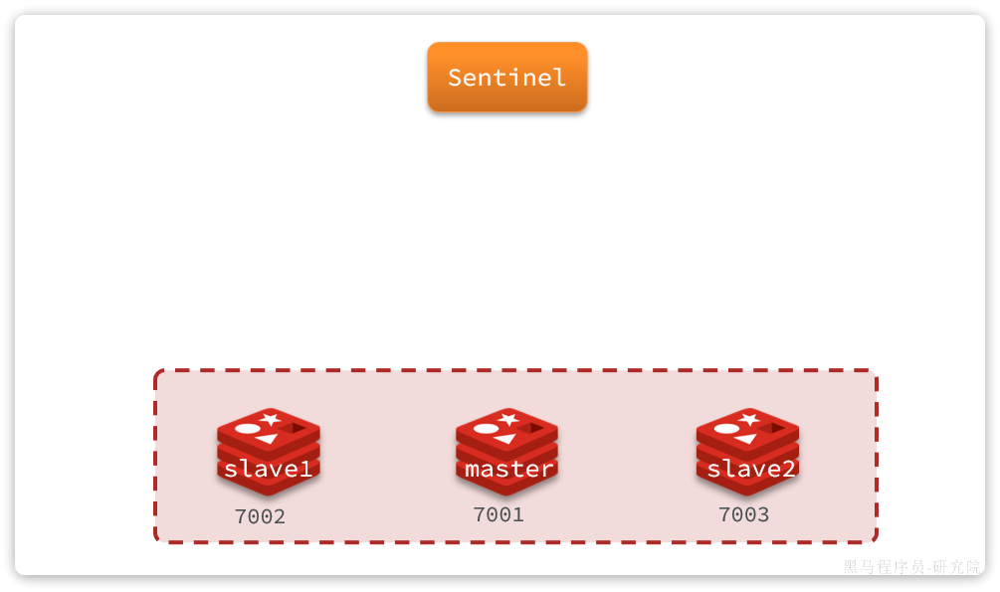

假如master发生故障，slave1当选。则故障转移的流程如下：

1）`sentinel`给备选的`slave1`节点发送`slaveof no one`命令，让该节点成为`master`

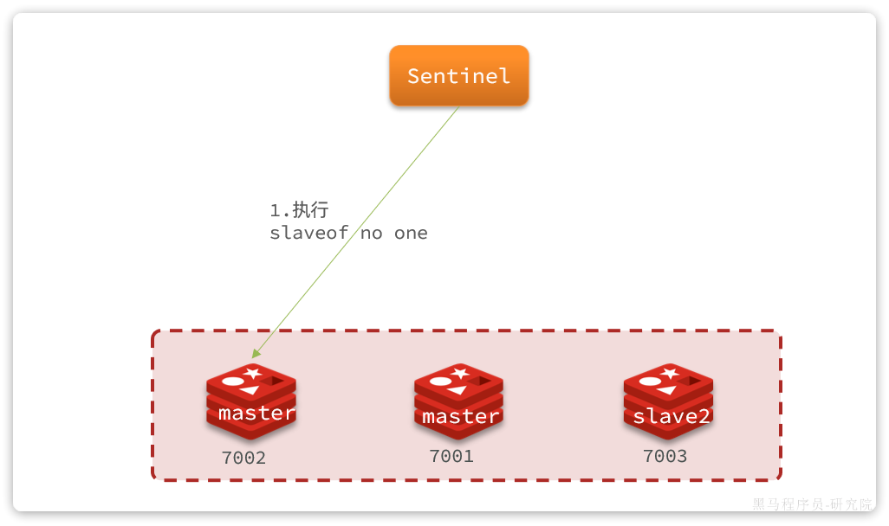

2）`sentinel`给所有其它`slave`发送`slaveof 192.168.150.101 7002` 命令，让这些节点成为新`master`，也就是`7002`的`slave`节点，开始从新的`master`上同步数据。

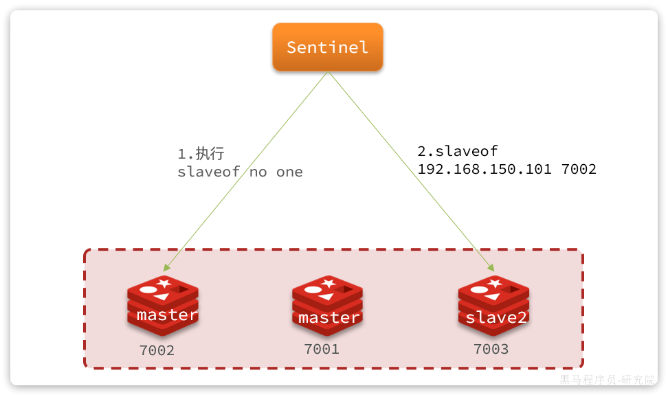

3）最后，当故障节点恢复后会接收到哨兵信号，执行`slaveof 192.168.150.101 7002`命令，成为`slave`：

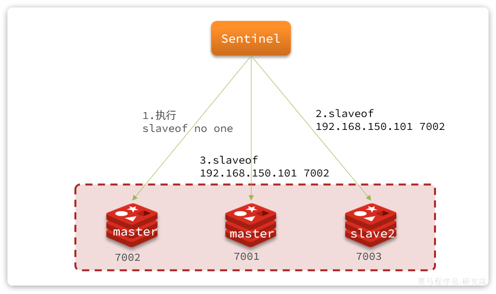

## 2.2.搭建哨兵集群

首先，我们停掉之前的redis集群：

```Bash
# 老版本DockerCompose
docker-compose down

# 新版本Docker
docker compose down
```

然后，我们找到课前资料提供的sentinel.conf文件：

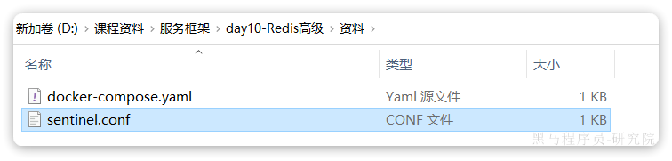

其内容如下：

```Bash
sentinel announce-ip "192.168.150.101"
sentinel monitor hmaster 192.168.150.101 7001 2
sentinel down-after-milliseconds hmaster 5000
sentinel failover-timeout hmaster 60000
```

说明：

- `sentinel announce-ip "192.168.150.101"`：声明当前sentinel的ip
- `sentinel monitor hmaster 192.168.150.101 7001 2`：指定集群的主节点信息 
  - `hmaster`：主节点名称，自定义，任意写
  - `192.168.150.101 7001`：主节点的ip和端口
  - `2`：认定`master`下线时的`quorum`值
- `sentinel down-after-milliseconds hmaster 5000`：声明master节点超时多久后被标记下线
- `sentinel failover-timeout hmaster 60000`：在第一次故障转移失败后多久再次重试

我们在虚拟机的`/root/redis`目录下新建3个文件夹：`s1`、`s2`、`s3`:

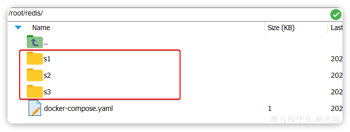

将课前资料提供的`sentinel.conf`文件分别拷贝一份到3个文件夹中。

接着修改`docker-compose.yaml`文件，内容如下：

```YAML
version: "3.2"

services:
  r1:
    image: redis
    container_name: r1
    network_mode: "host"
    entrypoint: ["redis-server", "--port", "7001"]
  r2:
    image: redis
    container_name: r2
    network_mode: "host"
    entrypoint: ["redis-server", "--port", "7002", "--slaveof", "192.168.150.101", "7001"]
  r3:
    image: redis
    container_name: r3
    network_mode: "host"
    entrypoint: ["redis-server", "--port", "7003", "--slaveof", "192.168.150.101", "7001"]
  s1:
    image: redis
    container_name: s1
    volumes:
      - /root/redis/s1:/etc/redis
    network_mode: "host"
    entrypoint: ["redis-sentinel", "/etc/redis/sentinel.conf", "--port", "27001"]
  s2:
    image: redis
    container_name: s2
    volumes:
      - /root/redis/s2:/etc/redis
    network_mode: "host"
    entrypoint: ["redis-sentinel", "/etc/redis/sentinel.conf", "--port", "27002"]
  s3:
    image: redis
    container_name: s3
    volumes:
      - /root/redis/s3:/etc/redis
    network_mode: "host"
    entrypoint: ["redis-sentinel", "/etc/redis/sentinel.conf", "--port", "27003"]
```

直接运行命令，启动集群：

```Shell
docker-compose up -d
```

运行结果：

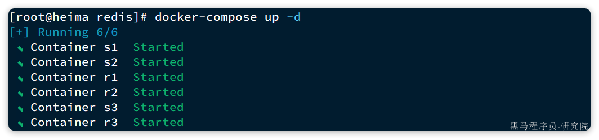

我们以s1节点为例，查看其运行日志：

`docker logs -f s1`

```Bash
# Sentinel ID is 8e91bd24ea8e5eb2aee38f1cf796dcb26bb88acf
# +monitor master hmaster 192.168.150.101 7001 quorum 2
* +slave slave 192.168.150.101:7003 192.168.150.101 7003 @ hmaster 192.168.150.101 7001
* +sentinel sentinel 5bafeb97fc16a82b431c339f67b015a51dad5e4f 192.168.150.101 27002 @ hmaster 192.168.150.101 7001
* +sentinel sentinel 56546568a2f7977da36abd3d2d7324c6c3f06b8d 192.168.150.101 27003 @ hmaster 192.168.150.101 7001
* +slave slave 192.168.150.101:7002 192.168.150.101 7002 @ hmaster 192.168.150.101 7001
```

可以看到`sentinel`已经联系到了`7001`这个节点，并且与其它几个哨兵也建立了链接。哨兵信息如下：

- `27001`：`Sentinel ID`是`8e91bd24ea8e5eb2aee38f1cf796dcb26bb88acf`
- `27002`：`Sentinel ID`是`5bafeb97fc16a82b431c339f67b015a51dad5e4f`
- `27003`：`Sentinel ID`是`56546568a2f7977da36abd3d2d7324c6c3f06b8d`

## 2.3.演示failover

接下来，我们演示一下当主节点故障时，哨兵是如何完成集群故障恢复（failover）的。

我们连接`7001`这个`master`节点，然后通过命令让其休眠60秒，模拟宕机：

```Bash
# 连接7001这个master节点，通过sleep模拟服务宕机，60秒后自动恢复
docker exec -it r1 redis-cli -p 7001 DEBUG sleep 60
# docker stop r1
```

稍微等待一段时间后，会发现sentinel节点触发了`failover`：

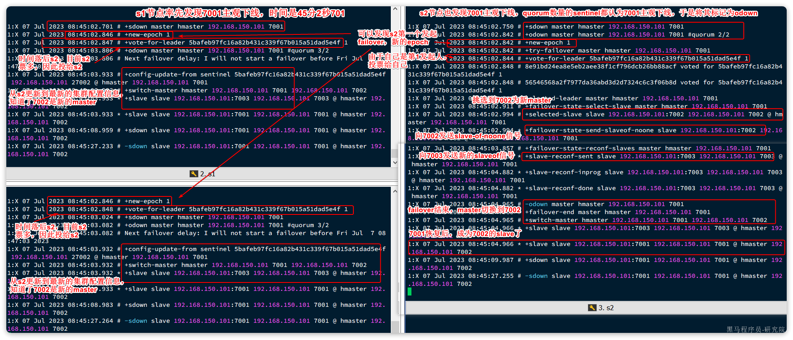

如果重启7001`docker start r1`

7001变成slave

## 2.4.总结

Sentinel的三个作用是什么？

- 集群监控
- 故障恢复
- 状态通知

Sentinel如何判断一个redis实例是否健康？

- 每隔1秒发送一次ping命令，如果超过一定时间没有相向则认为是主观下线（`sdown`）
- 如果大多数sentinel都认为实例主观下线，则判定服务客观下线（`odown`）

故障转移步骤有哪些？

- 首先要在`sentinel`中选出一个`leader`，由leader执行`failover`
- 选定一个`slave`作为新的`master`，执行`slaveof noone`，切换到master模式
- 然后让所有节点都执行`slaveof` 新master
- 修改故障节点配置，添加`slaveof` 新master

sentinel选举leader的依据是什么？

- 票数超过sentinel节点数量1半
- 票数超过quorum数量
- 一般情况下最先发起failover的节点会当选

sentinel从slave中选取master的依据是什么？

- 首先会判断slave节点与master节点断开时间长短，如果超过`down-after-milliseconds`` * 10`则会排除该slave节点
- 然后判断slave节点的`slave-priority`值，越小优先级越高，如果是0则永不参与选举（默认都是1）。
- 如果`slave-prority`一样，则判断slave节点的`offset`值，越大说明数据越新，优先级越高
- 最后是判断slave节点的`run_id`大小，越小优先级越高（`通过info server可以查看run_id`）。


## 2.5.RedisTemplate连接哨兵集群（自学）

分为三步：

- 1）引入依赖
- 2）配置哨兵地址
- 3）配置读写分离

### 2.5.1.引入依赖

就是SpringDataRedis的依赖：

```XML
<dependency>
    <groupId>org.springframework.boot</groupId>
    <artifactId>spring-boot-starter-data-redis</artifactId>
</dependency>
```

### 2.5.2.配置哨兵地址

连接哨兵集群与传统单点模式不同，不再需要设置每一个redis的地址，而是直接指定哨兵地址：

```YAML
spring:
  redis:
    sentinel:
      master: hmaster # 集群名
      nodes: # 哨兵地址列表
        - 192.168.150.101:27001
        - 192.168.150.101:27002
        - 192.168.150.101:27003
```

### 2.5.3.配置读写分离

最后，还要配置读写分离，让java客户端将写请求发送到master节点，读请求发送到slave节点。定义一个bean即可：

```Java
@Bean
public LettuceClientConfigurationBuilderCustomizer clientConfigurationBuilderCustomizer(){
    return clientConfigurationBuilder -> clientConfigurationBuilder.readFrom(ReadFrom.REPLICA_PREFERRED);
}
```

这个bean中配置的就是读写策略，包括四种：

- `MASTER`：从主节点读取
- `MASTER_PREFERRED`：优先从`master`节点读取，`master`不可用才读取`slave`
- `REPLICA`：从`slave`节点读取
- `REPLICA_PREFERRED`：优先从`slave`节点读取，所有的`slave`都不可用才读取`master`

# 3.Redis分片集群

主从模式可以解决高可用、高并发读的问题。但依然有两个问题没有解决：

- 海量数据存储
- 高并发写

要解决这两个问题就需要用到分片集群了。分片的意思，就是把数据拆分存储到不同节点，这样整个集群的存储数据量就更大了。

Redis分片集群的结构如图：

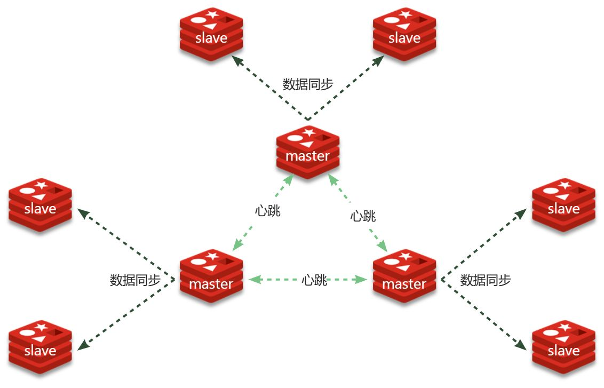

分片集群特征：

-  集群中有多个master，每个master保存不同分片数据 ，解决海量数据存储问题
-  每个master都可以有多个slave节点 ，确保高可用
-  master之间通过ping监测彼此健康状态 ，类似哨兵作用
-  客户端请求可以访问集群任意节点，最终都会被转发到数据所在节点 

## 3.1.搭建分片集群

Redis分片集群最少也需要3个master节点，由于我们的机器性能有限，我们只给每个master配置1个slave，形成最小的分片集群：

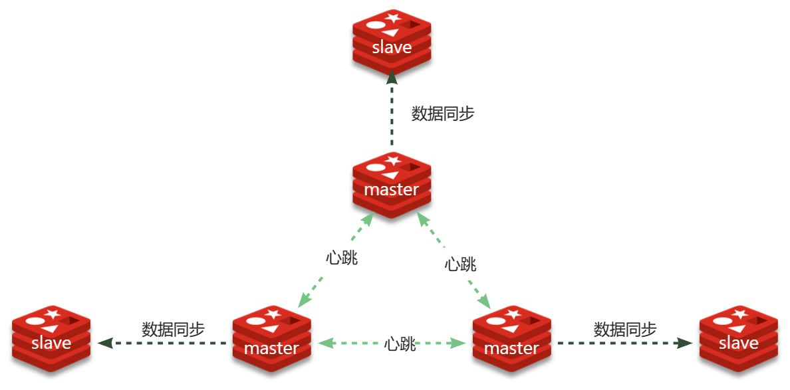

计划部署的节点信息如下：

| 容器名 | 角色   | IP              | 映射端口 |
| ------ | ------ | --------------- | -------- |
| r1     | master | 192.168.150.101 | 7001     |
| r2     | master | 192.168.150.101 | 7002     |
| r3     | master | 192.168.150.101 | 7003     |
| r4     | slave  | 192.168.150.101 | 7004     |
| r5     | slave  | 192.168.150.101 | 7005     |
| r6     | slave  | 192.168.150.101 | 7006     |

### 3.1.1.集群配置

分片集群中的Redis节点必须开启集群模式，一般在配置文件中添加下面参数：

```Bash
port 7000
cluster-enabled yes
cluster-config-file nodes.conf
cluster-node-timeout 5000
appendonly yes
```

其中有3个我们没见过的参数：

- `cluster-enabled`：是否开启集群模式
- `cluster-config-file`：集群模式的配置文件名称，无需手动创建，由集群自动维护
- `cluster-node-timeout`：集群中节点之间心跳超时时间

一般搭建部署集群肯定是给每个节点都配置上述参数，不过考虑到我们计划用`docker-compose`部署，因此可以直接在启动命令中指定参数，偷个懒。

在虚拟机的`/root`目录下新建一个`redis-cluster`目录，然后在其中新建一个`docker-compose.yaml`文件，内容如下：

```YAML
version: "3.2"

services:
  r1:
    image: redis
    container_name: r1
    network_mode: "host"
    entrypoint: ["redis-server", "--port", "7001", "--cluster-enabled", "yes", "--cluster-config-file", "node.conf"]
  r2:
    image: redis
    container_name: r2
    network_mode: "host"
    entrypoint: ["redis-server", "--port", "7002", "--cluster-enabled", "yes", "--cluster-config-file", "node.conf"]
  r3:
    image: redis
    container_name: r3
    network_mode: "host"
    entrypoint: ["redis-server", "--port", "7003", "--cluster-enabled", "yes", "--cluster-config-file", "node.conf"]
  r4:
    image: redis
    container_name: r4
    network_mode: "host"
    entrypoint: ["redis-server", "--port", "7004", "--cluster-enabled", "yes", "--cluster-config-file", "node.conf"]
  r5:
    image: redis
    container_name: r5
    network_mode: "host"
    entrypoint: ["redis-server", "--port", "7005", "--cluster-enabled", "yes", "--cluster-config-file", "node.conf"]
  r6:
    image: redis
    container_name: r6
    network_mode: "host"
    entrypoint: ["redis-server", "--port", "7006", "--cluster-enabled", "yes", "--cluster-config-file", "node.conf"]
```

**注意**：使用Docker部署Redis集群，network模式必须采用host

### 3.1.2.启动集群

进入`/root/redis-cluster`目录，使用命令启动redis：

```Bash
docker-compose up -d
```

启动成功，可以通过命令查看启动进程：

```Bash
ps -ef | grep redis
# 结果：
root       4822   4743  0 14:29 ?        00:00:02 redis-server *:7002 [cluster]
root       4827   4745  0 14:29 ?        00:00:01 redis-server *:7005 [cluster]
root       4897   4778  0 14:29 ?        00:00:01 redis-server *:7004 [cluster]
root       4903   4759  0 14:29 ?        00:00:01 redis-server *:7006 [cluster]
root       4905   4775  0 14:29 ?        00:00:02 redis-server *:7001 [cluster]
root       4912   4732  0 14:29 ?        00:00:01 redis-server *:7003 [cluster]
```

可以发现每个redis节点都以cluster模式运行。不过节点与节点之间并未建立连接。

接下来，我们使用命令创建集群：

```Bash
# 进入任意节点容器
docker exec -it r1 bash
# 然后，执行命令
redis-cli --cluster create --cluster-replicas 1 \
192.168.150.101:7001 192.168.150.101:7002 192.168.150.101:7003 \
192.168.150.101:7004 192.168.150.101:7005 192.168.150.101:7006
```

命令说明：

- `redis-cli --cluster`：代表集群操作命令
- `create`：代表是创建集群
- `--cluster-replicas 1` ：指定集群中每个`master`的副本个数为1
  - 此时`节点总数 ÷ (replicas + 1)` 得到的就是`master`的数量`n`。因此节点列表中的前`n`个节点就是`master`，其它节点都是`slave`节点，随机分配到不同`master`

输入命令后控制台会弹出下面的信息：

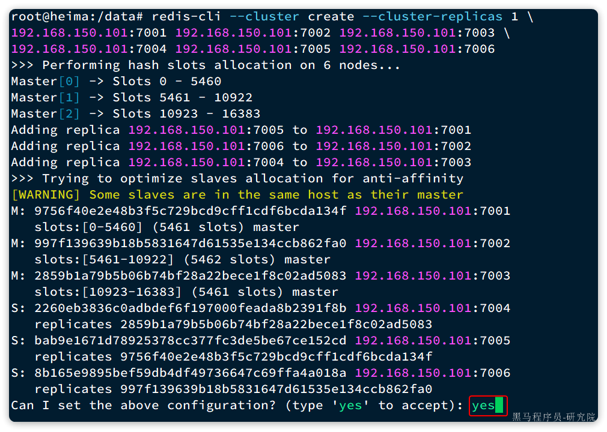

这里展示了集群中`master`与`slave`节点分配情况，并询问你是否同意。节点信息如下：

- `7001`是`master`，节点`id`后6位是`da134f`
- `7002`是`master`，节点`id`后6位是`862fa0`
- `7003`是`master`，节点`id`后6位是`ad5083`
- `7004`是`slave`，节点`id`后6位是`391f8b`，认`ad5083`（7003）为`master`
- `7005`是`slave`，节点`id`后6位是`e152cd`，认`da134f`（7001）为`master`
- `7006`是`slave`，节点`id`后6位是`4a018a`，认`862fa0`（7002）为`master`

输入`yes`然后回车。会发现集群开始创建，并输出下列信息：

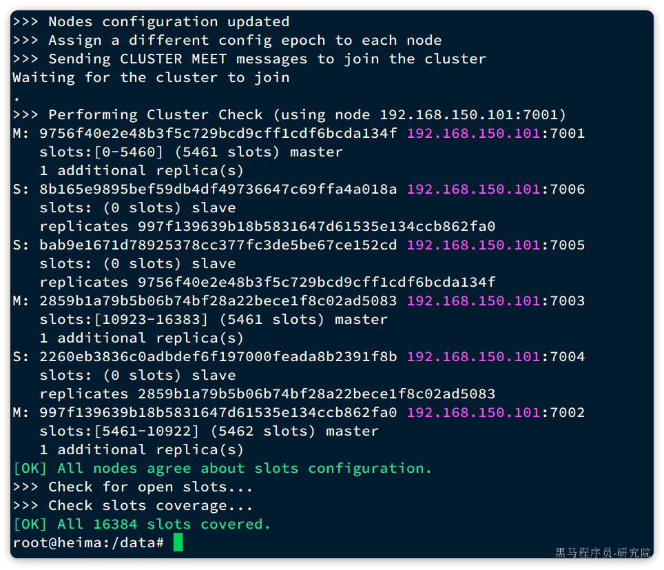

接着，我们可以通过命令查看集群状态：

```Bash
redis-cli -p 7001 cluster nodes
```

结果：

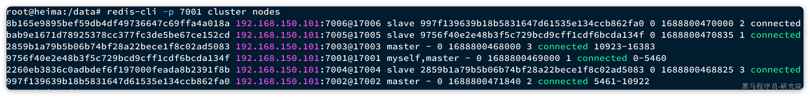

## 3.2.散列插槽

数据要分片存储到不同的Redis节点，肯定需要有分片的依据，这样下次查询的时候才能知道去哪个节点查询。很多数据分片都会采用一致性hash算法。而Redis则是利用散列插槽（**`hash slot`**）的方式实现数据分片。

详见官方文档：

https://redis.io/docs/management/scaling/#redis-cluster-101

在Redis集群中，共有16384个`hash slots`，集群中的每一个master节点都会分配一定数量的`hash slots`。具体的分配在集群创建时就已经指定了：

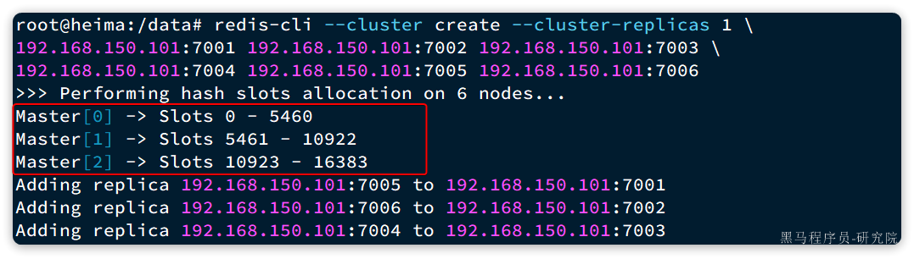

如图中所示：

- Master[0]，本例中就是7001节点，分配到的插槽是0~5460
- Master[1]，本例中就是7002节点，分配到的插槽是5461~10922
- Master[2]，本例中就是7003节点，分配到的插槽是10923~16383

当我们读写数据时，Redis基于`CRC16` 算法对`key`做`hash`运算，得到的结果与`16384`取余，就计算出了这个`key`的`slot`值。然后到`slot`所在的Redis节点执行读写操作。

不过`hash slot`的计算也分两种情况：

- 当`key`中包含`{}`时，根据`{}`之间的字符串计算`hash slot`
- 当`key`中不包含`{}`时，则根据整个`key`字符串计算`hash slot`

例如：

- key是`user`，则根据`user`来计算hash slot
- key是`user:{age}`，则根据`age`来计算hash slot

我们来测试一下，先于`7001`建立连接：

```Bash
# 进入容器
docker exec -it r1 bash
# 进入redis-cli
redis-cli -p 7001
# 测试
set user jack
```

会发现报错了：

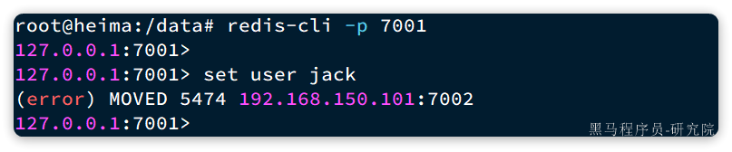

提示我们`MOVED 5474`，其实就是经过计算，得出`user`这个`key`的`hash slot` 是`5474`，而`5474`是在`7002`节点，不能在`7001`上写入！！

说好的任意节点都可以读写呢？

这是因为我们连接的方式有问题，连接集群时，要加`-c`参数：

```Bash
# 通过7001连接集群
redis-cli -c -p 7001
# 存入数据
set user jack
```

结果如下：

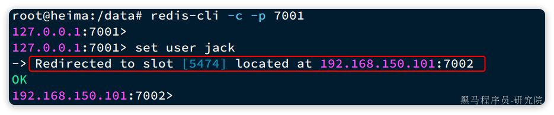

可以看到，客户端自动跳转到了`5474`这个`slot`所在的`7002`节点。

现在，我们添加一个新的key，这次加上`{}`：

```Bash
# 试一下key中带{}
set user:{age} 21

# 再试一下key中不带{}
set age 20
```

结果如下：


可以看到`user:{age}`和`age`计算出的`slot`都是`741`。

## 3.3.故障转移

分片集群的节点之间会互相通过ping的方式做心跳检测，超时未回应的节点会被标记为下线状态。当发现master下线时，会将这个master的某个slave提升为master。

我们先打开一个控制台窗口，利用命令监测集群状态：

```Bash
watch docker exec -it r1 redis-cli -p 7001 cluster nodes
```

命令前面的watch可以每隔一段时间刷新执行结果，方便我们实时监控集群状态变化。

接着，我们故技重施，利用命令让某个master节点休眠。比如这里我们让`7002`节点休眠，打开一个新的ssh控制台，输入下面命令：

```Bash
docker exec -it r2 redis-cli -p 7002 DEBUG sleep 30
```

可以观察到，集群发现7002宕机，标记为下线：

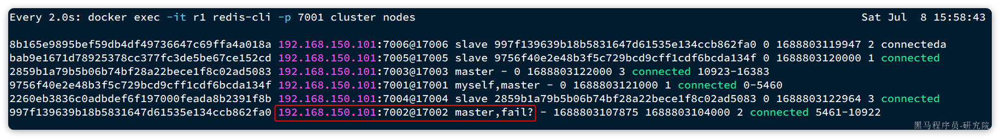

过了一段时间后，7002原本的小弟7006变成了`master`：

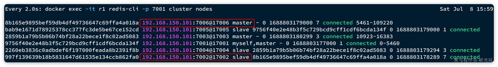

而7002被标记为`slave`，而且其`master`正好是7006，主从地位互换。

## 3.4.总结

Redis分片集群如何判断某个key应该在哪个实例？

- 将16384个插槽分配到不同的实例
- 根据key计算哈希值，对16384取余
- 余数作为插槽，寻找插槽所在实例即可

如何将同一类数据固定的保存在同一个Redis实例？

- Redis计算key的插槽值时会判断key中是否包含`{}`，如果有则基于`{}`内的字符计算插槽
- 数据的key中可以加入`{类型}`，例如key都以`{typeId}`为前缀，这样同类型数据计算的插槽一定相同

## 3.5.Java客户端连接分片集群（选学）

RedisTemplate底层同样基于lettuce实现了分片集群的支持，而使用的步骤与哨兵模式基本一致，参考`2.5节`：

1）引入redis的starter依赖

2）配置分片集群地址

3）配置读写分离

与哨兵模式相比，其中只有分片集群的配置方式略有差异，如下：

```YAML
spring:
  redis:
    cluster:
      nodes:
        - 192.168.150.101:7001
        - 192.168.150.101:7002
        - 192.168.150.101:7003
        - 192.168.150.101:8001
        - 192.168.150.101:8002
        - 192.168.150.101:8003
```

# 4.Redis数据结构

我们常用的Redis数据类型有5种，分别是：

- String
- List
- Set
- SortedSet
- Hash

还有一些高级数据类型，比如Bitmap、HyperLogLog、GEO等，其底层都是基于上述5种基本数据类型。因此在Redis的源码中，其实只有5种数据类型。

## 4.1.RedisObject

不管是任何一种数据类型，最终都会封装为RedisObject格式，它是一种结构体，C语言中的一种结构，可以理解为Java中的类。

结构大概是这样的：

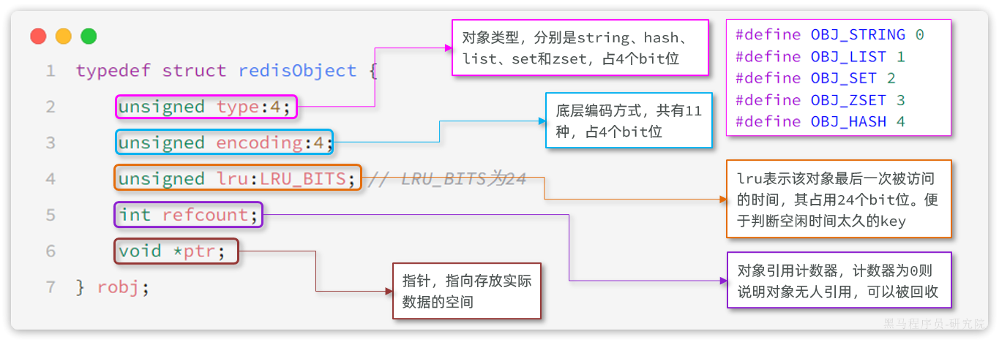

可以看到整个结构体中并不包含真实的数据，仅仅是对象头信息，内存占用的大小为4+4+24+32+64 = 128bit

也就是16字节，然后指针`ptr`指针指向的才是真实数据存储的内存地址。所以RedisObject的内存开销是很大的。

属性中的`encoding`就是当前对象底层采用的**数据结构**或**编码方式**，可选的有11种之多：

| **编号** | **编码方式**            | **说明**               |
| :------- | :---------------------- | :--------------------- |
| 0        | OBJ_ENCODING_RAW        | raw编码动态字符串      |
| 1        | OBJ_ENCODING_INT        | long类型的整数的字符串 |
| 2        | OBJ_ENCODING_HT         | hash表（也叫dict）     |
| 3        | OBJ_ENCODING_ZIPMAP     | 已废弃                 |
| 4        | OBJ_ENCODING_LINKEDLIST | 双端链表               |
| 5        | OBJ_ENCODING_ZIPLIST    | 压缩列表               |
| 6        | OBJ_ENCODING_INTSET     | 整数集合               |
| 7        | OBJ_ENCODING_SKIPLIST   | 跳表                   |
| 8        | OBJ_ENCODING_EMBSTR     | embstr编码的动态字符串 |
| 9        | OBJ_ENCODING_QUICKLIST  | 快速列表               |
| 10       | OBJ_ENCODING_STREAM     | Stream流               |
| 11       | OBJ_ENCODING_LISTPACK   | 紧凑列表               |

Redis中的5种不同的数据类型采用的底层数据结构和编码方式如下：

| **数据类型** | **编码方式**                                                 |
| :----------- | :----------------------------------------------------------- |
| STRING       | `int`、`embstr`、`raw`                                       |
| LIST         | `LinkedList和ZipList`(3.2以前)、`QuickList`（3.2以后）       |
| SET          | `intset`、`HT`                                               |
| ZSET         | `ZipList`（7.0以前）、`Listpack`（7.0以后）、`HT`、`SkipList` |
| HASH         | `ZipList`（7.0以前）、`Listpack`（7.0以后）、`HT`            |


## 4.2.SkipList

SkipList的特点： 

- 跳跃表是一个有序的双向链表 
- 每个节点都可以包含多层指针,层数是1到32之间的随机数 
- 不同层指针到下一个节点的跨度不同，层级越高，跨度越大 
- 增删改查效率与红黑树基本一致，实现却更简单。但空间复杂度更高

SkipList（跳表）首先是链表，但与传统链表相比有几点差异：

- 元素按照升序排列存储
- 节点可能包含多个指针，指针跨度不同。

传统链表只有指向前后元素的指针，因此只能顺序依次访问。如果查找的元素在链表中间，查询的效率会比较低。而SkipList则不同，它内部包含跨度不同的多级指针，可以让我们跳跃查找链表中间的元素，效率非常高。

其结构如图：

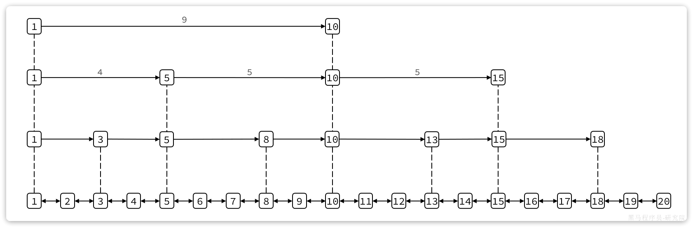

我们可以看到1号元素就有指向3、5、10的多个指针，查询时就可以跳跃查找。例如我们要找大小为14的元素，查找的流程是这样的：

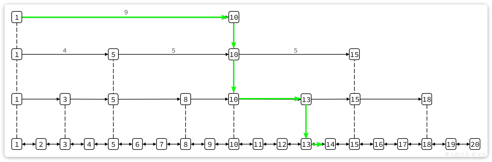

- 首先找元素1节点最高级指针，也就是4级指针，起始元素大小为1，指针跨度为9，可以判断出目标元素大小为10。由于14比10大，肯定要从10这个元素向下接着找。
- 找到10这个元素，发现10这个元素的最高级指针跨度为5，判断出目标元素大小为15，大于14，需要判断下级指针
- 10这个元素的2级指针跨度为3，判断出目标元素为13，小于14，因此要基于元素13接着找
- 13这个元素最高级级指针跨度为2，判断出目标元素为15，比14大，需要判断下级指针。
- 13的下级指针跨度为1，因此目标元素是14，刚好于目标一致，找到。

这种多级指针的查询方式就避免了传统链表的逐个遍历导致的查询效率下降问题。在对有序数据做随机查询和排序时效率非常高。

跳表的结构体如下：

```C
typedef struct zskiplist {
    // 头尾节点指针
    struct zskiplistNode *header, *tail;
    // 节点数量
    unsigned long length;
    // 最大的索引层级
    int level;
} zskiplist;
```

可以看到SkipList主要属性是header和tail，也就是头尾指针，因此它是支持双向遍历的。

跳表中节点的结构体如下：

```C
typedef struct zskiplistNode {
    sds ele; // 节点存储的字符串
    double score;// 节点分数，排序、查找用
    struct zskiplistNode *backward; // 前一个节点指针
    struct zskiplistLevel {
        struct zskiplistNode *forward; // 下一个节点指针
        unsigned long span; // 索引跨度
    } level[]; // 多级索引数组
} zskiplistNode;
```

每个节点中都包含ele和score两个属性，其中score是得分，也就是节点排序的依据。ele则是节点存储的字符串数据指针。

其内存结构如下：

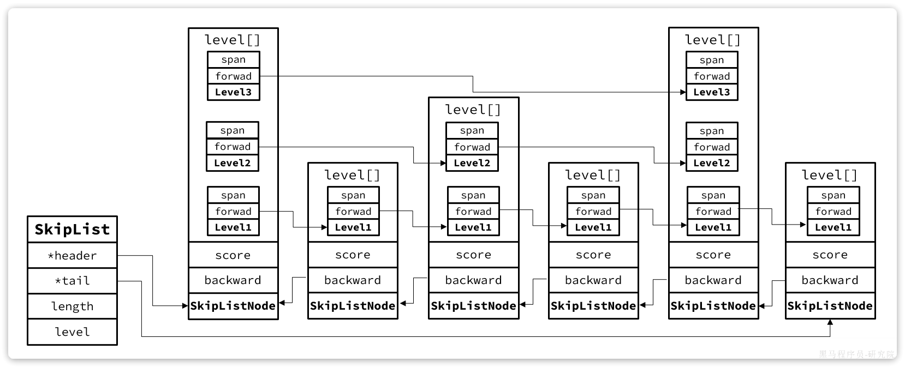

## 4.3.SortedSet

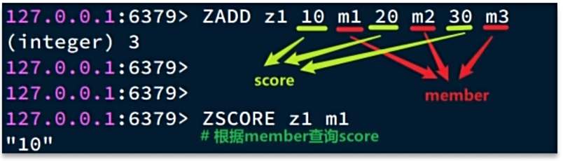

**面试题**：Redis的`SortedSet`底层的数据结构是怎样的？

**答**：SortedSet是有序集合，底层的存储的每个数据都包含element和score两个值。score是得分，element则是字符串值。SortedSet会根据每个element的score值排序，形成有序集合。

- 每组数据都包含score和member
- member唯一
- 可根据score排序

它支持的操作很多，比如：

- 根据element查询score值
- 按照score值升序或降序查询element

要实现根据element查询对应的score值，就必须实现element与score之间的键值映射。SortedSet底层是基于**HashTable**来实现的。

要实现对score值排序，并且查询效率还高，就需要有一种高效的有序数据结构，SortedSet是基于**跳表**实现的。

加分项：因为SortedSet底层需要用到两种数据结构，对内存占用比较高。因此Redis底层会对SortedSet中的元素大小做判断。如果**元素大小****小于128**且**每个元素都小于64字节**，SortedSet底层会采用**ZipList**，也就是**压缩列**表来代替**HashTable**和**SkipList**

不过，`ZipList`存在连锁更新问题，因此而在Redis7.0版本以后，`ZipList`又被替换为**Listpack**（紧凑列表）。

Redis源码中`zset`，也就是`SortedSet`的结构体如下：

```C
typedef struct zset {
    dict *dict; // dict，底层就是HashTable
    zskiplist *zsl; // 跳表
} zset;
```

其内存结构如图：

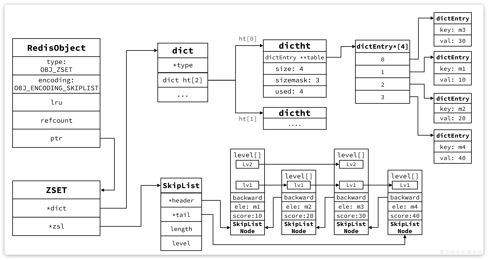

# 5.Redis内存回收

Redis之所以性能强，最主要的原因就是基于内存存储。然而单节点的Redis其内存大小不宜过大，会影响持久化或主从同步性能。

我们可以通过修改redis.conf文件，添加下面的配置来配置Redis的最大内存：

```Properties
maxmemory 1gb
```

当内存达到上限，就无法存储更多数据了。因此，Redis内部会有两套内存回收的策略：

- 内存过期策略
- 内存淘汰策略

## 5.1.内存过期处理

存入Redis中的数据可以配置过期时间，到期后再次访问会发现这些数据都不存在了，也就是被过期清理了。

### 5.1.1.过期命令

Redis中通过`expire`命令可以给KEY设置`TTL`（过期时间），例如：

```Bash
# 写入一条数据
set num 123
# 设置20秒过期时间
expire num 20
```

不过set命令本身也可以支持过期时间的设置：

```Shell
# 写入一条数据并设置20s过期时间
set num EX 20
```

当过期时间到了以后，再去查询数据，会发现数据已经不存在。 

### 5.1.2.过期策略

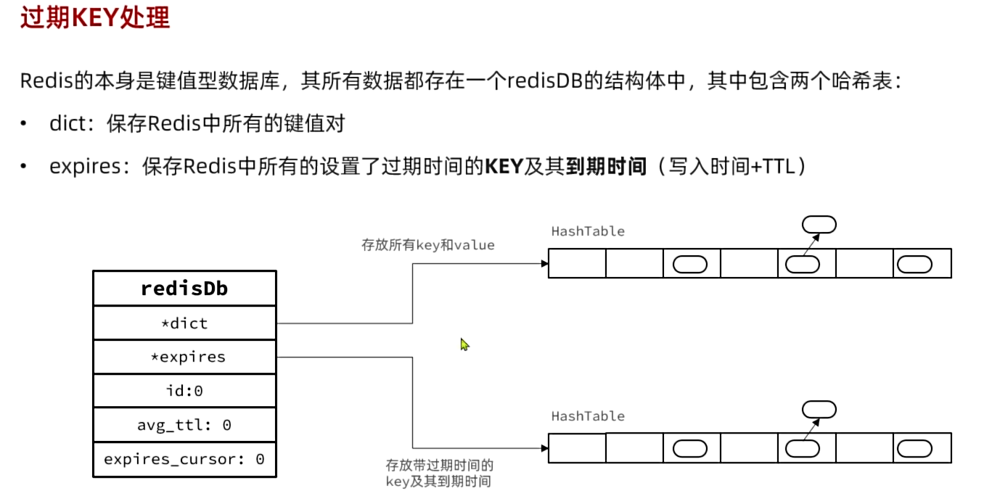

那么问题来了：

- Redis如何判断一个KEY是否过期呢？
- Redis又是何时删除过期KEY的呢？

Redis不管有多少种数据类型，本质是一个`KEY-VALUE`的键值型数据库，而这种键值映射底层正式基于HashTable来实现的，在Redis中叫做Dict.

来看下RedisDB的底层源码：

```C
typedef struct redisDb {
    dict dict;                 / The keyspace for this DB , 也就是存放KEY和VALUE的哈希表*/
    dict *expires;              /* 同样是哈希表，但保存的是设置了TTL的KEY，及其到期时间*/
    dict *blocking_keys;        /* Keys with clients waiting for data (BLPOP)*/
    dict *ready_keys;           /* Blocked keys that received a PUSH */
    dict *watched_keys;         /* WATCHED keys for MULTI/EXEC CAS /
    int id;                     / Database ID, 0 ~ 15 /
    long long avg_ttl;          / Average TTL, just for stats /
    unsigned long expires_cursor; / Cursor of the active expire cycle. */
    list *defrag_later;         /* List of key names to attempt to defrag one by one, gradually. */
} redisDb;
```

现在回答第一个问题：

**面试题**：Redis如何判断KEY是否过期呢？

**答**：在Redis中会有两个Dict，也就是HashTable，其中一个记录KEY-VALUE键值对，另一个记录KEY和过期时间。要判断一个KEY是否过期，只需要到记录过期时间的Dict中根据KEY查询即可。

Redis是何时删除过期KEY的呢？

Redis并不会在KEY过期时立刻删除KEY，因为要实现这样的效果就必须给每一个过期的KEY设置时钟，并监控这些KEY的过期状态。无论对CPU还是内存都会带来极大的负担。

Redis的过期KEY删除策略有两种：

- 惰性删除
- 周期删除

**惰性删除**，顾明思议就是过期后不会立刻删除。那在什么时候删除呢？

Redis会在每次访问KEY的时候判断当前KEY有没有设置过期时间，如果有，过期时间是否已经到期。对应的源码如下：

```C
// db.c
// 寻找要执行写操作的key
robj *lookupKeyWriteWithFlags(redisDb *db, robj *key, int flags) {
    // 检查key是否过期，如果过期则删除
    expireIfNeeded(db,key);
    return lookupKey(db,key,flags);
}

// 寻找要执行读操作的key
robj *lookupKeyReadWithFlags(redisDb *db, robj *key, int flags) {
    robj *val;
    // 检查key是否过期，如果过期则删除
    if (expireIfNeeded(db,key) == 1) {
        // 略 ...
    }
    val = lookupKey(db,key,flags);
    if (val == NULL)
        goto keymiss;
    server.stat_keyspace_hits++;
    return val;
}
```

**周期删除**：顾明思议是通过一个定时任务，周期性的抽样部分过期的key，然后执行删除。

执行周期有两种：

- **SLOW模式：**Redis会设置一个定时任务`serverCron()`，按照`server.hz`的频率来执行过期key清理
- **FAST模式：**Redis的每个事件循环前执行过期key清理（事件循环就是NIO事件处理的循环）。

**SLOW**模式规则：

- ① 执行频率受`server.hz`影响，默认为10，即每秒执行10次，每个执行周期100ms。
- ② 执行清理耗时不超过一次执行周期的25%，即25ms.
- ③ 逐个遍历db，逐个遍历db中的bucket，抽取20个key判断是否过期
- ④ 如果没达到时间上限（25ms）并且过期key比例大于10%，再进行一次抽样，否则结束

**FAST**模式规则（过期key比例小于10%不执行）：

- ① 执行频率受`beforeSleep()`调用频率影响，但两次FAST模式间隔不低于2ms
- ② 执行清理耗时不超过1ms
- ③ 逐个遍历db，逐个遍历db中的bucket，抽取20个key判断是否过期
- ④ 如果没达到时间上限（1ms）并且过期key比例大于10%，再进行一次抽样，否则结束

## 5.2.内存淘汰策略

对于某些特别依赖于Redis的项目而言，仅仅依靠过期KEY清理是不够的，内存可能很快就达到上限。因此Redis允许设置内存告警阈值，当内存使用达到阈值时就会主动挑选部分KEY删除以释放更多内存。这叫做**内存淘汰**机制。

### 5.2.1.内存淘汰时机

那么问题来了，当内存达到阈值时执行内存淘汰，但问题是Redis什么时候会执去判断内存是否达到预警呢？

Redis每次执行任何命令时，都会判断内存是否达到阈值：

```C
// server.c中处理命令的部分源码
int processCommand(client *c) {
    // ... 略
    if (server.maxmemory && !server.lua_timedout) {
        // 调用performEvictions()方法尝试进行内存淘汰
        int out_of_memory = (performEvictions() == EVICT_FAIL);
        // ... 略
        if (out_of_memory && reject_cmd_on_oom) {
            // 如果内存依然不足，直接拒绝命令
            rejectCommand(c, shared.oomerr);
            return C_OK;
        }
    }
}
```

### 5.2.2.淘汰策略

好了，知道什么时候尝试淘汰了，那具体Redis是如何判断该淘汰哪些`Key`的呢？

Redis支持8种不同的内存淘汰策略：

- `noeviction`： 不淘汰任何key，但是内存满时不允许写入新数据，默认就是这种策略。
- `volatile``-ttl`： 对设置了TTL的key，比较key的剩余TTL值，TTL越小越先被淘汰
- `allkeys``-random`：对全体key ，随机进行淘汰。也就是直接从db->dict中随机挑选
- `volatile-random`：对设置了TTL的key ，随机进行淘汰。也就是从db->expires中随机挑选。
- `allkeys-lru`： 对全体key，基于LRU算法进行淘汰
- `volatile-lru`： 对设置了TTL的key，基于LRU算法进行淘汰
- `allkeys-lfu`： 对全体key，基于LFU算法进行淘汰
- `volatile-lfu`： 对设置了TTL的key，基于LFI算法进行淘汰

比较容易混淆的有两个算法：

- **LRU**（**`L`**`east `**`R`**`ecently `**`U`**`sed`），最近最久未使用。用当前时间减去最后一次访问时间，这个值越大则淘汰优先级越高。
- **LFU**（**`L`**`east `**`F`**`requently `**`U`**`sed`），最少频率使用。会统计每个key的访问频率，值越小淘汰优先级越高。

Redis怎么知道某个KEY的`最近一次访问时间`或者是`访问频率`呢？

还记不记得之前讲过的RedisObject的结构？

回忆一下：


其中的`lru`就是记录最近一次访问时间和访问频率的。当然，你选择`LRU`和`LFU`时的记录方式不同：

- **LRU**：以秒为单位记录最近一次访问时间，长度24bit
- **LFU**：高16位以分钟为单位记录最近一次访问时间，低8位记录逻辑访问次数

时间就不说了，那么逻辑访问次数又是怎么回事呢？8位无符号数字最大才255，访问次数超过255怎么办？

这就要聊起Redis的**逻辑访问次数**算法了，LFU的访问次数之所以叫做**逻辑访问次数**，是因为并不是每次key被访问都计数，而是通过运算：

- ① 生成`[0,1)`之间的随机数`R`
- ② 计算 `1/(``旧次数`` * lfu_log_factor + 1)`，记录为`P`， `lfu_log_factor`默认为10
- ③ 如果 `R` < `P `，则计数器 `+1`，且最大不超过255
- ④ 访问次数会随时间衰减，距离上一次访问时间每隔 `lfu_decay_time` 分钟(默认1) ，计数器`-1`

显然LFU的基于访问频率的统计更符合我们的淘汰目标，因此**官方推荐使用LFU算法。**

算法我们弄明白了，不过这里大家要注意一下：Redis中的`KEY`可能有数百万甚至更多，每个KEY都有自己访问时间或者逻辑访问次数。我们要找出时间最早的或者访问次数最小的，难道要把Redis中**所有数据排序**？

要知道Redis的内存淘汰是在每次执行命令时处理的。如果每次执行命令都先对全量数据做内存排序，那命令的执行时长肯定会非常长，这是不现实的。

所以Redis采取的是**抽样法**，即每次抽样一定数量（`maxmemory_smples`）的key，然后基于内存策略做排序，找出淘汰优先级最高的，删除这个key。这就导致Redis的算法并不是真正的**LRU**，而是一种基于抽样的**近似LRU算法**。

不过，在Redis3.0以后改进了这个算法，引入了一个淘汰候选池，抽样的key要与候选池中的key比较淘汰优先级，优先级更高的才会被放入候选池。然后在候选池中找出优先级最高的淘汰掉，这就使算法的结果更接近与真正的LRU算法了。特别是在抽样值较高的情况下（例如10），可以达到与真正的LRU接近的效果。

这也是官方给出的真正LRU与近似LRU的结果对比：

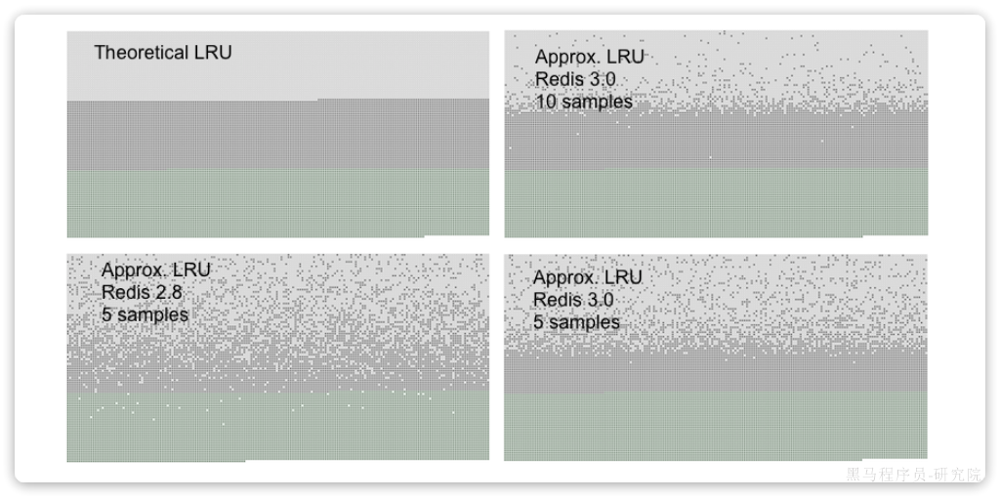

你可以在图表中看到三种颜色的点形成三个不同的带，每个点就是一个加入的`KEY`。

- 浅灰色带是被驱逐的对象
- 灰色带是没有被驱逐的对象
- 绿色带是被添加的对象

## 5.3.总结

**面试题**：**Redis如何判断KEY是否过期呢？**

**答**：在Redis中会有两个Dict，也就是HashTable，其中一个记录KEY-VALUE键值对，另一个记录KEY和过期时间。要判断一个KEY是否过期，只需要到记录过期时间的Dict中根据KEY查询即可。

**面试题**：**Redis何时删除过期KEY？如何删除？**

**答**：Redis的过期KEY处理有两种策略，分别是惰性删除和周期删除。

**惰性删除**是指在每次用户访问某个KEY时，判断KEY的过期时间：如果过期则删除；如果未过期则忽略。

**周期删除**有两种模式：

- **SLOW**模式：通过一个定时任务，定期的抽样部分带有TTL的KEY，判断其是否过期。默认情况下定时任务的执行频率是每秒10次，但每次执行不能超过25毫秒。如果执行抽样后发现时间还有剩余，并且过期KEY的比例较高，则会多次抽样。
- **FAST**模式：在Redis每次处理NIO事件之前，都会抽样部分带有TTL的KEY，判断是否过期，因此执行频率较高。但是每次执行时长不能超过1ms，如果时间充足并且过期KEY比例过高，也会多次抽样

**面试题**：**当Redis****内存****不足时会怎么做**？

**答**：这取决于配置的内存淘汰策略，Redis支持很多种内存淘汰策略，例如LRU、LFU、Random. 但默认的策略是直接拒绝新的写入请求。而如果设置了其它策略，则会在每次执行命令后判断占用内存是否达到阈值。如果达到阈值则会基于配置的淘汰策略尝试进行内存淘汰，直到占用内存小于阈值为止。

**面试题**：**那你能聊聊****LRU****和****LFU****吗**？

**答**：`LRU`是最近最久未使用。Redis的Key都是RedisObject，当启用LRU算法后，Redis会在Key的头信息中使用24个bit记录每个key的最近一次使用的时间`lru`。每次需要内存淘汰时，就会抽样一部分KEY，找出其中空闲时间最长的，也就是`now - lru`结果最大的，然后将其删除。如果内存依然不足，就重复这个过程。

由于采用了抽样来计算，这种算法只能说是一种近似LRU算法。因此在Redis4.0以后又引入了`LFU`算法，这种算法是统计最近最少使用，也就是按key的访问频率来统计。当启用LFU算法后，Redis会在key的头信息中使用24bit记录最近一次使用时间和逻辑访问频率。其中高16位是以分钟为单位的最近访问时间，后8位是逻辑访问次数。与LFU类似，每次需要内存淘汰时，就会抽样一部分KEY，找出其中逻辑访问次数最小的，将其淘汰。

**面试题**：**逻辑访问次数是如何计算的**？

**答**：由于记录访问次数的只有`8bit`，即便是无符号数，最大值只有255，不可能记录真实的访问次数。因此Redis统计的其实是逻辑访问次数。这其中有一个计算公式，会根据当前的访问次数做计算，结果要么是次数`+1`，要么是次数不变。但随着当前访问次数越大，`+1`的概率也会越低，并且最大值不超过255.

除此以外，逻辑访问次数还有一个衰减周期，默认为1分钟，即每隔1分钟逻辑访问次数会`-1`。这样逻辑访问次数就能基本反映出一个`key`的访问热度了。

# 6.缓存问题

Redis经常被用作缓存，而缓存在使用的过程中存在很多问题需要解决。例如：

- 缓存的数据一致性问题
- 缓存击穿
- 缓存穿透
- 缓存雪崩

## 6.1.缓存一致性

我们先看下目前企业用的最多的缓存模型。缓存的通用模型有三种：

- `Cache Aside`：有缓存调用者自己维护数据库与缓存的一致性。即：
  - 查询时：命中则直接返回，未命中则查询数据库并写入缓存
  - 更新时：更新数据库并删除缓存，查询时自然会更新缓存
- `Read/Write Through`：数据库自己维护一份缓存，底层实现对调用者透明。底层实现：
  - 查询时：命中则直接返回，未命中则查询数据库并写入缓存
  - 更新时：判断缓存是否存在，不存在直接更新数据库。存在则更新缓存，同步更新数据库
- `Write Behind Cahing`：读写操作都直接操作缓存，由线程异步的将缓存数据同步到数据库

目前企业中使用最多的就是`Cache Aside`模式，因为实现起来非常简单。但缺点也很明显，就是无法保证数据库与缓存的强一致性。为什么呢？我们一起来分析一下。

`Cache Aside`的写操作是要在更新数据库的同时删除缓存，那为什么不选择更新数据库的同时更新缓存，而是删除呢？

原因很简单，假如一段时间内无人查询，但是有多次更新，那这些更新都属于无效更新。采用删除方案也就是延迟更新，什么时候有人查询了，什么时候更新。

那到底是先更新数据库再删除缓存，还是先删除缓存再更新数据库呢？

现在假设有两个线程，一个来更新数据，一个来查询数据。我们分别分析两种策略的表现。

我们先分析策略1，先更新数据库再删除缓存：

**正常情况**

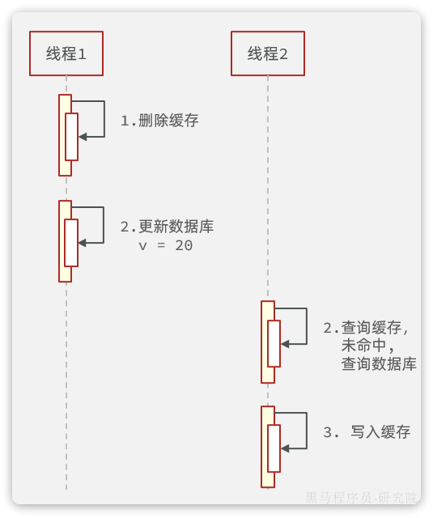

**异常情况**

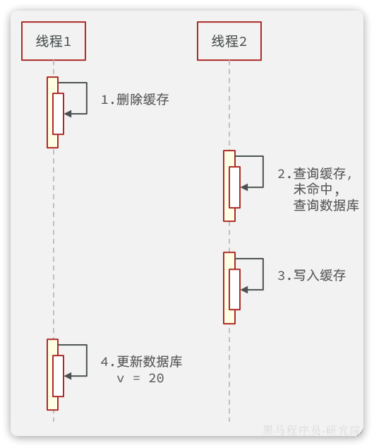

异常情况说明：

- 线程1删除缓存后，还没来得及更新数据库，
- 此时线程2来查询，发现缓存未命中，于是查询数据库，写入缓存。由于此时数据库尚未更新，查询的是旧数据。也就是说刚才的删除白删了，缓存又变成旧数据了。
- 然后线程1更新数据库，此时数据库是新数据，缓存是旧数据

由于更新数据库的操作本身比较耗时，在期间有线程来查询数据库并更新缓存的概率非常高。因此不推荐这种方案。

再来看策略2，先更新数据库再删除缓存：

**正常情况**

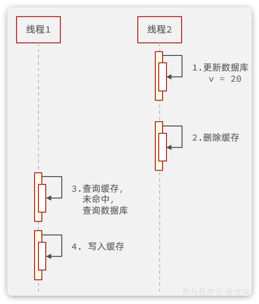

**异常情况**

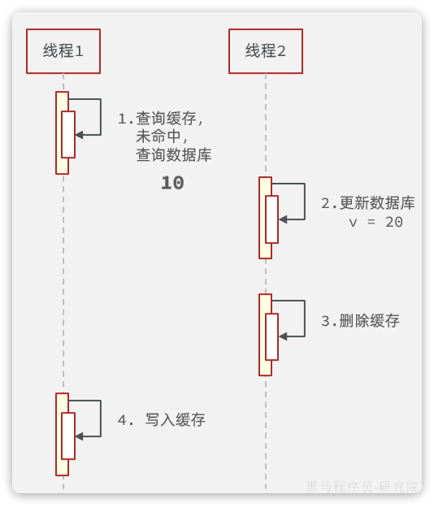

异常情况说明：

- 线程1查询缓存未命中，于是去查询数据库，查询到旧数据
- 线程1将数据写入缓存之前，线程2来了，更新数据库，删除缓存
- 线程1执行写入缓存的操作，写入旧数据

可以发现，异常状态发生的概率极为苛刻，线程1必须是查询数据库已经完成，但是缓存尚未写入之前。线程2要完成更新数据库同时删除缓存的两个操作。要知道线程1执行写缓存的速度在毫秒之间，速度非常快，在这么短的时间要完成数据库和缓存的操作，概率非常之低。

**综上**，添加缓存的目的是为了提高系统性能，而你要付出的代价就是缓存与数据库的强一致性。如果你要求数据库与缓存的强一致，那就需要加锁避免并行读写。但这就降低了性能，与缓存的目标背道而驰。

因此不管任何缓存同步方案最终的目的都是尽可能保证最终一致性，降低发生不一致的概率。我们采用先更新数据库再删除缓存的方案，已经将这种概率降到足够低，目的已经达到了。

同时我们还要给缓存加上过期时间，一旦发生缓存不一致，当缓存过期后会重新加载，数据最终还是能保证一致。这就可以作为一个兜底方案。

## 6.2.缓存穿透

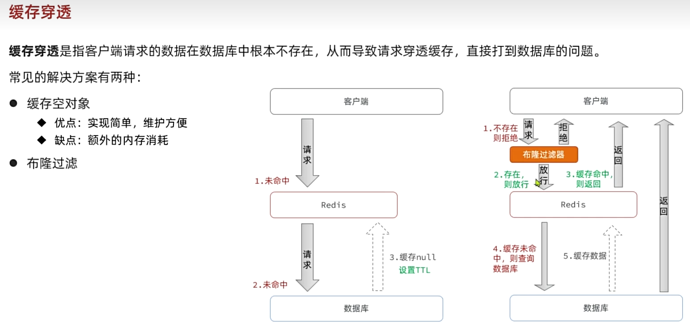

什么是缓存穿透呢？

我们知道，当请求查询缓存未命中时，需要查询数据库以加载缓存。但是大家思考一下这样的场景：

> 如果我访问一个数据库中也不存在的数据。会出现什么现象？

由于数据库中不存在该数据，那么缓存中肯定也不存在。因此不管请求该数据多少次，缓存永远不可能建立，请求永远会直达数据库。

假如有不怀好意的人，开启很多线程频繁的访问一个数据库中也不存在的数据。由于缓存不可能生效，那么所有的请求都访问数据库，可能就会导致数据库因过高的压力而宕机。

解决这个问题有两种思路：

- 缓存空值
- 布隆过滤器

### 6.2.1.缓存空值

简单来说，就是当我们发现请求的数据即不存在与缓存，也不存在与数据库时，将空值缓存到Redis，避免频繁查询数据库。实现思路如下：

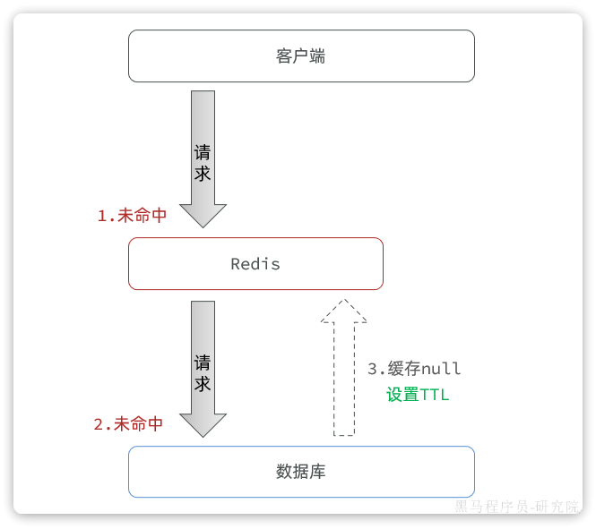

优点：

- 实现简单，维护方便

缺点：

- 额外的内存消耗

### 6.2.2.布隆过滤器

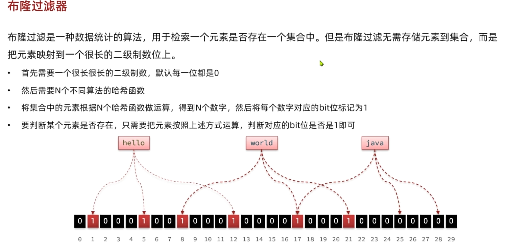

布隆过滤是一种数据统计的算法，用于检索一个元素是否存在一个集合中。

一般我们判断集合中是否存在元素，都会先把元素保存到类似于树、哈希表等数据结构中，然后利用这些结构查询效率高的特点来快速匹配判断。但是随着元素数量越来越多，这种模式对内存的占用也越来越大，检索的速度也会越来越慢。而布隆过滤的内存占用小，查询效率却很高。

布隆过滤首先需要一个很长的bit数组，默认数组中每一位都是0. 

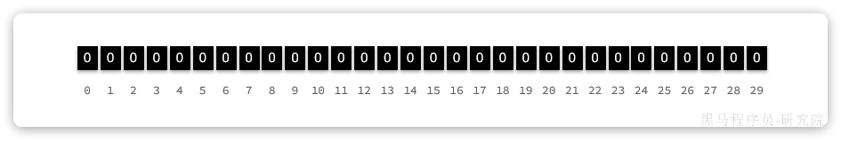

然后还需要`K`个`hash`函数，将元素基于这些hash函数做运算的结果映射到bit数组的不同位置，并将这些位置置为1，例如现在k=3：

- `hello`经过运算得到3个角标：1、5、12
- `world`经过运算得到3个角标：8、17、21
- `java`经过运算得到3个角标：17、25、28

则需要将每个元素对应角标位置置为1：

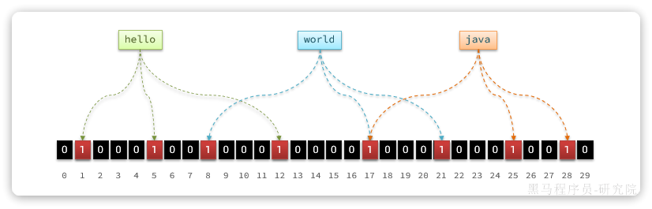

此时，我们要判断元素是否存在，只需要再次基于`K`个`hash`函数做运算， 得到`K`个角标，判断每个角标的位置是不是1：

- 只要全是1，就证明元素存在
- 任意位置为0，就证明元素一定不存在

假如某个元素本身并不存在，也没添加到布隆过滤器过。但是由于存在hash碰撞的可能性，这就会出现这个元素计算出的角标已经被其它元素置为1的情况。那么这个元素也会被误判为已经存在。

因此，布隆过滤器的判断存在误差：

- 当布隆过滤器认为元素不存在时，它**肯定不存在**
- 当布隆过滤器认为元素存在时，它**可能存在，也可能不存在**

当`bit`数组越大、`Hash`函数`K`越复杂，`K`越大时，这个误判的概率也就越低。由于采用`bit`数组来标示数据，即便`4,294,967,296`个`bit`位，也只占`512mb`的空间

我们可以把数据库中的数据利用布隆过滤器标记出来，当用户请求缓存未命中时，先基于布隆过滤器判断。如果不存在则直接拒绝请求，存在则去查询数据库。尽管布隆过滤存在误差，但一般都在0.01%左右，可以大大减少数据库压力。

使用布隆过滤后的流程如下：

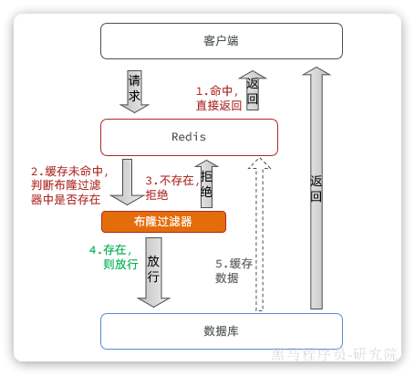

## 6.3.缓存雪崩

缓存雪崩是指在同一时段大量的缓存key同时失效或者Redis服务宕机，导致大量请求到达数据库，带来巨大压力。

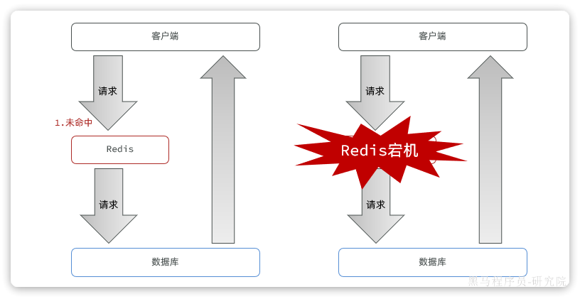

常见的解决方案有：

- 给不同的Key的TTL添加随机值，这样KEY的过期时间不同，不会大量KEY同时过期
- 利用Redis集群提高服务的可用性，避免缓存服务宕机
- 给缓存业务添加降级限流策略
- 给业务添加多级缓存，比如先查询本地缓存，本地缓存未命中再查询Redis，Redis未命中再查询数据库。即便Redis宕机，也还有本地缓存可以抗压力

## 6.4.缓存击穿

**缓存击穿**问题也叫**热点Key**问题，就是一个被高并发访问并且缓存重建业务较复杂的key突然失效了，无数的请求访问会在瞬间给数据库带来巨大的冲击。

由于我们采用的是`Cache Aside`模式，当缓存失效时需要下次查询时才会更新缓存。当某个key缓存失效时，如果这个key是热点key，并发访问量比较高。就会在一瞬间涌入大量请求，都发现缓存未命中，于是都会去查询数据库，尝试重建缓存。可能一瞬间就把数据库压垮了。

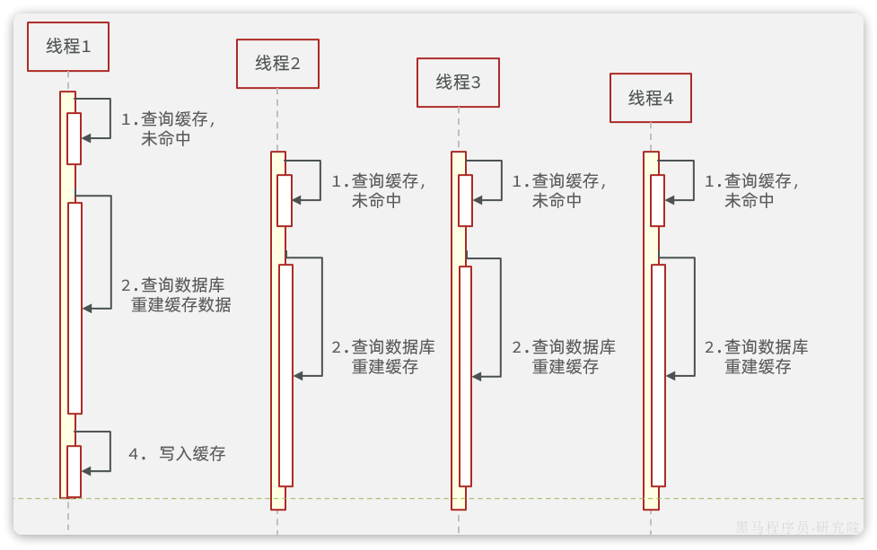

如上图所示：

- 线程1发现缓存未命中，准备查询数据库，重建缓存，但是因为数据比较复杂，导致查询数据库耗时较久
- 在这个过程中，一下次来了3个新的线程，就都会发现缓存未命中，都去查询数据库
- 数据库压力激增

常见的解决方案有两种：

- 互斥锁：给重建缓存逻辑加锁，避免多线程同时指向
- 逻辑过期：热点key不要设置过期时间，在活动结束后手动删除。

基于互斥锁的方案如图：

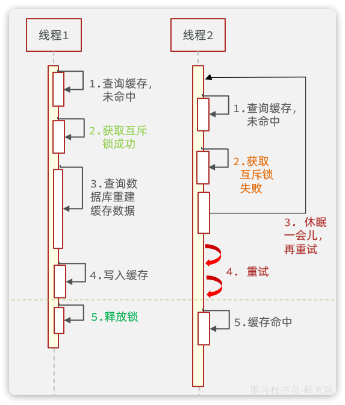

逻辑过期的思路如图：

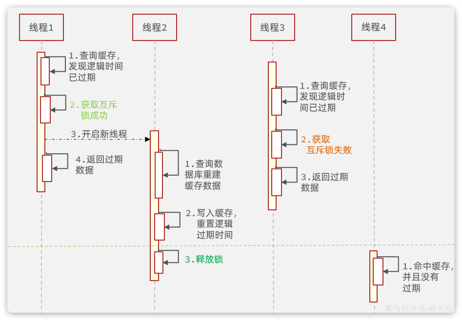

## 6.5.面试总结

**面试题**：**如何保证缓存的****双写一致性**？

**答**：缓存的双写一致性很难保证强一致，只能尽可能降低不一致的概率，确保最终一致。我们项目中采用的是`Cache Aside`模式。简单来说，就是在更新数据库之后删除缓存；在查询时先查询缓存，如果未命中则查询数据库并写入缓存。同时我们会给缓存设置过期时间作为兜底方案，如果真的出现了不一致的情况，也可以通过缓存过期来保证最终一致。

**追问**：为什么不采用延迟双删机制？

**答**：延迟双删的第一次删除并没有实际意义，第二次采用延迟删除主要是解决数据库主从同步的延迟问题，我认为这是数据库主从的一致性问题，与缓存同步无关。既然主节点数据已经更新，Redis的缓存理应更新。而且延迟双删会增加缓存业务复杂度，也没能完全避免缓存一致性问题，投入回报比太低。

**面试题**：**如何解决缓存穿透问题**？

**答**：缓存穿透也可以说是穿透攻击，具体来说是因为请求访问到了数据库不存在的值，这样缓存无法命中，必然访问数据库。如果高并发的访问这样的接口，会给数据库带来巨大压力。

我们项目中都是基于布隆过滤器来解决缓存穿透问题的，当缓存未命中时基于布隆过滤器判断数据是否存在。如果不存在则不去访问数据库。

当然，也可以使用缓存空值的方式解决，不过这种方案比较浪费内存。

**面试题**：**如何解决缓存雪崩问题**？

**答**：缓存雪崩的常见原因有两个，第一是因为大量key同时过期。针对问这个题我们可以可以给缓存key设置不同的TTL值，避免key同时过期。

第二个原因是Redis宕机导致缓存不可用。针对这个问题我们可以利用集群提高Redis的可用性。也可以添加多级缓存，当Redis宕机时还有本地缓存可用。

**面试题**：**如何解决缓存击穿问题**？

**答**：缓存击穿往往是由热点Key引起的，当热点Key过期时，大量请求涌入同时查询，发现缓存未命中都会去访问数据库，导致数据库压力激增。解决这个问题的主要思路就是避免多线程并发去重建缓存，因此方案有两种。

第一种是基于互斥锁，当发现缓存未命中时需要先获取互斥锁，再重建缓存，缓存重建完成释放锁。这样就可以保证缓存重建同一时刻只会有一个线程执行。不过这种做法会导致缓存重建时性能下降严重。

第二种是基于逻辑过期，也就是不给热点Key设置过期时间，而是给数据添加一个过期时间的字段。这样热点Key就不会过期，缓存中永远有数据。

查询到数据时基于其中的过期时间判断key是否过期，如果过期开启独立新线程异步的重建缓存，而查询请求先返回旧数据即可。当然，这个过程也要加互斥锁，但由于重建缓存是异步的，而且获取锁失败也无需等待，而是返回旧数据，这样性能几乎不受影响。

需要注意的是，无论是采用哪种方式，在获取互斥锁后一定要再次判断缓存是否命中，做dubbo check. 因为当你获取锁成功时，可能是在你之前有其它线程已经重建缓存了。

# CAP

## 核心要素

**✅ 一致性 (Consistency)**

- **定义**：所有节点在同一时刻看到的数据都是**最新**且**相同**的。
- **通俗理解**：就像你去 ATM 机取钱，无论你在哪个城市的 ATM 机操作，取款成功后，你账户里的余额在银行的所有系统中都应该立刻减少相应的金额。没有任何延迟，没有任何偏差。
- **注意**：CAP 中的 C 指的是**强一致性**（线性一致性），而不是最终一致性。

**✅ 可用性 (Availability)**

- **定义**：系统中的每个请求（无论是读还是写），都能在**有限的时间内**得到**非错误**的响应。
- **通俗理解**：只要系统没死，用户发来的请求，服务器就必须响应。哪怕此时网络断了，服务器也要给个结果（哪怕是旧数据），而不能让用户一直转圈圈等待或者直接报错“服务不可用”。

**✅ 分区容忍性 (Partition Tolerance)**

- **定义**：系统在网络分区（即节点之间因为网络故障无法通信，被分割成孤立的区域）的情况下，仍然能够继续运行。
- **通俗理解**：比如机房断网，导致北京的服务器和上海的服务器断联了。具备 P 的系统，即使在这种“失联”状态下，两边的服务器依然能各自处理请求，不会整个系统瘫痪。

## 现实中的二选一：CP vs AP

既然三者不能兼得，而分布式系统的核心价值就是通过多台机器协同来处理海量数据和高并发，所以**网络分区（P）是不可避免的客观现实**。

> **核心结论**：在实际的分布式系统设计中，P 是必选项。因此，真正的选择题是在 **C** 和 **A** 之间二选一。

**🛡️ CP 模式（一致性和分区容忍性）**

- **策略**：当网络分区发生时，为了保证数据的一致性（C），系统宁愿牺牲一部分可用性（A）。
- **行为**：如果系统检测到网络分区（比如主从节点断连），它会**拒绝**部分请求（例如拒绝写入），或者让请求阻塞等待，直到网络恢复、数据同步完成，从而确保用户不会读到脏数据或旧数据。
- 适用场景：对数据准确性要求极高的系统。
  - **典型例子**：银行转账系统、ZooKeeper（分布式协调服务）、etcd。
  - **代价**：用户体验可能变差（比如转账时提示“系统繁忙，请稍后”），但保证了资金安全。

**AP 模式（可用性和分区容忍性）**

- **策略**：当网络分区发生时，为了保证系统始终可用（A），系统允许各节点数据暂时不一致（牺牲 C）。
- **行为**：即使网络断了，系统依然接收请求并返回结果。此时，不同用户可能看到不同的数据（例如库存显示不一致），但系统没有宕机。网络恢复后，系统会通过异步机制（如日志同步）让数据最终变得一致（最终一致性）。
- 适用场景：对系统可用性要求极高，能容忍短暂数据不一致的系统。
  - **典型例子**：电商网站的商品详情页（库存可能短暂不准）、社交网络（朋友圈点赞延迟）、Cassandra 数据库、Eureka 注册中心。
  - **代价**：数据可能不是最新的，但系统始终在线。

## BASE

BASE 理论是分布式系统设计中非常务实的一套指导原则。如果说 CAP 理论揭示了分布式系统的“不可能三角”，为我们划定了理论边界，那么 BASE 理论就是一条具体的“出路”，它指导我们如何在牺牲强一致性的前提下，构建出高可用、可扩展的大型互联网系统。

BASE 理论由 eBay 的架构师 Dan Pritchett 提出，它是对 CAP 理论中 AP（可用性与分区容忍性）路径的延伸和具体化。其核心思想是：**通过牺牲强一致性，来换取系统的高可用性与柔性可用**。

BASE 是三个核心概念的英文缩写：**基本可用 (Basically Available)**、**软状态 (Soft State)** 和 **最终一致性 (Eventually Consistent)**。

**基本可用**是对系统可用性的最低保障。它承认在复杂的分布式环境中，故障（如服务器宕机、网络波动）是常态。当系统遭遇不可预知的故障或流量洪峰时，它允许损失部分非核心功能的可用性，以确保核心功能的稳定运行。

这并非简单的“服务降级”，而是一种主动的、有策略的取舍。在工程实践中，通常通过以下四种方式实现：

1. **流量削峰**：通过分时段、分区域等手段，将瞬时涌入的海量请求错开，避免系统被瞬间压垮。例如，12306 购票系统分时段放票，或电商大促时的排队入场机制。
2. **延迟响应**：当系统负载过高时，将部分非紧急请求放入队列中异步处理，容忍响应时间的延长，但保证请求不会丢失或失败。例如，银行系统在业务高峰期将非实时交易转为批量处理。
3. **体验降级**：在保证核心流程（如下单、支付）畅通的前提下，暂时关闭或降低非核心功能的质量。例如，电商大促时，商品详情页的推荐系统、用户评论功能可能暂时不可用，或者图片分辨率降低以加快加载速度。
4. **过载保护**：通过限流、熔断等机制，主动拒绝超出系统处理能力的请求，防止系统因资源耗尽而彻底崩溃。

**软状态**是 BASE 理论中连接“基本可用”与“最终一致性”的桥梁。它指的是系统中的数据允许存在一种**中间状态**，并且这种状态不会影响系统整体的可用性。

在传统的 ACID 事务模型中，数据状态是“硬”的，要求时刻保持强一致。而在 BASE 理论中，系统被允许“暂时的不一致”。这种不一致是数据同步过程中的必然产物，尤其是在网络延迟、异步复制等场景下。

- **通俗理解**：就像你给朋友转账，你的银行 APP 上可能立刻显示“转账成功”，但朋友的账户里可能需要几秒钟才能收到款项。在这几秒钟内，系统就处于一种“软状态”——数据在全局上不一致，但这种不一致是被允许且暂时的。

**最终一致性**是 BASE 理论的最终目标。它定义了系统对数据一致性的承诺：系统不保证数据在任何时刻都保持强一致，但承诺在没有新的更新操作介入的情况下，经过一段合理的时间后，所有节点的数据副本最终会达到一致的状态。

这与 CAP 理论中的“一致性（C）”有本质区别。CAP 中的 C 指的是**强一致性**（即时一致性），而 BASE 追求的是**最终一致性**，它是一种特殊的**弱一致性**。

为了实现最终一致性，工程上通常采用以下几种修复机制：

1. **写时修复 (Write Repair)**：在写入数据时，检测并修复不一致的副本。例如，Cassandra 数据库的 Hinted Handoff 机制。
2. **读时修复 (Read Repair)**：在读取数据时，发现不同副本间的差异并进行修复。例如，当读取到旧数据时，触发后台进程更新该副本。
3. **异步修复 (Anti-Entropy)**：通过后台定时任务，定期对比和同步不同节点的数据，确保它们最终趋于一致。这类似于系统的“对账”过程。

## ACID

ACID 四大特性的详细讲解：

**1. 原子性 (Atomicity) —— “要么全有，要么全无”**

**核心定义**：事务是最小的逻辑单元，不可再分割。事务中的所有操作要么全部成功执行，要么全部不执行。

- **通俗理解**：就像化学中的原子是不可分割的最小单位一样，事务中的操作是一个整体。如果在转账过程中，扣款成功但收款失败，系统必须把扣款操作“回滚”（撤销），让一切恢复如初，绝不能出现“钱飞了”或者“钱变多了”的中间状态。
- **实现原理**：数据库通过 **Undo Log（回滚日志）** 来实现原子性。在事务修改数据之前，系统会先记录下数据修改前的状态。如果事务执行失败或被回滚，数据库就读取 Undo Log，将数据恢复到事务开始前的样子。

**2. 一致性 (Consistency) —— “数据必须合法”**

**核心定义**：事务执行前后，数据库必须从一个**合法状态**转换到另一个**合法状态**。

- **通俗理解**：这是 ACID 的**最终目标**。它要求数据必须符合预设的规则（如主键约束、外键约束、唯一性约束等）。例如，在银行转账中，无论发生什么，A 账户和 B 账户的总金额在转账前后必须保持不变；或者库存数量不能变成负数。
- **关键点**：一致性不仅仅靠数据库实现，它需要**应用层逻辑**和**数据库约束**共同来维护。原子性、隔离性和持久性都是为了保证一致性而存在的手段。

**3. 隔离性 (Isolation) —— “互不干扰”**

**核心定义**：当多个事务并发执行时，一个事务的操作不应影响其他事务，每个事务都感觉不到其他事务的存在，就像它是单独运行一样。

- **通俗理解**：就像你在银行柜台办理业务时，你的操作不应该受到旁边窗口那个人操作的影响。
- **解决的问题**：如果没有隔离性，高并发下会出现脏读（读到未提交的数据）、不可重复读（同一条数据读两次结果不一样）、幻读（两次查询结果集行数不一样）等问题。
- **实现原理**：数据库通过 **锁机制**（如行锁、表锁）和 **MVCC（多版本并发控制）** 来实现隔离性，确保事务之间相互隔离。

**4. 持久性 (Durability) —— “一旦提交，永不丢失”**

**核心定义**：一旦事务被成功提交（Commit），它对数据库的修改就是永久性的，即使系统发生崩溃、断电等故障，数据也不会丢失。

- **通俗理解**：就像你把文件“保存”到了硬盘里，即使突然拔掉电源，重启电脑后文件依然还在。
- **实现原理**：数据库通过 **Redo Log（重做日志）** 来实现持久性。当事务提交时，数据库会先将修改操作记录到 Redo Log 中（并刷入磁盘），然后再异步地将数据写入磁盘。如果系统崩溃，重启后数据库会读取 Redo Log，并“重放”这些操作，从而恢复丢失的数据。

# Redis是AP的还是CP的

单机版Redis不属于分布式系统，因此**不适用CAP理论**：

- 不存在网络分区(P)问题，CAP是分布式场景中的理论，如果单机Redis，那就没啥分布式可言了。P都没有了，还谈什么AP、CP呢？
- 在单机Redis中，因为只有一个实例，他的一致性是有保障的，具备强一致性，但单点故障时服务完全不可用。
- 本质上是CA系统，但因非分布式，严格来说不在CAP分类范围内。

## Redis Cluster（分布式Redis）：AP系统

Redis Cluster在设计上明确属于**AP系统**（可用性和分区容忍性）：

### 为什么是AP系统？

1. 异步复制机制：
   - 这是 Redis Cluster 成为 AP 系统的**基石**。
   - **工作流程**：当客户端向主节点写入数据时，主节点在本地写入成功后，会立即向客户端返回响应。随后，它通过**异步方式**将写命令发送给从节点。
   - 对 CAP 的影响：
     - **优先保证 A**：客户端无需等待从节点确认，响应速度快，系统可用性高。
     - **牺牲 C**：由于复制是异步的，在主节点写入成功但尚未同步到从节点的极短时间内，从节点的数据是旧的。如果此时主节点宕机，这部分未同步的数据就会丢失，导致数据不一致。
2. 网络分区（P）行为：
   - **继续服务**：如果网络分区导致集群分裂成多个部分，只要某个分区中包含了大多数槽位（majority of hash slots）和对应的主节点，该分区就会继续接受客户端的读写请求。
   - **明确选择 A**：它不会像 CP 系统那样，在检测到网络分区时阻塞所有请求以等待网络恢复，从而保证数据绝对一致。相反，Redis Cluster 选择继续提供服务，即使这意味着在分区期间可能存在数据不一致的风险。
3. 最终一致性模型：
   - **通过异步复制逐步收敛数据**
   - **不保证强一致性（如故障时可能丢失未同步的写入）。**Redis没办法保证强一致性的主要原因是，因为它的分布式设计中采用的是异步复制，这导致在节点之间存在数据同步延迟和不一致的可能性。也就是说，当某个节点上的数据发生改变时，Redis会将这个修改操作发送给其他节点进行同步，但由于网络传输的延迟等原因，这些操作不一定会立即被其他节点接收到和执行，这就可能导致节点之间存在数据不一致的情况。
   - 除此之外，Redis的一致性还受到了节点故障的影响。当一个节点宕机时,这个节点上的数据可能无法同步到其他节点,这就可能导致数据在节点之间的不一致。虽然Redis通过复制和哨兵等机制可以提高系统的可用性和容错性，但是这些机制并不能完全解决数据一致性问题。
   - Redis的一致性模型是**最终一致性**，即在某个时间点读取的数据可能并不是最新的，但最终会达到一致的状态。

## 3. WAIT命令的局限性

虽然Redis提供了WAIT命令（要求主节点等待N个副本确认写入），但它**不能将Redis转变为CP系统**

这一点在Redis的官网中自已明确的说

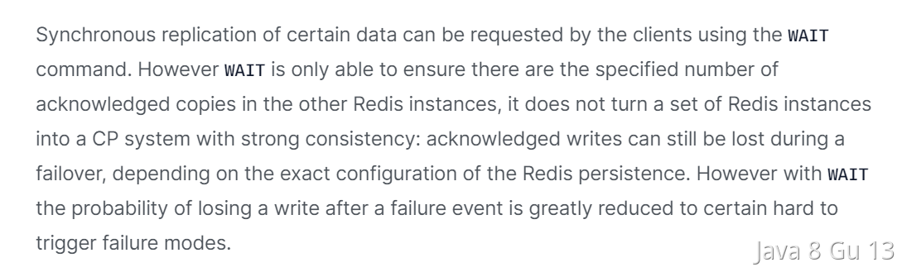

- 非原子性保证：副本确认后仍可能因故障回滚。
- 故障转移风险：旧主节点恢复后可能触发数据冲突
- Redis官方明确表示WAIT无法构建强一致系统，仅降低数据丢失概率
- 也就是说。客户端可以使用WAIT命令请求对特定数据进行同步复制。然而, WAIT 仅能确保数据在 Redis 实例中有指定数量的副本中被确认，它并不能将一组 Redis实例转变为具有强一致性的 CP 系统：在故障转移期间,已确认的写操作仍然可能会丢失,这取决于Redis持久化的具体配置。然而，使用 WAIT 后，在发生故障事件时丢失写操作的概率大大降低，只在某些难以触发的故障模式下才会发生。

## 4. 与真正CP系统的对比

| 特性         | Redis集群          | ZooKeeper(典型CP系统) |
| :----------- | :----------------- | :-------------------- |
| 数据同步方式 | 异步复制           | 原子广播(ZAB协议)     |
| 写入响应时机 | 主节点成功即返回   | 多数节点确认后返回    |
| 网络分区处理 | 继续服务，可能丢数 | 阻塞写入保一致性      |
| 一致性模型   | 最终一致           | 线性一致              |

## 5. 为什么会有"Redis是CP"的误解？

部分资料错误地将Redis归类为CP系统，主要原因：

1. **混淆单机与分布式**：单机Redis确实有强一致性，但不适用CAP理论
2. **误解主从复制**：认为主从复制保证了一致性，忽略了异步复制的本质
3. **混淆持久化与一致性**：将RDB/AOF持久化机制与分布式一致性混淆

## 6. 实际应用建议

- **缓存场景**：充分利用Redis的AP特性，接受短暂不一致换取高性能
- **关键业务**：强一致性需求建议结合关系型数据库，使用Redis作缓存层
- **分布式场景**：使用Redis Cluster时需设计容错机制，对一致性要求高的操作考虑WAIT命令（但需了解其局限性）

## 结论

Redis Cluster在CAP理论中明确属于**AP系统**，其设计优先保障高可用性和分区容忍性，通过异步复制实现最终一致性。开发者需要根据业务需求，在CAP之间找到合适的平衡点，必要时结合其他CP型组件构建混合架构。

# 介绍一下Redis的集群模式

Redis有三种主要的集群模式，用于在分布式环境中实现高可用性和数据复制。这些集群模式分别是：**主从复制（Master-Slave Replication）、哨兵模式（Sentinel）和Redis Cluster模式。**

Redis has three main cluster modes for achieving high availability and data replication in a distributed environment. These Cluster modes are respectively: Master-Slave Replication, Sentinel mode and Redis Cluster mode.

## 主从模式

主从复制是Redis最简单的集群模式。这个模式主要是为了**解决单点故障**的问题，所以将数据复制多个副本中，这样即使有一台服务器出现故障，其他服务器依然可以继续提供服务。

 主从模式中，包括一个主节点（Master）和一个或多个从节点（Slave）。主节点负责处理写操作和读操作，而从节点则复制主节点的数据，并且只能处理读操作。当主节点发生故障时，可以将一个从节点升级为主节点，实现故障转移（需要手动实现）。

Master-slave replication is the simplest cluster mode of Redis. This mode is mainly designed to address the issue of single point of failure. Therefore, data is replicated into multiple copies, so that even if one server fails, the others can still continue to provide services.In the master-slave mode, there is one Master node (Master) and one or more


**主从复制的优势在于简单易用，适用于读多写少的场景。**它提供了数据备份功能，并且可以有很好的扩展性，只要增加更多的从节点，就能让整个集群的读的能力不断提升。

**The advantage of master-slave replication lies in its simplicity and ease of use, making it suitable for scenarios where there are many reads and few writes.** It offers a data backup function and has excellent scalability. As long as more slave nodes are added, the reading capacity of the entire cluster can be continuously enhanced.

但是主从模式最大的缺点，就是不具备故障自动转移的能力，没有办法做容错和恢复。

However, the biggest drawback of the master-slave mode is that it lacks the ability to automatically transfer faults, making it impossible to perform fault tolerance and recovery.

主节点和从节点的宕机都会导致客户端部分读写请求失败，需要人工介入让节点恢复或者手动切换一台从节点服务器变成主节点服务器才可以。并且在主节点宕机时，如果数据没有及时复制到从节点，也会导致数据不一致。

## 哨兵模式

为了解决主从模式的无法自动容错及恢复的问题，Redis引入了一种哨兵模式的集群架构。

哨兵模式是在主从复制的基础上加入了哨兵节点。哨兵节点是一种特殊的Redis节点，用于监控主节点和从节点的状态。当主节点发生故障时，哨兵节点可以自动进行故障转移，选择一个合适的从节点升级为主节点，并通知其他从节点和应用程序进行更新。

在原来的主从架构中，引入哨兵节点，其作用是监控Redis主节点和从节点的状态。通常需要部署多个哨兵节点，以确保故障转移的可靠性。

 哨兵节点定期向所有主节点和从节点发送PING命令，如果在指定的时间内未收到PONG响应，哨兵节点会将该节点标记为主观下线。如果一个主节点被多数哨兵节点标记为主观下线，那么它将被标记为客观下线。

 当主节点被标记为客观下线时，哨兵节点会触发故障转移过程。它会从所有健康的从节点中选举一个新的主节点，并将所有从节点切换到新的主节点，实现自动故障转移。同时，哨兵节点会更新所有客户端的配置，指向新的主节点。

 哨兵节点通过发布订阅功能来通知客户端有关主节点状态变化的消息。客户端收到消息后，会更新配置，将新的主节点信息应用于连接池，从而使客户端可以继续与新的主节点进行交互。

 这个哨兵模式的优点就是为整个集群提供了一种故障转移和恢复的能力。

## Cluster模式

Redis Cluster是Redis中推荐的分布式集群解决方案。它将数据自动分片到多个节点上，每个节点负责一部分数据。

Redis Cluster is the recommended distributed cluster solution in Redis. It automatically shards the data to multiple nodes, with each node responsible for a portion of the data.

Redis Cluster采用主从复制模式来提高可用性。每个分片都有一个主节点和多个从节点。主节点负责处理写操作，而从节点负责复制主节点的数据并处理读请求。[翻译](Redis Cluster adopts a master-slave replication mode to enhance availability. Each shard has one master node and multiple slave nodes. The master node is responsible for handling write operations, while the slave nodes are responsible for replicating the data of the master node and processing read requests.)

Redis Cluster能够自动检测节点的故障。当一个主节点失去连接或不可达时，Redis Cluster会尝试将该节点标记为不可用，并从可用的从节点中提升一个新的主节点。

Redis Cluster can automatically detect faults in nodes. When a master node loses connection or is unreachable, Redis Cluster will attempt to mark that node as unavailable and promote a new master node from among the available slave nodes.

Redis Cluster是适用于大规模应用的解决方案，它提供了更好的横向扩展和容错能力。它自动管理数据分片和故障转移，减少了运维的负担。

 Cluster模式的特点是数据分片存储在不同的节点上，每个节点都可以单独对外提供读写服务。不存在单点故障的问题。

 关于分片的规则和细节，参考：

[什么是Redis的数据分片](#什么是Redis的数据分片)

关于 Cluster 中存在对事务和 lua 的限制，参考：

[Redis Cluster中使用事务和lua有什么限制](#Redis Cluster 中使用事务和 lua 有什么限制？)

# 什么是Redis的数据分片？

在Redis的Cluster 集群模式中，使用哈希槽（hash slot）的方式来进行数据分片，将整个数据集划分为多个槽，每个槽分配给一个节点。客户端访问数据时，先计算出数据对应的槽，然后直接连接到该槽所在的节点进行操作。Redis Cluster还提供了自动故障转移、数据迁移和扩缩容等功能，能够比较方便地管理一个大规模的Redis集群。

In the Cluster mode of Redis, hash slots are used for data sharding, dividing the entire dataset into multiple slots, and each slot is assigned to a node. When the client accesses data, it first calculates the slot corresponding to the data and then directly connects to the node where the slot is located for operation. Redis Cluster also offers functions such as automatic failover, data migration, and scaling, making it relatively convenient to manage a large-scale Redis cluster.

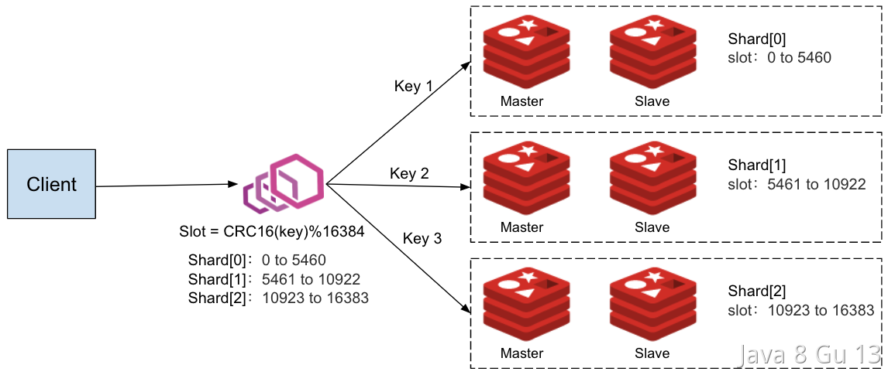

Redis Cluster将整个数据集划分为16384个槽，每个槽都有一个编号（0~16383），集群的每个节点可以负责多个hash槽，客户端访问数据时，先根据key计算出对应的槽编号，然后根据槽编号找到负责该槽的节点，向该节点发送请求。

在 Redis 的每一个节点上，都有这么两个东西，一个是槽（slot），它的的取值范围是：0-16383。还有一个就是 cluster，可以理解为是一个集群管理的插件。当我们在存取的 Key 的时候，Redis 会根据 CRC16 算法得出一个结果，然后把结果对 16384 求余数，这样每个 key 都会对应一个编号在 0-16383 之间的哈希槽，通过这个值，去找到对应的插槽所对应的节点，然后直接自动跳转到这个对应的节点上进行存取操作。

Redis Cluster中的数据分片具有以下特点：
  1. **提升性能和吞吐量**：通过在多个节点上分散数据，可以并行处理更多的操作，从而提升整体的性能和吞吐量。这在高流量场景下尤其重要，因为单个节点可能无法处理所有请求。
  2. **提高可扩展性**：分片使得Redis可以水平扩展。可以通过添加更多节点扩展数据库的容量和处理能力。
  3. **更好的资源利用**：分片允许更有效地利用服务器资源。每个节点只处理数据的一部分，这降低了单个节点的内存和计算需求。
  4. **避免单点故障**：在没有分片的情况下，如果唯一的Redis服务器发生故障，整个服务可能会停止。在分片的环境中，即使一个节点出现问题，其他节点仍然可以继续运行。
  5. **数据冗余和高可用性**：在某些分片策略中，如Redis集群，每个分片的数据都可以在集群内的其他节点上进行复制。这意味着即使一个节点失败，数据也不会丢失，从而提高了系统的可用性。

**扩展知识**

**Redis Cluster将整个数据集划分为16384个槽，为什么是16384呢，这个数字有什么特别的呢？**

这个问题在Github上有所讨论，Redis的作者也下场做过回复：https://github.com/redis/redis/issues/2576

16384这个数字是一个2的14次方（2^14），尽管crc16能得到2^16 -1=65535个值，但是并没有选择，主要从消息大小和集群规模等方面考虑的：

1、正常的心跳数据包携带了节点的完整配置，在更新配置的时候，可以以幂等方式进行替换。这意味着它们包含了节点的原始槽配置，对于包含16384个槽位的情况，使用2k的空间就够了，但如果使用65535个槽位，则需要使用8k的空间，这就有点浪费了。

2、由于其他设计权衡的原因，Redis Cluster不太可能扩展到超过1000个主节点，这种情况下，用65535的话会让每个节点上面的slot太多了，会导致节点的负载重并且数据迁移成本也比较高。而16384是相对比较好的选择，可以在1000个节点下使得slot均匀分布，每个分片平均分到的slot不至于太小。

除此之外，还有一些原因和优点供大家参考：

 1. 易于扩展：槽数量是一个固定的常数，这样就可以方便地进行集群的扩展和缩小。如果需要添加或删除节点，只需要将槽重新分配即可。
 2. 易于计算：哈希算法通常是基于槽编号计算的，将槽数量设置为2的幂次方，可以使用位运算等简单的算法来计算槽编号，从而提高计算效率。
 3. 负载均衡：槽数量的选择可以影响数据的负载均衡。如果槽数量太少，会导致某些节点负载过重；如果槽数量太多，会导致数据迁移的开销过大。16384这个数量在实践中被证明是一个比较合适的选择，能够在保证负载均衡的同时，减少数据迁移的开销。

CRC16**算法**

当我们在存取 Key 的时候，Redis 会根据 CRC16 算法得出一个结果，然后把结果对 16384 求余数，这样每个 key 都会对应一个编号在 0-16383 之间的哈希槽。

 那么，什么是CRC16算法呢？

 CRC16（Cyclic Redundancy Check，循环冗余校验码）算法是一种广泛使用的校验算法，主要用于数据通信和数据存储等领域，例如网络通信中的错误检测和校正、数据存储中的文件校验和等。

 CRC16算法基于多项式除法，将输入数据按位进行多项式除法运算，最后得到一个16位的校验码。CRC16算法的计算过程包括以下几个步骤：

1. 初始化一个16位的寄存器为全1；

 2. 将输入数据的第一个字节与16位寄存器的低8位进行异或操作，结果作为新的16位寄存器的值；
 3. 将16位寄存器的高8位和低8位分别右移一位，丢弃掉最低位，即寄存器右移一位；
 4. 如果输入数据还没有处理完，转到第2步继续处理下一个字节；
 5. 如果输入数据已经处理完，将16位寄存器的值取反，得到CRC16校验码。

CRC16算法的多项式是一个固定的16位二进制数，不同的CRC16算法使用的多项式也不相同。例如，CRC-16/CCITT算法使用的多项式为0x1021，而Modbus CRC16算法使用的多项式为0xA001。

CRC16算法的优点是计算速度快，校验效果好，具有广泛的应用范围。缺点是只能检测错误，无法纠正错误。如果数据被修改，CRC校验值也会被修改，但无法确定是哪一位数据被修改。因此，在数据传输和存储中，通常需要与其它校验算法配合使用，以保证数据的完整性和正确性。

#  Redis 使用什么协议进行通信？

[Redis知识总结-客服端通信协议](../Redis知识总结/Redis知识总结.md##客服端通信协议)

Redis 使用自己设计的一种文本协议进行客户端与服务端之间的通信——RESP（REdis Serialization Protocol），这种协议简单、高效，易于解析，被广泛使用。

RESP 协议基于 TCP 协议，采用请求/响应模式，每条请求由多个参数组成，以命令名称作为第一个参数。请求和响应都以行结束符（\r\n）作为分隔符，具体格式如下：

```
*<number of arguments>\r\n 
$<length of argument 1>\r\n 
<argument data>\r\n 
... 
$<length of argument N>\r\n <argument data>\r\n
```

其中，`<number of arguments>`表示参数个数，`<length of argument>` 表示参数数据的长度，`<argument data> `表示参数数据。参数可以是字符串、整数、数组等数据类型。

 例如，以下是一个 Redis 协议的示例请求和响应：
 请求：

```
*3\r\n 
$3\r\n 
SET\r\n 
$5\r\n 
mykey\r\n 
$7\r\n 
myvalue\r\n
```

响应：

```
+OK\r\n
```

上面的请求表示向 Redis 服务器设置一个名为 "mykey" 的键，值为 "myvalue"。响应返回 "+OK" 表示操作成功。

"$3\r\n"表示参数长度为3，即下一个参数是一个3个字符的字符串。它表示要执行的命令是"SET"，即设置键值对。

 "$5\r\n"表示参数长度为5，即下一个参数是一个5个字符的字符串。它表示要设置的键是"mykey"。

 "$7\r\n"表示参数长度为7，即下一个参数是一个7个字符的字符串。它表示要设置的值是"myvalue"。

 除了基本的 GET、SET 操作，Redis 还支持事务、Lua 脚本、管道等高级功能，这些功能都是通过 Redis 协议来实现的。

# Redis 与 Memcached 有什么区别？

Redis 和 Memcached 都是常见的缓存服务器，它们的主要区别包括以下几个方面：

# Redis为什么这么快？

- 内存存储：速度的基石
  - **所有数据驻留内存**：Redis将全部数据存储在内存中，内存访问速度在**几十纳秒级别**，而磁盘访问速度在**几毫秒到几十毫秒级别**，两者差距可达**10万倍以上**
  - **内存操作无I/O瓶颈**：传统数据库（如MySQL）需要频繁进行磁盘I/O操作，而Redis直接在内存中操作数据，避免了磁盘寻址和I/O等待时间。
  - **持久化不影响性能**：虽然Redis支持RDB和AOF持久化机制，但这些操作通过**后台子进程**执行，主进程仍专注于处理内存中的请求，不会阻塞正常读写
- 单线程模型：避免竞争与开销
  - **核心命令执行为单线程**：Redis使用单线程处理所有客户端请求（从Redis 6.0开始引入了I/O多线程，但**核心命令执行依然保持单线程**）
  - **避免上下文切换**：多线程环境下的线程切换会消耗CPU资源，单线程完全避免了这种开销，实测表明线程切换一次需1-5微秒，高并发下累积开销巨大
  - **无需锁机制**：单线程模型**天然避免了锁竞争**，不存在加锁释放锁操作，没有因为可能出现死锁而导致的性能消耗。
  - **原子性保障**：所有命令顺序执行，确保了操作的原子性，如`INCR`命令无需额外锁即可保证原子性。

- I/O多路复用：高效处理并发
  - **多路复用技术**：Redis采用**epoll**（Linux）或**kqueue**（BSD）等I/O多路复用技术，让单个线程能**同时监听多个网络连接**
  - 工作原理：
    - 客户端连接 → 注册到事件循环 → 监听可读事件
    - 请求到达 → 事件就绪 → 单线程处理 → 返回响应
  - **避免资源浪费**：无需为每个连接分配线程，1个线程可处理数万连接，大大提高了系统吞吐量

- 高效数据结构：时间复杂度优化
  - 动态选择数据结构：Redis根据数据大小自动切换编码方式，实现空间与时间的平衡：
    - **String**：小字符串用`embstr`（直接存于redisObject），大字符串用`raw`（指针指向缓冲区）
    - **List**：小列表用`ziplist`（紧凑存储），大数据量转`quicklist`（链表+压缩列表）
    - **ZSet**：小数据用`ziplist`，大数据用`skiplist`（跳表），支持O(logN)范围查询
  - **时间复杂度优势**：多数操作为O(1)或O(log n)，如哈希表查找、跳表范围查询，确保了高效执行

- 零拷贝与协议优化：减少数据移动
  - **零拷贝技术**：Redis网络通信采用了**writev/sendfile**等零拷贝技术，尽可能减少内核态与用户态之间的数据拷贝
  - **高效协议**：使用**RESP**（Redis序列化协议）作为通信协议，二进制格式解析高效，减少网络传输量
  - **Pipeline批量操作**：客户端可批量发送命令，减少网络往返时间（RTT），例如Pipeline(100)可将QPS从50k提升至500k

- Redis 6.0多线程：针对性突破瓶颈
  - **I/O多线程设计**：Redis 6.0引入多线程**仅用于网络I/O处理**，**核心命令执行仍为单线程**
  - 工作流程：
    - 主线程接收连接 → 分配给I/O线程
    - I/O线程解析请求 → 主线程执行命令
    - I/O线程序列化响应 → 发送回客户端
  - **性能提升**：在高并发、大带宽场景下，QPS可提升**2-3倍**（如从10万提升至20-30万）
  - **配置建议**：默认不开启，需手动设置`io-threads-do-reads yes`和`io-threads`数量（4核机器建议2-3个）

- 其他优化因素
  - **C语言实现**：Redis使用C语言开发，直接操作内存，不依赖虚拟机或垃圾回收机制，执行效率更高。
  - **热点数据缓存**：作为缓存层前置数据库，高命中率避免访问慢源，极大提高系统整体吞吐。
  - **对象共享池**：整数对象共享池（0～9999）减少内存占用，提高效率。

[为什么Redis设计成单线程也能这么快？](#为什么Redis设计成单线程也能这么快)

# 为什么Redis设计成单线程也能这么快，详解IO多路复用技术

在 Unix/Linux 系统中，**一切皆文件**。这不仅包括磁盘上的普通文件，还包括网络连接、管道、设备等。Socket 作为一种网络通信的端点，也被抽象为了“文件”。

**Socket**是网络通信的端点，由 IP 地址和端口号组成，用于在网络中发送和接收数据。**文件描述符 (FD)**是一个非负整数，它本质上是操作系统内核为进程维护的一个**索引值**，指向该进程打开的文件描述表。通过这个索引，进程可以访问对应的内核资源。当一个 Socket 被创建时，操作系统内核会分配一个数据结构来管理它，并返回一个文件描述符给应用程序。从此，应用程序通过这个文件描述符，就可以像读写普通文件一样，对网络连接进行数据的收发。

[Redis面试题-Redis为什么这么快？](#Redis为什么这么快？)

[Redis知识总结-Redis为什么快？高性能设计之epoll和IO多路复用深度解析](../Redis知识总结/Redis知识总结.md#Redis为什么快？高性能设计之epoll和IO多路复用深度解析)

https://zhuanlan.zhihu.com/p/462924941

Redis的性能很好，除了因为他基于内存，高效的数据结构，零拷贝，RESP协议，核心命令单线程执行外，有一个重要的原因是**在单线程中使用多路IO复用技术**

什么是IO多路复用？

一个进程/线程同时监听多个**文件描述符**（如Socket套接字、管道、标准输入等）的IO事件，并在有事件发生时处理。**select, poll, epoll** 都是I/O多路复用的具体的实现

select, poll, epoll具体实现原理？

## select

**select**的核心实现基于 **位图（Bitmap）** 和 **轮询（Polling）** 机制。

一、应用程序初始化三个 `fd_set` 位图，使用 `FD_ZERO(&set)` 宏将三个位图所有位bit全部为0，此时集合为空，不监控任何文件描述符。

>- fd_set叫文件描述符集合，数据结构是位图bitmap，包括可读集合，可写集合，异常集合，它本质上是一个由 `long` 类型整数组成的数组。数组中的每一位（bit）代表一个文件描述符。**0**：表示不监控该文件描述符。**1**：表示需要监控该文件描述符。
>
>- 文件描述符（如：磁盘上的普通文件，网络连接、管道、设备、socket）。
>- **普通文件的局限性**：虽然普通磁盘文件也有文件描述符，但 `select` 机制对**普通文件（Regular File）** 通常是无效的。因为普通文件的读写操作总是会立即返回（要么成功，要么失败），不会出现“等待数据就绪”的状态（阻塞）。`select` 主要是为**非阻塞 I/O** 设计的，最常用于 **Socket（网络 I/O）**、**管道（Pipe）** 和 **终端（Terminal）** 等。

二、通过宏`FD_SET(sockfd, &read_fds)`将你关心的文件描述符注册进去，将位图中对应于 `sockfd` 数值的那个位设置为 1，为1表示需要监控该文件描述符。

>`FD_SET` 宏的背后实际上是一系列位运算。虽然具体的实现可能因系统而异，但其核心逻辑如下：
>
>1. 确定数组下标：计算 sockfd 应该落在 fd_set数组的哪一个元素上。
>   - 伪代码：`index = sockfd / (sizeof(long) * 8)`
>2. 确定位偏移：计算 sockfd在该数组元素中的哪一位。
>   - 伪代码：`bit = sockfd % (sizeof(long) * 8)`
>3. 置位操作：使用按位或运算符 (|) 将该位置为 1。
>   - 伪代码：`set->fds_bits[index] |= (1UL << bit)`
>
>这个过程就像是在一张巨大的二进制表格里，根据 `sockfd` 的数字编号，找到对应的格子，然后打上一个勾（置为 1）。

三、调用 `select` 系统调用。操作系统`copy_from_user`将这三个fd_set位图从**用户态拷贝到内核态**。

四、内核拿到fd_set位图后，会**线性遍历fd_set**，对于每一个被置位（值为1）的文件描述符，如果内核检查后发现其对应的缓冲区**没有**数据（未就绪），内核会直接将位图中这一位**清零**。只有那些被置位**且**缓冲区有数据（就绪）的文件描述符，其对应的位才会被内核**保留为1**。

> **内核轮询 (内核态)**：内核拿到fd_set位图后，会**线性遍历fd_set**位图，从文件描述符0开始到你传入的参数nfds-1（即最大文件描述符+1），因为（文件描述符FD是一种索引，操作系统内核通过这个索引找到文件描述表的表项，文件描述表的表项中存储了指向**系统级打开文件表**中某个条目的指针）
>
> 这个“打开文件表项”中存储了什么？
>
> - **文件偏移量（File Offset）**：当前读写的位置。
> - **访问模式**：如只读、只写、追加等。
> - **引用计数**：有多少个文件描述符指向它。
> - **指向 i-node 表/Socket 结构的指针**：这才是通往缓冲区的钥匙。
>
> 检查缓冲区（是否有数据可读，是否有数据可写，异常队列）。这个过程的时间复杂度是 O(n)，当监控的连接数很大但活跃连接很少时，效率很低。

五、内核完成对位图的修改后，内核将**就绪的文件描述符的总个数**写入 `select` 系统调用的返回值中，同时内核将修改后的fd_set位图通过 `copy_to_user` 函数**拷贝回用户态**，覆盖掉用户传入的原始位图。

> - 它会通过两个通道将结果反馈给用户程序，通道一：位图通过`copy_to_user`**拷贝回用户态**。通道二：`select` 调用返回，内核将**就绪的文件描述符的总个数**写入 `select` 系统调用的返回值中。，告知应用程序有多少个文件描述符就绪。
> - "就绪的文件描述符的总个数”是 `select` 函数的返回值。这个整数值告诉应用程序，在这次调用中，总共有多少个文件描述符处于就绪状态。
>   - 作用：
>     - **快速判断**：如果返回值为 0，说明超时，没有文件描述符就绪，程序可以直接进入下一轮循环，无需检查位图。
>       游戏副本如果返回值为 -1，说明调用出错（例如被信号中断）。
>     - **验证**：如果返回值大于 0，程序才需要去检查位图，找出具体是哪些文件描述符就绪。

六、应用程序拿到结果后，需要再次**遍历**fd_set位图，应用程序通过`FD_ISSET(fd, &fd_set)` 宏发现该位为 1 后，就知道此时去调用 `read()` 或 `recv()` 是**绝对不会阻塞**的，可以立即从内核的**接收缓冲区**中把数据读走。


**优点**

1. 极佳的**跨平台可移植性** (Portability)，这是 `select` 最大的优势，也是它至今仍存在的核心理由。`select` 是 POSIX 标准的一部分，几乎被所有主流操作系统支持，包括 Linux、Windows (WinSock)、macOS 和各种 Unix 系统。**场景**：如果你在编写一个需要在多种操作系统上运行的网络程序（例如开源库、跨平台工具），使用 `select` 是最稳妥的选择，而 `epoll` 仅限于 Linux，`kqueue` 仅限于 BSD/macOS。

2. select的超时精度为**微秒级**，比poll和epoll的毫秒级精度更高，适用于对实时性要求较高的场景，如核反应堆控制等。
3. `select` 的位图操作（`FD_SET`/`FD_ISSET`）看起来繁琐，但其背后的数据结构和逻辑非常简单。
   - **数据结构**：`fd_set` 位图是固定大小的数组，理解成本低。
   - **调试**：因为它是“同步”且“遍历”的，其行为非常符合直觉，容易调试。相比之下，`epoll` 的边缘触发（ET）模式和内核事件表机制相对复杂，容易产生理解偏差和 Bug
4. 对于连接数不多、业务逻辑简单的场景，`select` 足够用。它允许单线程处理多个 I/O 事件，避免了多线程/多进程的上下文切换开销和复杂的同步机制。例如，一个简单的代理工具、监控脚本或连接数在几百以内的小型服务，`select` 的性能完全足够，且代码比 `epoll` 更简洁。

**缺点**

## poll

**`poll` 本质上是 `select` 的“改良版”**。

它保留了 `select` 的核心逻辑（轮询），但修复了 `select` 最让人头疼的几个设计缺陷。

一、**数据结构**

**`select` 的痛点**：使用位图，不仅限制了最大文件描述符数量（1024），而且文件描述符的数值必须小于这个上限。

`poll` 的解法：使用 struct pollfd结构体数组。不再有 1024 的硬性限制，可以监控任意数值的文件描述符（只要内存足够）。

二、**统一事件管理**

**`select` 的痛点**：需要维护三个独立的集合（`readfds`, `writefds`, `exceptfds`）。每次调用前必须用 `FD_ZERO` 和 `FD_SET` 重新初始化，否则会出错。

`poll` 的解法：所有事件（可读、可写、错误）都封装在一个结构体events

 字段中（通过位掩码组合，如 POLLIN | POLLOUT）。**优势**：逻辑更清晰，不需要在每次调用前重建整个集合（因为内核不会修改 `events` 字段）。

**然而，它并没有解决最核心的性能瓶颈。**

**一、依然是 O(n) 线性轮询**

当监控的连接数达到万级（C10K）时，即使只有 1 个连接活跃，内核也必须遍历整个数组，时间复杂度依然是 **O(n)**。这与 `select` 完全相同。

**二、用户态/内核态拷贝开销**

每次调用 `poll`，都需要将整个 `pollfd` 数组从用户态拷贝到内核态。如果数组很大（监控了几万个连接），这个拷贝动作本身就会消耗大量的 CPU 和内存带宽。

## epoll

### 1. 创建监听 Socket (`socket`, `bind`, `listen`)

```c
// 1. 创建 socket
int listen_sock = socket(AF_INET, SOCK_STREAM, 0);

// 2. 设置地址复用 (避免重启时端口占用)
int opt = 1;
setsockopt(listen_sock, SOL_SOCKET, SO_REUSEADDR, &opt, sizeof(opt));

// 3. 绑定地址和端口
struct sockaddr_in addr;
addr.sin_family = AF_INET;
addr.sin_port = htons(8080);
addr.sin_addr.s_addr = INADDR_ANY;
bind(listen_sock, (struct sockaddr*)&addr, sizeof(addr));

// 4. 开始监听
listen(listen_sock, SOMAXCONN); // SOMAXCONN 通常是 128
```

### 2. 创建 Epoll 实例 (`epoll_create1`)

这一步对应你之前分析的**内核对象初始化**。你拿到了操作这个内核事件表的句柄。

```c
// 创建 epoll 实例，返回 epoll 文件描述符
int epfd = epoll_create1(EPOLL_CLOEXEC); 
if (epfd == -1) {
    perror("epoll_create1");
    exit(EXIT_FAILURE);
}
```

`epoll_create1`源码解析

```c
// 文件: fs/eventpoll.c
SYSCALL_DEFINE1(epoll_create1, int, flags)
{
    int error, fd;
    struct eventpoll *ep = NULL;  // epoll的主内核对象
    struct file *file;

    /* 编译期检查：确保 EPOLL_CLOEXEC 和 O_CLOEXEC 定义一致 */
    BUILD_BUG_ON(EPOLL_CLOEXEC != O_CLOEXEC);

    /* 1. 参数校验：只允许 EPOLL_CLOEXEC 标志 */
    if (flags & ~EPOLL_CLOEXEC)
        return -EINVAL;

    /* 2. 分配并初始化核心数据结构 eventpoll */
    error = ep_alloc(&ep);
    if (error < 0)
        return error;

    /* 3. 获取一个未被使用的文件描述符 (fd) */
    fd = get_unused_fd_flags(O_RDWR | (flags & O_CLOEXEC));
    if (fd < 0)
        goto out_free_ep;

    /* 4. 创建匿名文件对象，并与 eventpoll 关联 */
    file = anon_inode_getfile("[eventpoll]", &eventpoll_fops, ep,
                O_RDWR | (flags & O_CLOEXEC));
    if (IS_ERR(file)) {
        error = PTR_ERR(file);
        goto out_free_fd;
    }

    /* 5. 将文件对象安装到当前进程的文件描述符表中 */
    ep->file = file;      // 建立 eventpoll -> file 的反向链接
    fd_install(fd, file); // 建立 fd -> file 的映射

    return fd; // 返回给用户态的句柄

out_free_fd:
    put_unused_fd(fd);
out_free_ep:
    ep_free(ep);
    return error;
}
```

当你调用 `epoll_create1(flag)` 时，内现代 Linux 内核（2.6.27+）实际上会将其转发给 `sys_epoll_create1` 系统调用。

内核调用 `ep_alloc(&ep)` 函数。这一步不仅是在堆上分配了一块内存（`kzalloc`），更重要的是它**初始化了 `eventpoll` 结构体内部的各种成员**。

调用`fd = get_unused_fd_flags(O_RDWR | (flags & O_CLOEXEC))` 从当前进程的文件描述符表中获取一个未被使用的文件描述符 `fd`

内核会创建一个 `struct file` 对象，并将这个对象的成员`f_op`指向 `eventpoll_fops`（文件操作集），同时将这个`struct file`文件对象的私有数据指针`private_data`指向刚才分配的 `eventpoll` 对象。

通过 fd_install(fd, file) 将文件描述符 fd 与 struct file 对象进行关联，并安装到当前进程的文件表中。最后，将这个 fd 作为句柄返回给用户态（epfd)，也就是你代码中的 `epfd`。这个 `epfd` 随后会被用于 `epoll_ctl` 和 `epoll_wait` 等操作。

>`eventpoll` 结构体的核心成员
>
>| 结构成员  | 数据结构                        | 作用                                                         |
>| --------- | ------------------------------- | ------------------------------------------------------------ |
>| `rbr`     | 红黑树根节点 (`rb_root_cached`) | 用来存储所有被监控的文件描述符（`epitem`）。插入、删除、查找的效率极高（O(log n)），且不会像 `select` 那样有 1024 的硬限制。 |
>| `rdllist` | 双向链表 (`list_head`)          | 也就是“就绪链表”。当被监控的文件描述符上有事件发生时，内核会通过回调机制，立即将对应的 epitem 插入到这个链表中。 |
>| `wq`      | 等待队列 (`wait_queue_head_t`)  | 用来挂载那些正在调用 epoll_wait 并处于阻塞状态的进程。当 rdllist 中有数据时，内核会唤醒这个队列中的进程。 |

### 3. 注册监听事件 (`epoll_ctl`)

这是将文件描述符（监听 socket）**加入内核红黑树**的过程。这一步非常关键，它开启了**回调机制**的监听。

```
struct epoll_event ev, events[MAX_EVENTS];

// 设置监听 socket 关注的事件：可读 (EPOLLIN)
ev.events = EPOLLIN; 
ev.data.fd = listen_sock; // 保存用户数据

// 将监听 socket 添加到 epoll 实例中
if (epoll_ctl(epfd, EPOLL_CTL_ADD, listen_sock, &ev) == -1) {
    perror("epoll_ctl: listen_sock");
    exit(EXIT_FAILURE);
}
```

内核通过 `epfd` 找到对应的 `struct file` 对象，并通过其 `private_data` 指针获取到 `struct eventpoll` 对象。

1. 操作红黑树：
   - **`EPOLL_CTL_ADD` (添加)**
     - **查找**：首先调用 `ep_find` 在红黑树中查找该 `fd` 是否已存在，防止重复添加。
     - **分配**：如果不存在，调用 `ep_insert`。内核会分配一个 `struct epitem`（epi）对象。
     - **初始化**：填充 `epi`，其中 `epi->ffd` 记录目标 `fd` 和文件结构体，`epi->ep` 指向当前的 `eventpoll`。
     - **插入**：调用 `ep_rbtree_insert` 将 `epi` 插入红黑树。红黑树的搜索/插入复杂度为 O(log⁡n)*O*(log*n*) ，这比 `select` 每次复制全量集合的 O(n)*O*(*n*) 效率更高。
   - **MOD**：在红黑树中找到对应的节点，并更新其监听的事件掩码。
   - **DEL**：在红黑树中找到并删除对应的节点，并注销回调函数。
2. **回调机制的注册**：在 `ADD` 操作时，内核会为该 `fd` 注册一个回调函数 `ep_poll_callback` 到其等待队列中。当 `fd` 有数据到达时，内核协议栈在处理完数据包后，会检查该 `fd` 的等待队列，并**触发回调函数 `ep_poll_callback`**。该回调函数负责将该 `fd` 对应的节点放入 `eventpoll` 的就绪链表（`rdllist`）中，从而避免了 `epoll_wait` 进行低效的轮询。

### 4. 事件循环 (`epoll_wait`)

```
while (1) {
    // 阻塞等待，直到有事件就绪
    // events: 用于接收就绪事件的数组
    // MAX_EVENTS: 数组大小
    // -1: 永久阻塞，直到有事件发生
    int nfds = epoll_wait(epfd, events, MAX_EVENTS, -1); 

    if (nfds == -1) {
        perror("epoll_wait");
        break;
    }

    // 遍历所有就绪的事件
    for (int i = 0; i < nfds; i++) {
        if (events[i].data.fd == listen_sock) {
            // 事件 1: 监听 socket 就绪 -> 有新连接
            handle_accept(epfd, listen_sock);
        } else {
            // 事件 2: 普通连接 socket 就绪 -> 有数据可读/写
            handle_io(epfd, events[i]);
        }
    }
}
```

### 边缘触发和水平触发

epoll 支持两种事件触发模式，分别是边缘触发（edge-triggered，ET）和水平触发（level-triggered，LT）。
这两个术语还挺抽象的，其实它们的区别还是很好理解的。
• 使用边缘触发模式时，当被监控的 Socket 描述符上有可读事件发生时，服务器端只会从 epoll_wait 中苏醒一次，即使进程没有调用 read 函数从内核读取数据，也依然只苏醒一次，因此我们程序要保证一次性将内核缓冲区的数据读取完；
• 使用水平触发模式时，当被监控的 Socket 上有可读事件发生时，服务器端不断地从 epoll_wait 中苏醒，直到内核缓冲区数据被 read 函数读完才结束，目的是告诉我们有数据需要读取；
举个例子，你的快递被放到了一个快递箱里，如果快递箱只会通过短信通知你一次，即使你一直没有去取，它也不会再发送第二条短信提醒你，这个方式就是边缘触发；如果快递箱发现你的快递没有被取出，它就会不停地发短信通知你，直到你取出了快递，它才消停，这个就是水平触发的方式。
这就是两者的区别，水平触发的意思是只要满足事件的条件，比如内核中有数据需要读，就一直不断地把这个事件传递给用户；而边缘触发的意思是只有第一次满足条件的时候才触发，之后就不会再传递同样的事件了。
如果使用水平触发模式，当内核通知文件描述符可读写时，接下来还可以继续去检测它的状态，看它是否依然可读或可写。所以在收到通知后，没必要一次执行尽可能多的读写操作。
如果使用边缘触发模式，I/O 事件发生时只会通知一次，而且我们不知道到底能读写多少数据，所以在收到通知后应尽可能地读写数据，以免错失读写的机会。因此，我们会循环从文件描述符读写数据，那么如果文件描述符是阻塞的，没有数据可读写时，进程会阻塞在读写函数那里，程序就没办法继续往下执行。所以，边缘触发模式一般和非阻塞 I/O 搭配使用，程序会一直执行 I/O 操作，直到系统调用（如 read 和 write）返回错误，错误类型为 EAGAIN 或 EWOULDBLOCK。
一般来说，边缘触发的效率比水平触发的效率要高，因为边缘触发可以减少 epoll_wait 的系统调用次数，系统调用也是有一定的开销的的，毕竟也存在上下文的切换。
select/poll 只有水平触发模式，epoll 默认的触发模式是水平触发，但是可以根据应用场景设置为边缘触发模式。
另外，使用 I/O 多路复用时，最好搭配非阻塞 I/O 一起使用，Linux 手册关于 select 的内容中有如下说明：
Under Linux, select() may report a socket file descriptor as "ready for reading", while nevertheless a subsequent read blocks. This could for example happen when data has arrived but upon examination has wrong checksum and is discarded. There may be other circumstances in which a file descriptor is spuriously reported as ready. Thus it may be safer to use O_NONBLOCK on sockets that should not block.
我谷歌翻译的结果：
在Linux下，select() 可能会将一个 socket 文件描述符报告为 "准备读取"，而后续的读取块却没有。例如，当数据已经到达，但经检查后发现有错误的校验和而被丢弃时，就会发生这种情况。也有可能在其他情况下，文件描述符被错误地报告为就绪。因此，在不应该阻塞的 socket 上使用 O_NONBLOCK 可能更安全。
简单点理解，就是多路复用 API 返回的事件并不一定可读写的，如果使用阻塞 I/O， 那么在调用 read/write 时则会发生程序阻塞，因此最好搭配非阻塞 I/O，以便应对极少数的特殊情况。


第一点，epoll 在内核里使用红黑树来跟踪进程所有待检测的文件描述字，把需要监控的 socket 通过 epoll_ctl() 函数加入内核中的红黑树里，红黑树是个高效的数据结构，增删改一般时间复杂度是 O(logn)。而 select/poll 内核里没有类似 epoll 红黑树这种保存所有待检测的 socket 的数据结构，所以 select/poll 每次操作时都传入整个 socket 集合给内核，而 epoll 因为在内核维护了红黑树，可以保存所有待检测的 socket ，所以只需要传入一个待检测的 socket，减少了内核和用户空间大量的数据拷贝和内存分配。

第二点， epoll 使用事件驱动的机制，内核里维护了一个链表来记录就绪事件，当某个 socket 有事件发生时，通过回调函数内核会将其加入到这个就绪事件列表中，当用户调用 epoll_wait() 函数时，只会返回有事件发生的文件描述符的个数，不需要像 select/poll 那样轮询扫描整个 socket 集合，大大提高了检测的效率。


# 为什么Redis 6.0引入了多线程？

Redis 6.0引入多线程主要是为了**提升网络I/O吞吐量**和**充分利用多核CPU资源**，同时保持核心命令执行的单线程特性，以解决高并发场景下的性能瓶颈问题。

## 一、核心原因分析

### 1. 网络I/O成为主要瓶颈

- **传统单线程模型的局限**：在Redis 6.0之前，所有工作（包括网络I/O和命令执行）都由单个主线程处理。虽然I/O多路复用技术有效提升了效率，但**网络I/O处理本质上仍是同步阻塞型**。
- **现代网络带宽提升**：随着万兆网卡等高速网络设备的普及，单线程处理网络请求的性能已无法充分利用高带宽资源。
- **实测数据支持**：在网络I/O处理上，单线程耗时占比可达60%以上，成为明显的性能瓶颈。

### 2. 多核CPU资源利用不足

- **硬件发展趋势**：现代服务器普遍配备多核CPU，但单线程模型只能利用单个核心。
- **资源浪费**：在高并发场景下，大量CPU时间被网络I/O同步处理占用，无法充分发挥多核优势。
- **性能提升空间**：通过多线程并行处理网络I/O，可显著提升系统整体吞吐量，实测表明性能提升至少一倍以上。

### 3. 保持核心优势的平衡设计

- **精准的多线程应用**：Redis 6.0仅在网络请求接收、解析和响应环节使用多线程，**核心数据读写操作仍保持单线程模式**。
- **避免并发问题**：这种设计从根本上避免了多线程带来的锁竞争、上下文切换等复杂性和性能开销，保证了数据一致性和系统稳定性。
- **保留原子性优势**：所有命令依然由主线程串行执行，无需为Lua脚本、事务的原子性而额外开发多线程互斥机制。

## 二、多线程模型的工作原理

Redis 6.0采用了"1个主线程 + N个I/O线程"的混合模型，工作流程如下：

1. **连接建立与分发**：
   - 主线程负责接收客户端连接请求
   - 将建立的Socket连接放入全局等待队列
   - 通过轮询方式将连接分配给I/O线程3
2. **并行I/O处理**：
   - I/O线程并行读取客户端请求数据
   - 解析Redis协议( RESP )，将命令封装为结构化对象
   - 将解析后的命令压入全局命令队列3
3. **单线程命令执行**：
   - 主线程从命令队列中取出命令
   - **以串行方式执行所有Redis命令**
   - 将执行结果写入输出缓冲区13
4. **并行响应处理**：
   - 主线程将响应结果分配给I/O线程
   - I/O线程并行将结果写回客户端Socket
   - 清空等待队列，准备处理后续请求12

## 三、性能提升与配置建议

### 1. 性能提升效果

- **QPS显著提升**：在4线程I/O配置下，GET/SET命令性能相比单线程几乎翻倍8。
- **高带宽场景优势**：对于80%的公司，单线程Redis已足够使用，但面对亿级交易量的场景，多线程I/O成为必要选择1。
- **资源利用更高效**：通过分摊网络I/O压力，主线程能更专注于核心命令执行，整体资源利用率提升5。

### 2. 合理配置建议

- **默认关闭**：为保持向后兼容，Redis 6.0中多线程I/O默认关闭3。

- 开启配置：

  ```
  io-threads-do-reads yes  # 开启多线程I/O
  io-threads 4             # 设置I/O线程数
  ```

- 线程数设置：

  - 4核CPU：建议设置2-3个线程
  - 8核CPU：建议设置6个线程
  - **线程数应小于机器核数**，且超过8个线程基本无意义8

## 四、总结与启示

Redis 6.0引入多线程是**对系统瓶颈的精准优化**，而非简单地将所有操作多线程化。这种设计体现了Redis开发团队对资源瓶颈的动态判断和对核心优势的坚守：

- **网络I/O多线程化**：解决高并发场景下的网络瓶颈
- **命令执行单线程化**：保留数据一致性和简单性优势
- **资源利用最大化**：在不增加系统复杂性的前提下，充分利用现代硬件资源

这种"精准多线程"的设计哲学，使得Redis在保持原有优势的同时，能够更好地适应现代高并发、高带宽的业务场景，为亿级交易量的企业提供更强大的支持。


# Redis Cluster 中使用事务和 lua 有什么限制？

[介绍一下Redis的集群模式？](#介绍一下Redis的集群模式？)

Redis Cluster采用主从复制模式来提高可用性。每个分片都有一个主节点和多个从节点。主节点负责处理写操作，而从节点负责复制主节点的数据并处理读请求。在Redis的Cluster 集群模式中，会对数据进行数据分片，将整个数据集分配给不同节点。

这个思想就和我们在MySQL 中做分库分表是一样的，都是通过一定的分片算法，把数据分散到不同的节点上进行存储。

**那么和 MySQL 对跨库事务支持存在限制一样，在 Redis Cluster 中使用事务和 Lua 脚本时，也是有一定的限制的。**

在 Redis Cluster 中，事务不能跨多个节点执行。事务中涉及的所有键必须位于同一节点上。如果尝试在一个事务中包含多个分片的键，事务将失败。另外，对 WATCH 命令也用同样的限制，要求他只能监视位于同一分片上的键。

和事务相同，执行 Lua 脚本时，脚本中访问的所有键也必须位于同一节点。Redis 不会在节点之间迁移数据来支持跨节点的脚本执行。Lua 脚本执行为原子操作，但是如果脚本因为某些键不在同一节点而失败，整个脚本将终止执行，可能会影响数据的一致性。

当我们要跨节点执行 lua 的时候，会报错提示：command keys must in same slot。（详见：https://redis.io/docs/latest/operate/oss_and_stack/reference/cluster-spec/ ）

**如何解决**

[如何在RedisCluster中执行lua脚本](#如何在Redis Cluster中执行lua脚本)

# 如何在 Redis Cluster 中执行 lua 脚本？

[Redis Cluster 中使用事务和 lua 有什么限制？](#Redis Cluster 中使用事务和 lua 有什么限制？)

因为 Redis  Cluster 中，数据会被分片到多个节点上，跨节点的 lua 脚本是不支持的，所以就会失败。但是 Cluster 是很常见的场景，lua （以及事务）也是一个非常重要的用法，这个问题怎么解决呢？

**Hash Tag**

 在 Redis 的官方中，提到了一个 hash tags的功能：

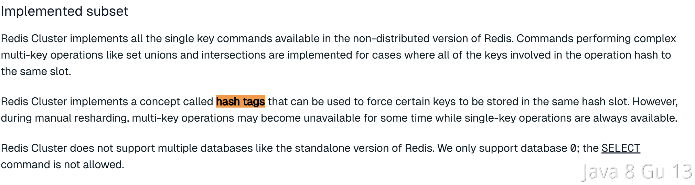

如果我们想要执行 lua 脚本或者事务的时候，就需要确保多个相关的键应该存储在同一个节点上以便执行原子操作，**默认情况下，Redis 使用键的哈希值来决定将数据存储在哪个节点**。而Redis 中的 hashtag 就是一种可以让我们干预 hash 结果的机制。

Redis 中的 hashtag 是键名中用大括号 {} 包裹的部分。Redis 对大括号内的字符串计算哈希值，并基于这个哈希值将键分配到特定的节点。只有键名中包含大括号，且大括号内有内容时，大括号内的部分才会被用来计算哈希值。如果大括号为空或不包含任何字符，Redis 将整个键名用于哈希计算。

有了这个特性，我们就可以在设计键名时，可以将共享相同逻辑或数据集的键包含相同的 hashtag。就和我们在 MySQL 的分库分表中的基因法其实是类似的概念。

例如，如果你有多个与用户 ID 相关的键，可以使用 user:{12345}:profile 和 user:{12345}:settings 这样的命名方式，确保它们都位于同一个节点。这样他只会用{12345}进行 hash 算法，这样虽然他们是不同的key，但是分片之后的结果就可以在同一个节点上。这样就能执行事务或者 lua 脚本了。

**其他方案**

 除了使用 Hash Tag 以外，还有一些其他的方案，也能实现，比如：

  1. 应用层处理：如果跨节点操作不可避免，可以在应用层通过分布式事务管理器或其他机制来协调多个节点的数据一致性。这通常需要复杂的逻辑和额外的开发工作。

  2. 拆分操作：尽量将需要事务处理的逻辑拆分成多个独立的、可以在单个节点上执行的小操作，从而避免跨节点事务的需求。


**扩展知识**

     allow-cross-slot-keys

 在 Redis 7.0.11中新增了一个命令：allow-cross-slot-keys

https://github.com/redis/redis-doc/pull/1893/files

开启这个配置，可以允许在单个命令中使用不同槽（slot）的键。例如，你可以在一个 MSET 命令中设置多个键，即使这些键属于不同的槽。

 但是，需要注意的是，即使启用了 allow-cross-slot-keys，事务中的所有键仍然必须位于同一个槽（即同一个节点）才能保证事务的原子性。如果事务中的键分布在不同的节点上，Redis 会拒绝执行这些命令。

 所以，网上有的文章说，使用 allow-cross-slot-keys就能做跨节点事务或者 lua 了，其实是不对的！

 但是需要注意的是，启用这个选项的命令可能会因为涉及多个节点的网络通信而导致性能降低，但这并不会让这些操作变成原子操作。

# Redis 支持哪几种数据类型？

Redis 中支持了多种数据类型，其中比较常用的有五种：

 1. 字符串（String）
 2. 哈希（Hash）
 3. 列表（List）
 4. 集合（Set）
 5. 有序集合（Sorted Set）

 另外，Redis中还支持一些高级的数据类型，如：Streams、Bitmap、Geospatial以及HyperLogLog

**字符串**

[Redis为什么要自已定义SDS?](#Redis为什么要自已定义SDS?)

**有序集合**

[Redis中的Zset是怎么实现的？](Redis中的Zset是怎么实现的？)

# Redis为什么要自已定义SDS?

Redis是一种KV的存储结构，他的key是字符串类型，值也支持字符串，所以字符串是redis中最常见的一个类型了。Redis自己本身是通过C语言实现的，但是他并没有直接使用C语言中的字符数组的方式来实现字符串，而是自己实现了一个SDS（Simple Dynamic Strings），即简单动态字符串，这是为什么呢？

首先，因为字符串在Redis中使用实在是太广泛了 ，所以对他的基本要求就有两点，第一就是要支持任意字符的存储，第二就是各种操作需要高效。

接着我们看看C语言中字符串的实现方式有什么问题呢？很多人可能都忘了，我帮大家回忆一下，C语言中，字符串是通过字符数组实现的，底层呢是开辟了一块连续的空间，依次存放字符串中的每一个字符。为了表示字符串的结束，他会在字符数组的最后一个字符处记录\0，

也就是说，在C语言中，当识别到字符数组中的\0字符的时候，就认为字符串结束了，那么这么做会带来哪些问题呢？

**就是这样实现的字符串中就不能保存任意内容了，至少\0就不行，因为遇到他的时候就直接截断了，这肯定是接受不了的。**

 **还有就是因为C中的字符串以\0作为识别字符串结束的方式，所以他的字符串长度判断、字符串追加等操作，都需要从头开始遍历，一直遍历到\0的时候再返回长度或者做追加。这就使得字符串相关的操作效率都很低。**

那么，想要解决上面的两个问题要怎么办呢？那就是**在用字符数组表示字符串的同时，在这个字符串中增加一个表示分配给该字符数组的总长度的alloc字段，和一个表示字符串现有长度的len字段。这样在获取长度的时候就不依赖\0了，直接返回len的值就行了。**

 还有呢，就是在做追加操作的时候，只需要判断新追加的部分的len加上已有的len是否大于alloc，如果超过就重新再申请新空间，如果没超过，就直接进行追加就行了。

 还有很多其他操作，比如复制、比较等都可以使用类似的思想高效的操作。

[Redis中的Zset是怎么实现的？](#Redis中的Zset是怎么实现的？)

# Redis中的Zset是怎么实现的？

ZSet（也称为Sorted Set）是Redis中的一种特殊的数据结构，它内部维护了一个有序的字典，这个字典的元素中既包括了一个成员（member），也包括了一个double类型的分值(score)。这个结构可以帮助用户实现记分类型的排行榜数据，比如游戏分数排行榜，网站流行度排行等。

**Redis中的ZSet在实现中，有多种结构，大类的话有两种，分别是ziplist(压缩列表)和skiplist(跳跃表)，但是这只是以前，在Redis 5.0中新增了一个listpack（紧凑列表）的数据结构，这种数据结构就是为了替代ziplist的，而在之后Redis 7.0的发布中，在Zset的实现中，已经彻底不再使用zipList了。**

当ZSet的元素数量比较少时，Redis会采用ZipList（ListPack）来存储ZSet的数据。ZipList（ListPack）是一种紧凑的列表结构，它通过连续存储元素来节约内存空间。当ZSet的元素数量增多时，Redis会自动将ZipList（ListPack）转换为SkipList，以保持元素的有序性和支持范围查询操作。

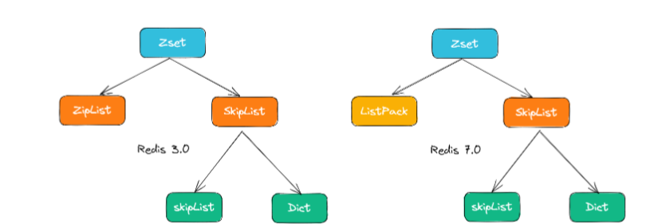


# Zset为什么在数据量少的时候用zipList，而在数据量大·的时候转成SkipList?

[Redis中的Zset是怎么实现的？](#Redis中的Zset是怎么实现的？)

通过上文我们知道，在 Redis 中，ZSet在特定条件下会使用ZipList作为其内部表示。这通常发生在有序集合较小的时候，默认情况下，当元素数量少于128，每个元素的长度都小于64字节的时候，使用ZipList（ListPack），否则，使用SkipList！

Redis 之所以在数据量少的时候使用ZipList（包括后来的ListPack），而在数据量大时转成SkipList（跳表），是出于 内存优化 和 性能考量 的双重目的。

内存对比

 首先ZipList是一个压缩的数据结构，它的每个元素都是连续存储的（和数组有点像），因此内存的使用非常紧凑。与其他数据结构相比，ZipList在小规模数据存储时显著减少了内存占用。

而在内存方面，SkipList 相比于 ZipList 内存开销要大得多，因为它是通过多个链表层级来实现的，每个元素需要额外的指针来维护层级结构。

 这就涉及到ZipList的一个缺点了。而在内存方面，SkipList 相比于 ZipList 内存开销要大得多，因为它是通过多个链表层级来实现的，每个元素需要额外的指针来维护层级结构。

 那么按理说，ZipList的内存占用要比Skip要小的，所以他更适合用来存储数据，所以ZSet会使用ZipList，那为啥不全都用，而只有在数据量小的额时候采用呢？

 这就涉及到ZipList的一个缺点了。

性能对比

 前面说过了ZipList 是一个紧凑的线性结构，所以如果在 ZipList 中查找一个元素时，可能需要遍历整个列表，同理插入和删除操作也是线性的。所以它的插入、删除和查找操作的时间复杂度通常是 O(N)。

 而SkipList 采用多级索引结构，它的查找、插入、删除操作的时间复杂度是 O(log N)，远远优于 ZipList 的 O(N)。

总结

 所以，ZipList的存储更节省空间，而SkipList的操作性能会更好。

 所以，对于少量数据，ZipList更好，因为它的内存开销很小，而且性能也可以接受（N越小，logN和N的差别更小）。但是当数据量大到一定程度时，SkipList的 O(log N) 性能会显著优于ZipList 的 O(N) 性能，尤其是涉及到范围查询和顺序遍历时。

 所以，默认情况下，当元素数量少于128，每个元素的长度都小于64字节的时候，ZSet使用ZipList（ListPack），否则，使用SkipList！

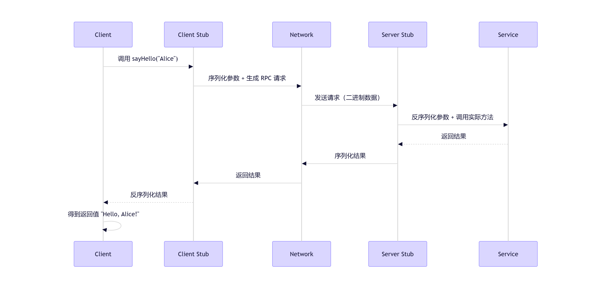

# Redis 5.0中的 Stream是什么？

[Redis知识总结2-Redis发布订阅](../Redis知识总结/Redis知识总结2.md#发布订阅)

Redis 本身是有一个 Redis **发布订阅 (pub/sub)** 来实现消息队列的功能，但它有个缺点就是消息**无法持久化**，如果出现网络断开、Redis 宕机等，消息就会被丢弃。

**简单来说发布订阅 (pub/sub) 可以分发消息，但无法记录历史消息。**

> 订阅 (pub/sub) 这个模式，和我们平常看电视频道类似，把电视台切换到湖南卫视，你就能自然看到当前电视台播放的节目（快乐大本营、天天向上 ...），就相当于你订阅了湖南卫视频道，在湖南卫视电视台发布节目的时候，你就能够很自然的接收到。但是这种模式有一个弊端，就是错过了就是错过了，错过了19:00的新闻联播，就是错过了。

Redis Stream 主要用于**消息队列**（MQ，Message Queue）

而 Redis Stream 提供了消息的**持久化和主备复制**功能，可以让任何客户端访问任何时刻的数据，并且能记住每一个客户端的访问位置，还能保证消息不丢失。

每个 Stream 都有唯一的名称，它就是 Redis 的 key，在我们首次使用 xadd 指令追加消息时自动创建。

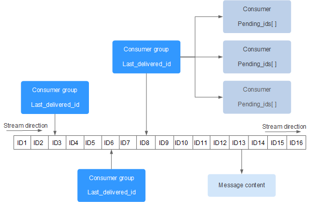

每个 Stream 都有唯一的名称，它就是 Redis 的 key，在我们首次使用 xadd 指令追加消息时自动创建。

上图解析：

- **Consumer Group** ：消费组，使用 XGROUP CREATE 命令创建，一个消费组有多个消费者(Consumer)。
  - **组内竞争**：同一个消费者组内的多个消费者（Consumer）共同分摊消费消息，一条消息只能被组内的一个消费者处理（负载均衡）
  - **组间广播**：不同的消费者组可以独立消费同一条消息（例如，一个组处理日志，另一个组发送通知）。
- **last_delivered_id** ：游标，每个消费组会有个游标 last_delivered_id，任意一个消费者读取了消息都会使游标 last_delivered_id 往前移动。
- **pending_ids** ：消费者(Consumer)的状态变量，作用是维护消费者的未确认的 id。 pending_ids 记录了当前已经被客户端读取的消息，但是还没有 `ack` (Acknowledge character：确认字符）。如果客户端没有ack，这个变量里面的消息ID会越来越多，一旦某个消息被ack，它就开始减少。这个pending_ids变量在Redis官方被称之为PEL，也就是Pending Entries List，这是一个很核心的数据结构，它用来确保客户端至少消费了消息一次，而不会在网络传输的中途丢失了没处理。
- `消息ID`: 消息ID的形式是timestampInMillis-sequence，例如1527846880572-5，它表示当前的消息在毫米时间戳1527846880572时产生，并且是该毫秒内产生的第5条消息。消息ID可以由服务器自动生成，也可以由客户端自己指定，但是形式必须是整数-整数，而且必须是后面加入的消息的ID要大于前面的消息ID。
- `消息内容`: 消息内容就是键值对，形如hash结构的键值对，这没什么特别之处。

## 消息队列操作

- XADD

  使用**XADD命令添加消息到队列末尾**，如果指定的 队列不存在，则该命令执行时会新建一个队列。

  添加的消息是一个和多个键值对。XADD也是唯一可以向队列中添加数据的 Redis 命令。

  语法格式：

  ```
  XADD key ID field value [field value ...]
  ```

  - key：队列名称，如果不存在就创建
  - ID：消息id，使用*表示由redis生成。可以自定义，但是要自己保证递增性
  - field value：记录，当前消息内容，由一个或多个key-value构成

  命令使用：

  创建两条消息，分别是(name=tom, age=22),(height=180, use=iphone)

  ```
  127.0.0.1:6379> xadd mystream * name tom age 22
  "1674984765438-0"
  127.0.0.1:6379> xadd mystream * height 180 use iphone
  "1674985213802-0"
  ```

  创建消息时会生成一个序号，支持自定义序号和自动生成序号。**`*`表示自动生成序号**

  XADD生成的1553439850328-0，就是Redis生成的消息ID，由两部分组成:**时间戳-序号**。时间戳是毫秒级单位，是生成消息的Redis服务器时间，它是个64位整型（int64）。序号是在这个毫秒时间点内的消息序号，它也是个64位整型。

  可以通过multi批处理，来验证序号的递增：

  ```
  127.0.0.1:6379> MULTI
  OK
  127.0.0.1:6379> XADD memberMessage * msg one
  QUEUED
  127.0.0.1:6379> XADD memberMessage * msg two
  QUEUED
  127.0.0.1:6379> XADD memberMessage * msg three
  QUEUED
  127.0.0.1:6379> XADD memberMessage * msg four
  QUEUED
  127.0.0.1:6379> XADD memberMessage * msg five
  QUEUED
  127.0.0.1:6379> EXEC
  1) "1553441006884-0"
  2) "1553441006884-1"
  3) "1553441006884-2"
  4) "1553441006884-3"
  5) "1553441006884-4"
  
  ```

  由于一个redis命令的执行很快，所以可以看到在同一时间戳内，是通过序号递增来表示消息的。

  为了保证消息是有序的，因此Redis生成的ID是单调递增有序的。由于ID中包含时间戳部分，为了避免服务器时间错误而带来的问题（例如服务器时间延后了），Redis的每个Stream类型数据都维护一个latest_generated_id属性，用于记录最后一个消息的ID。**若发现当前时间戳退后（小于latest_generated_id所记录的），则采用时间戳不变而序号递增的方案来作为新消息ID**（这也是序号为什么使用int64的原因，保证有足够多的的序号），从而保证ID的单调递增性质。

  强烈建议使用Redis的方案生成消息ID，因为这种时间戳+序号的单调递增的ID方案，几乎可以满足你全部的需求。但同时，记住ID是支持自定义的，别忘了！

- XLEN

  使用**XLEN获取队列包含的元素数量，即消息长度**

  语法格式：

  ```
  XLEN key
  ```

  命令使用：

  ```
  127.0.0.1:6379> xlen mystream
  (integer) 2
  ```

- XDEL

  使用**XDEL删除消息**。语法格式：

  ```
  XDEL key ID [ID ...]
  ```

  **XDEL删除消息的指令，并不会从内存上删除消息，它只是给消息打上标记位，下次使用XRANGE指令时自动过滤这些消息**

- XRANGE

  **使用XRANGE获取消息列表，会自动过滤已经删除的消息**，语法格式：

  ```
  XRANGE key start end [COUNT count]
  ```

  - key：队列名
  - start：开始值，-表示最小值
  - end：结束值，+表示最大值
  - count：数量

  命令使用：

  不指定count默认查询所有

  ```
  127.0.0.1:6379> xrange mystream - + 
  1) 1) "1674984765438-0"
     2) 1) "name"
        2) "tom"
        3) "age"
        4) "22"
  2) 1) "1674985213802-0"
     2) 1) "height"
        2) "180"
        3) "use"
        4) "iphone"
  127.0.0.1:6379> 
  ```

- XREAD

  XREAD命令提供**读取队列消息**的能力，返回大于指定ID的消息。

  XREAD常用于用于迭代队列的消息，所以传递给 XREAD 的通常是上一次从该队列接收到的最后一个消息的ID。

  语法格式：

  ```
  XREAD [COUNT count] [BLOCK milliseconds] STREAMS key [key ...] id [id ...]
  ```

  - count：用于限定获取的消息数量
  - BLOCK milliseconds：用于设置XREAD为阻塞模式以及阻塞的时长，单位毫秒，默认为非阻塞模式
  - **ID：设置开始读取的消息ID，使用0表示从第一条消息开始。**
    **消息队列ID是单调递增的，所以通过设置起点，可以向后读取。**
    **在阻塞模式中，可以使用`$`，表示最新的消息ID, block 0表示永久阻塞。（非阻塞模式下$无意义）。**

  非阻塞读取：

  从第一条消息开始

  ```
  127.0.0.1:6379> xread streams mystream 0
  1) 1) "mystream"
     2) 1) 1) "1674984765438-0"
           2) 1) "name"
              2) "tom"
              3) "age"
              4) "22"
        2) 1) "1674985213802-0"
           2) 1) "height"
              2) "180"
              3) "use"
              4) "iphone"
  127.0.0.1:6379> 
  ```

  阻塞读取：

  ```
  127.0.0.1:6379> xread block 10000 streams mystream $
  (nil)
  (10.04s)
  127.0.0.1:6379>
  ```

  阻塞模式读，阻塞时长为10s。如果10s内未读取到消息则退出阻塞。另开一

  个终端向队列中写入一条消息，阻塞读的终端就能接收到消息。

  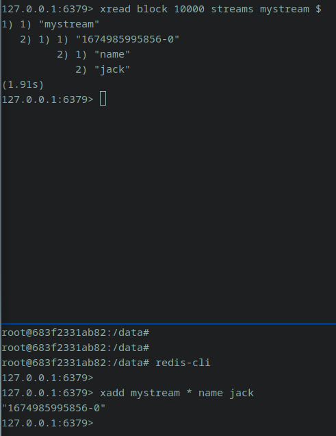

## 消费者操作

- **消费组消费图**

  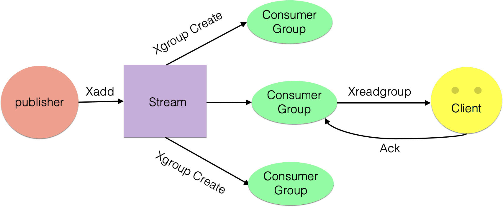

- XGROUP CREATE

  创建消费组。消费组用于管理消费者和队列读取记录。Stream中的消费组有两个特点：

  1. 从资源结构上说消费者从属于一个消费组
  2. 一个队列可以拥有多个消费组。不同消费组之间读取队列互不干扰

  语法格式：

  ```
  XGROUP [CREATE key groupname id-or-$] [SETID key groupname id-or-$] [DESTROY key groupname] [DELCONSUMER key groupname consumername]
  ```

  - key：队列名称，如果不存在就创建
  - groupname：组名
  - id: $表示从尾部开始消费，只接受新消息，当前Stream消息会全部忽略

  命令使用：

  为队列mystream创建一个消费组 mqGroup，从第一个消息开始读

  ```
  127.0.0.1:6379> XGROUP CREATE mystream mqGroup 0
  OK
  ```

- XREADGROUP

  读取队列的消息。在读取消息时需要指定消费者，只需要指定名字，不用预先创建。

  语法格式：

  ```
  XREADGROUP GROUP group consumer [COUNT count] [BLOCK milliseconds]
    [NOACK] STREAMS key [key ...] id [id ...]
  ```

  - group：消费组名
  - consumer：消费者名
  - count：读取数量
  - BLOCK milliseconds：阻塞读以及阻塞毫秒数。默认非阻塞。和XREAD类似
  - key：队列名
  - id：消息ID。ID可以填写特殊符号`>`，表示未被组内消费的起始消息

  命令使用：

  创建消费者consumerA和consumerB，各读取一条消息

  ```
  127.0.0.1:6379> XREADGROUP GROUP mqGroup consumerA COUNT 1 STREAMS mystream >
  1) 1) "mystream"
     2) 1) 1) "1674984765438-0"
           2) 1) "name"
              2) "tom"
              3) "age"
              4) "22"
              
  127.0.0.1:6379> XREADGROUP group mqGroup consumerB count 1 streams mystream >
  1) 1) "mystream"
     2) 1) 1) "1674985213802-0"
           2) 1) "height"
              2) "180"
              3) "use"
              4) "iphone"
  ```

  可以进行组内消费的基本原理是，STREAM类型会为每个组记录一个最后读取的消息ID（last_delivered_id），这样在组内消费时，就可以从这个值后面开始读取，保证不重复消费。

  消费组消费时，还有一个必须要考虑的问题，就是若某个消费者，消费了某条消息，但是并没有处理成功时（例如消费者进程宕机），这条消息可能会丢失，因为组内其他消费者不能再次消费到该消息了

  

- XPENDING

  **为了解决组内消息读取但处理期间消费者崩溃带来的消息丢失问题，Stream 设计了 Pending 列表，用于记录读取但并未确认完毕的消息。**

  语法格式：

  ```
  XPENDING key group [[IDLE min-idle-time] start end count [consumer]]
  ```

  - key：队列名
  - group： 消费组名
  - start：开始值，-表示最小值
  - end：结束值，+表示最大值
  - count：数量

  命令使用：

  首先查看队列中的消息数量有3个，然后查看已读取未处理的消息有两个。

  ```
  127.0.0.1:6379> xlen mystream
  (integer) 3
  
  127.0.0.1:6379> xpending mystream mqGroup
  1) (integer) 2 # 2个已读取但未处理的消息
  2) "1674984765438-0" # 起始ID
  3) "1674985213802-0" # 结束ID
  4) 1) 1) "consumerA"  # 消费者A有1个
        2) "1"
     2) 1) "consumerB"  # 消费者B有1个
        2) "1"
  ```

  队列中一共三条信息，有两条被消费但未处理完毕，也就是上面XREADGROUP消费的两条。一个是消费者consumerA，另一个是consumerB。

  获取未确认的详细信息

  ```
  127.0.0.1:6379> xpending mystream mqGroup - + 10
  1) 1) "1674984765438-0"
     2) "consumerA"
     3) (integer) 12110001
     4) (integer) 1
  2) 1) "1674985213802-0"
     2) "consumerB"
     3) (integer) 89140701
     4) (integer) 1
  ```

  每个Pending的消息有4个属性：

  - 消息ID
  - 所属消费者
  - IDLE，已读取时长
  - delivery counter，消息被读取次数

  演示如下：

  ```
  127.0.0.1:6379> XPENDING mq mqGroup # mpGroup的Pending情况
  1) (integer) 5 # 5个已读取但未处理的消息
  2) "1553585533795-0" # 起始ID
  3) "1553585533795-4" # 结束ID
  4) 1) 1) "consumerA" # 消费者A有3个
        2) "3"
     2) 1) "consumerB" # 消费者B有1个
        2) "1"
     3) 1) "consumerC" # 消费者C有1个
        2) "1"
  
  127.0.0.1:6379> XPENDING mq mqGroup - + 10 # 使用 start end count 选项可以获取详细信息
  1) 1) "1553585533795-0" # 消息ID
     2) "consumerA" # 消费者
     3) (integer) 1654355 # 从读取到现在经历了1654355ms，IDLE
     4) (integer) 5 # 消息被读取了5次，delivery counter
  2) 1) "1553585533795-1"
     2) "consumerA"
     3) (integer) 1654355
     4) (integer) 4
  # 共5个，余下3个省略 ...
  
  127.0.0.1:6379> XPENDING mq mqGroup - + 10 consumerA # 在加上消费者参数，获取具体某个消费者的Pending列表
  1) 1) "1553585533795-0"
     2) "consumerA"
     3) (integer) 1641083
     4) (integer) 5
  # 共3个，余下2个省略 ...
  
  ```

  上面的结果我们可以看到，我们之前读取的消息，都被记录在Pending列表中，说明全部读到的消息都没有处理，仅仅是读取了。那如何表示消费者处理完毕了消息呢？使用命令 XACK 完成告知消息处理完成，演示如下：

  ```
  127.0.0.1:6379> XACK mq mqGroup 1553585533795-0 # 通知消息处理结束，用消息ID标识
  (integer) 1
  
  127.0.0.1:6379> XPENDING mq mqGroup # 再次查看Pending列表
  1) (integer) 4 # 已读取但未处理的消息已经变为4个
  2) "1553585533795-1"
  3) "1553585533795-4"
  4) 1) 1) "consumerA" # 消费者A，还有2个消息处理
        2) "2"
     2) 1) "consumerB"
        2) "1"
     3) 1) "consumerC"
        2) "1"
  127.0.0.1:6379>
  
  ```

  有了这样一个Pending机制，就意味着在某个消费者读取消息但未处理后，消息是不会丢失的。等待消费者再次上线后，可以读取该Pending列表，就可以继续处理该消息了，保证消息的有序和不丢失。

- XACK

  对于已读取未处理的消息，使用命令 XACK 完成告知消息处理完成
  XACK 命令确认消费的信息，一旦信息被确认处理，就表示信息被完善处理。

  ```
  XACK key group id [id ...]
  ```

  - key: stream 名
  - group：消费组
  - id：消息ID

  确认消息`1674985213802-0`

  ```
  127.0.0.1:6379> XACK mystream mqGroup 1674985213802-0
  (integer) 1
  127.0.0.1:6379> 
  ```

- XCLAIM

  某个消费者读取了消息但没有处理，这时消费者宕机或重启等就会导致该消息失踪。那么就需要该消息转移给其他的消费者处理，就是消息转移。XCLAIM来实现消息转移的操作。

  语法格式：

  ```
  XCLAIM key group consumer min-idle-time id [id ...] [IDLE ms]
    [TIME unix-time-milliseconds] [RETRYCOUNT count] [FORCE] [JUSTID]
    [LASTID id]
  ```

  - key： 队列名称
  - group ：消费组
  - consumer：消费组里的消费者
  - min-idle-time 最小时间。空闲时间大于min-idle-time的消息才会被转移成功
  - id：消息的ID

  转移除了要指定ID外，还需要指定min-idle-time，min-idle-time是最小空闲时间，该值要小于消息的空闲时间，这个参数是为了保证是多于多长时间的消息未处理的才被转移。比如超过24小时的处于pending未xack的消息要进行转移
  同时min-idle-time还有一个功能是能够避免两个消费者同时转移一条消息。被转移的消息的IDLE会被重置为0。假设两个消费者都以2min来转移，第一个成功之后IDLE被重置为0，第二个消费者就会因为min-idle-time大与空闲时间而是失败。

  命令使用：
  目前未确认的消息

  ```
  127.0.0.1:6379> xpending mystream mqGroup - + 10
  1) 1) "1674984765438-0"
     2) "consumerA"
     3) (integer) 12145595
     4) (integer) 1
  ```

  id: 1674984765438-0
  空闲时间：12145595，单位ms
  读取次数：1

  将cosumerA未处理的消息转移给consumerB。

  ```
  127.0.0.1:6379> XCLAIM mystream mqGroup consumerB 3600000 1674984765438-0
  1) 1) "1674984765438-0"
     2) 1) "name"
        2) "tom"
        3) "age"
        4) "22"
  ```

  查看未确认的消息
  消息已经从consumerA转移给consumerB，**IDLE重置，读取次数加1**。转移之后就可以继续处理这条消息。

  ```
  127.0.0.1:6379> xpending mystream mqGroup - + 10
  1) 1) "1674984765438-0"
     2) "consumerB"
     3) (integer) 5729 # 注意IDLE，被重置了
     4) (integer) 2 # 注意，读取次数也累加了1次
  ```

  通常转移操作的完整流程是：

  1. 先用xpending命令找出所有未确认的消息
  2. 再用xclaim命令转移所有未确认消息

  在redis6.2.0之后有一个命令`XAUTOCLAIM`，可以将xpending查找未确认消息和xclaim转移消息合并成一个操作。

  **坏消息问题，Dead Letter，死信问题**

  正如上面所说，**如果某个消息，不能被消费者处理，也就是不能被XACK，这是要长时间处于Pending列表中，即使被反复的转移给各个消费者也是如此。此时该消息的delivery counter就会累加（上一节的例子可以看到），当累加到某个我们预设的临界值时，我们就认为是坏消息（也叫死信，DeadLetter，无法投递的消息），由于有了判定条件，我们将坏消息处理掉即可，删除即可。**删除一个消息，使用XDEL语法，演示如下：

  ```
  # 删除队列中的消息
  127.0.0.1:6379> XDEL mq 1553585533795-1
  (integer) 1
  # 查看队列中再无此消息
  127.0.0.1:6379> XRANGE mq - +
  1) 1) "1553585533795-0"
     2) 1) "msg"
        2) "1"
  2) 1) "1553585533795-2"
     2) 1) "msg"
        2) "3"
  ```

  **注意本例中，并没有删除Pending中的消息因此你查看Pending，消息还会在。可以执行XACK标识其处理完毕！**

- XINFO

  Stream提供了XINFO来实现对服务器信息的监控

  查看队列信息

  ```
  127.0.0.1:6379> xinfo stream mystream
   1) "length"
   2) (integer) 3
   3) "radix-tree-keys"
   4) (integer) 1
   5) "radix-tree-nodes"
   6) (integer) 2
   7) "groups"
   8) (integer) 1
   9) "last-generated-id"
  10) "1674985995856-0"
  11) "first-entry"
  12) 1) "1674984765438-0"
      2) 1) "name"
         2) "tom"
         3) "age"
         4) "22"
  13) "last-entry"
  14) 1) "1674985995856-0"
      2) 1) "name"
         2) "jack"
  ```

  消费组信息

  ```
  127.0.0.1:6379> xinfo groups mystream
  1) 1) "name"
     2) "mqGroup"
     3) "consumers"
     4) (integer) 2
     5) "pending"
     6) (integer) 1
     7) "last-delivered-id"
     8) "1674985213802-0"
  ```

  消费者组成员信息

  ```
  127.0.0.1:6379> xinfo consumers mystream mqGroup
  1) 1) "name"
     2) "consumerA"
     3) "pending"
     4) (integer) 0
     5) "idle"
     6) (integer) 12904777
  2) 1) "name"
     2) "consumerB"
     3) "pending"
     4) (integer) 1
     5) "idle"
     6) (integer) 696457
  127.0.0.1:6379> 
  ```

## 更深入理解

### Stream用在什么样场景

可用作时通信等，大数据分析，异地数据备份等

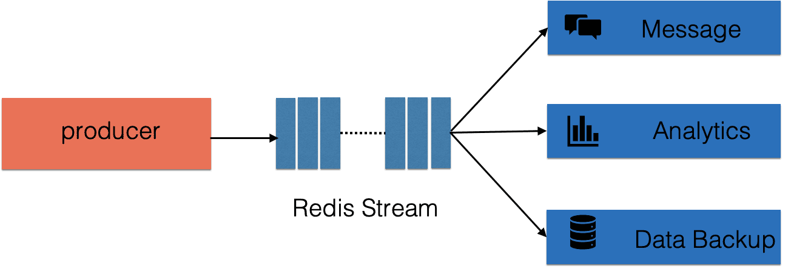

客户端可以平滑扩展，提高处理能力

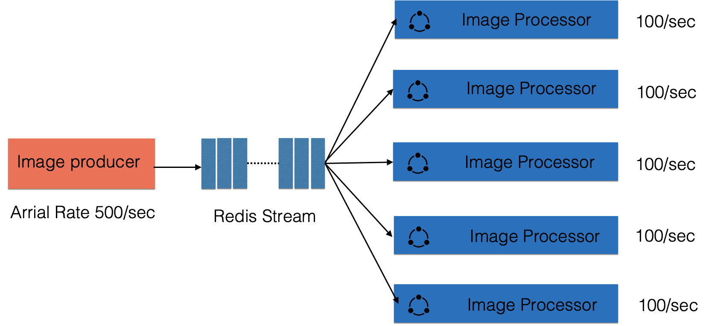

### Stream 消息积压怎么处理

消息积累太多，Stream 的链表岂不是很长，内容会不会爆掉?xdel指令又不会删除消息，它只是给消息做了个标志位。

Redis考虑到了这一点，所以它提供了一个**定长 Stream 功能**。在 **xadd 的指令提供一个定长长度 maxlen，就可以将老的消息干掉，确保最多不超过指定长度**

```
127.0.0.1:6379> xlen artisan
(integer) 7
127.0.0.1:6379> xadd artisan maxlen 3 * name artisan89 age 90
"1587890235506-0"
127.0.0.1:6379> XLEN artisan
(integer) 3
127.0.0.1:6379> 
```

我们看到 Stream 的长度被砍掉了,通过指定 maxlen，仅保留了 maxlen的长度数据。

### 消息如果忘记 ACK 会怎样？

Stream 在每个消费者结构中保存了正在处理中的消息 ID 列表 PEL，如果消费者收到了消息处理完了但是没有回复 ack，就会导致 PEL 列表不断增长，如果有很多消费组的话，那么**这个 PEL 占用的内存就会放大**。

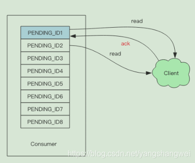

### PEL 如何避免消息丢失?

在客户端消费者读取 Stream 消息时，Redis 服务器将消息回复给客户端的过程中，客户端突然断开了连接，消息就丢失了.

但是 PEL 里已经保存了发出去的消息 ID。待客户端重新连上之后，可以再次收到 PEL 中的消息 ID 列表。不过此时 **xreadgroup 的起始消息ID 不能为参数>，而必须是任意有效的消息 ID，一般将参数设为 0-0，表示读取所有的PEL 消息以及自 last_delivered_id 之后的新消息。**

### 消费者崩溃带来的会不会消息丢失问题?

为了解决组内消息读取但处理期间消费者崩溃带来的消息丢失问题，STREAM 设计了 Pending 列表，用于记录读取但并未处理完毕的消息。命令XPENDIING 用来获消费组或消费内消费者的未处理完毕的消息。演示如下：

```
127.0.0.1:6379> XPENDING mq mqGroup # mpGroup的Pending情况
1) (integer) 5 # 5个已读取但未处理的消息
2) "1553585533795-0" # 起始ID
3) "1553585533795-4" # 结束ID
4) 1) 1) "consumerA" # 消费者A有3个
      2) "3"
   2) 1) "consumerB" # 消费者B有1个
      2) "1"
   3) 1) "consumerC" # 消费者C有1个
      2) "1"

127.0.0.1:6379> XPENDING mq mqGroup - + 10 # 使用 start end count 选项可以获取详细信息
1) 1) "1553585533795-0" # 消息ID
   2) "consumerA" # 消费者
   3) (integer) 1654355 # 从读取到现在经历了1654355ms，IDLE
   4) (integer) 5 # 消息被读取了5次，delivery counter
2) 1) "1553585533795-1"
   2) "consumerA"
   3) (integer) 1654355
   4) (integer) 4
# 共5个，余下3个省略 ...

127.0.0.1:6379> XPENDING mq mqGroup - + 10 consumerA # 在加上消费者参数，获取具体某个消费者的Pending列表
1) 1) "1553585533795-0"
   2) "consumerA"
   3) (integer) 1641083
   4) (integer) 5
# 共3个，余下2个省略 ...
```

每个Pending的消息有4个属性：

- 消息ID
- 所属消费者
- IDLE，已读取时长
- delivery counter，消息被读取次数

上面的结果我们可以看到，我们之前读取的消息，都被记录在Pending列表中，说明全部读到的消息都没有处理，仅仅是读取了。那如何表示消费者处理完毕了消息呢？使用命令 XACK 完成告知消息处理完成，演示如下：

```
127.0.0.1:6379> XACK mq mqGroup 1553585533795-0 # 通知消息处理结束，用消息ID标识
(integer) 1

127.0.0.1:6379> XPENDING mq mqGroup # 再次查看Pending列表
1) (integer) 4 # 已读取但未处理的消息已经变为4个
2) "1553585533795-1"
3) "1553585533795-4"
4) 1) 1) "consumerA" # 消费者A，还有2个消息处理
      2) "2"
   2) 1) "consumerB"
      2) "1"
   3) 1) "consumerC"
      2) "1"
127.0.0.1:6379>
```

有了这样一个Pending机制，就意味着在某个消费者读取消息但未处理后，消息是不会丢失的。等待消费者再次上线后，可以读取该Pending列表，就可以继续处理该消息了，保证消息的有序和不丢失。

# Redis如何实现延迟任务

## 基于Key的过期消息

### 原理：

- **核心机制**：利用Redis的**键空间通知功能**（Keyspace Notifications），当某个键因过期被删除时，Redis会自动向指定频道发布消息，应用程序通过订阅该频道即可获知Key过期事件。

- Redis 2.0引入的**发布/订阅**（pub/sub）机制是此方案的基础：

  [基于频道(Channel)的发布/订阅](../Redis知识总结/Redis知识总结2.md#基于频道(Channel)的发布或订阅)

  - **发布者**：Redis内核（当Key被删除时）
  - **订阅者**：你的应用程序
  - **频道**：`__keyevent@<db>__:expired`（其中`<db>`为数据库编号，如0）
  - **消息内容**：过期的Key名称

### 实现步骤是：

1. 设置开启 Redis 过期键通知事件，可以通过执行**“CONFIG SET notify-keyspace-events KEA”**命令来动态开启键空间通知功能，而无需重启 Redis 服务器。
2. 生产者通过 `SET key value EX <seconds>` 或 `EXPIRE key <seconds>` 命令设置一个键值对及其生存时间。
3. 消费者通过订阅 `__keyevent@<db>__:expired` 频道来监听过期事件。
   - 当 Redis **实际删除** 该 Key 时，它会向该频道发布一条消息。
   - 消息内容就是那个过期的 Key 的名字（例如 `mykey`）。

### Redis 过期事件监听缺陷：

1. 时效性差（时间不可控）

   **Redis 的过期事件并不是在时间到达的瞬间触发的，而是在 Key 被删除的那一刻触发的。**Redis 为了平衡内存与 CPU 性能，采用了**“定期删除 + 惰性删除”**的混合策略。

   - 惰性删除 (Lazy Deletion)
     - **机制**：Redis 不会主动监控哪些 Key 到期了。只有当**某个过期 Key 被访问时**，Redis 才会检查其是否过期，如果过期则立即删除并发布事件。
     - **后果**：如果你设置了一个 Key 3 秒后过期，但在这之后的 10 分钟内没有任何人访问它，那么它会一直存在于内存中，直到有人访问它为止。你的延时任务可能会延迟数分钟甚至数小时才执行。

   - 定期删除 (Active Expiration)
     - **机制**：Redis 会周期性地（默认每秒 10 次）从设置了过期时间的 Key 中**随机抽取**一部分进行检查。如果发现过期，则删除。
     - **后果**：这是一种“抽样”检查，不是全量检查。如果一次抽样没有抽中你的 Key，它就会继续存活。在极端情况下，一个到期的 Key 可能会在内存中停留相当长的时间

2. 丢消息（消息不可靠）
   - 这是由 Redis Pub/Sub（发布/订阅）机制本身的特性决定的。
     - **无持久化**：Pub/Sub 是一种“即发即忘”的模式。Redis **不会**将消息存储在内存中等待消费者处理。
     - 场景分析：
       - **启动顺序问题**：如果消费者服务先挂了，或者启动晚了，刚好在这个空窗期有 Key 过期，那么当消费者重新上线时，这条消息已经永久丢失了。
       - **处理失败问题**：如果消费者在处理消息时发生异常（如系统崩溃），Redis 不会重试，也不会回滚，这条消息就彻底消失了。
     - **后果**：缺乏消息队列必备的**可靠性保证（At-Least-Once）**，在金融或核心业务中，丢失一条消息的代价是巨大的。

3. 多服务实例下消息重复消费（消费难管理）

   这是分布式环境下最容易踩的坑。

   - **广播模式**：Redis Pub/Sub 本质上是**广播**。生产者发送一条消息，所有订阅该频道的消费者都会收到这条消息。
   - 场景分析：
     - 假设你为了高可用，部署了 2 个应用实例（Instance A 和 Instance B），它们都订阅了 `__keyevent@0__:expired` 频道。
     - 当一个 Key 过期时，**A 和 B 会同时收到这条消息**。
     - 结果就是：同一个任务被执行了两次（例如：给用户发了两次红包，扣了两次库存）。
   - **后果**：你需要额外编写复杂的逻辑来保证**幂等性**（Idempotency），或者引入分布式锁来协调多个实例，这大大增加了开发和维护成本。

## Redis的ZSET

## Redisson的RDelayQueue

# 除了做缓存，Redis还能用来干什么？

1. 消息队列（不建议）：Redis 支持发布/订阅模式和Stream，可以作为轻量级消息队列使用，用于异步处理任务或处理高并发请求。

   [Redis 5.0中的Stream是什么？](#Redis 5.0中的 Stream是什么？)

2. 延迟消息（不建议）：Redis的ZSET可以用来实现延迟消息，也可以基于Key的过期消息实现延迟消息，还可以借助Redisson的RDelayQueue来实现延迟消息，都是可以的。

   [Redis如何实现延迟任务](#Redis如何实现延迟任务)
